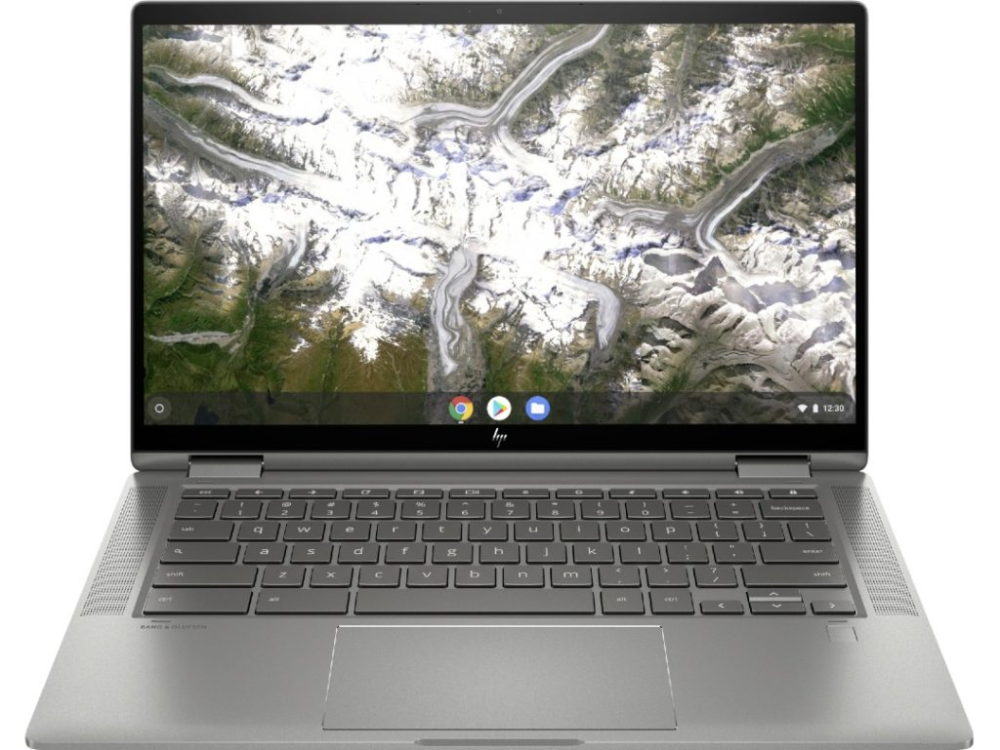

There's another sale at Best Buy on the [HP Chromebook X360 14c bringing the $629 price down by $100 right now](https://www.bestbuy.com/site/hp-2-in-1-14-touch-screen-chromebook-intel-core-i3-8gb-memory-64gb-emmc-flash-memory-mineral-silver/6407695.p?skuId=6407695). That's not the best deal I've seen on this 2-in-1 Chromebook but it's still decent. This HP Chromebook X360 14c sale gets you a 10th generation Core i3 processor, 8 GB of memory, and 64 GB of storage for $529.

The prior model was quite nice but you're getting a new chipset on this model along with longer support for Chrome OS automatic updates, through June 2028.

[Get the HP Chromebook X360 14c](https://www.bestbuy.com/site/hp-2-in-1-14-touch-screen-chromebook-intel-core-i3-8gb-memory-64gb-emmc-flash-memory-mineral-silver/6407695.p?skuId=6407695 "Get the HP Chromebook X360 14c")

In terms of the HP Chromebook X360 14c, I’d call it squarely in the mid-range Chromebook market. Expect plenty of performance for everyday basic use, easily handling 10 to 15 browser tabs open.

You can also throw some full-time Android apps into the mix. The device should handle light Linux use as well but if you plan to run Linux for hours a day, every day, you’d probably want to invest in something a little better.

Here’s what you get: A 10th-gen [Intel Core i3-10110U](https://ark.intel.com/content/www/us/en/ark/products/196451/intel-core-i3-10110u-processor-4m-cache-up-to-4-10-ghz.html) with a 2.1 GHz base frequency, turbo-boost up to 4.1 GHz; a 14-inch full HD touch display with thin bezels on the sides, 8GB of memory, 64GB of eMMC storage, Wi-Fi 6 and Bluetooth 5.

There are a pair of USB Type-C 3.1 SuperSpeed ports and one Type-A, wide-view webcam with privacy shutter, plus a headphone/microphone jack and microSD card reader. HP also packs in a 60.9 wHr battery for all-day use.

[Get the HP Chromebook X360 14c](https://www.bestbuy.com/site/hp-2-in-1-14-touch-screen-chromebook-intel-core-i3-8gb-memory-64gb-emmc-flash-memory-mineral-silver/6407695.p?skuId=6407695 "Get the HP Chromebook X360 14c")

Because the chip inside is a U-Series model, it can run longer at full capacity, unlike [Y-Series chips found in the Pixel Slate](https://www.aboutchromebooks.com/reviews/google-pixel-slate-review/), for example.

The one possible downside? U-Series chips require fans to reduce the heat produced during those heavy-duty CPU cycles, so the HP Chromebook X360 does have a fan.

Typically, low-end Chromebooks are in the sub-$200 to $400 price range with relatively less capable Pentium processors and 4 GB of RAM. If you can stretch a little further on price, the HP Chromebook X360 14c sale at $529 is a solid buy. You're going to get better performance and, in most cases, a better and larger screen.

**Update**: _This post was originally published on August 7, 2020 and has been updated to reflect the current discount_
