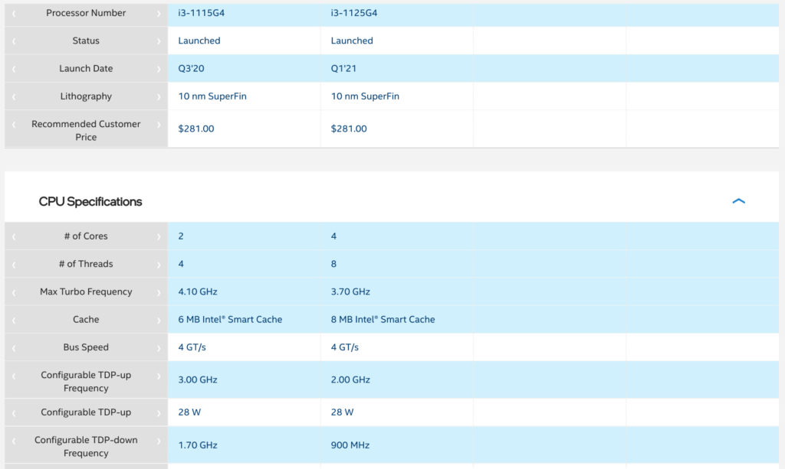
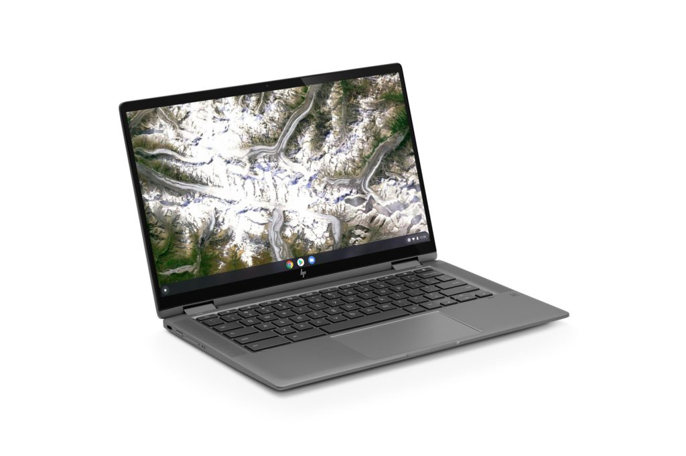

Is it just me or is there a surge in new Chromebooks available with the 11th-gen Core i3 processor these days? [Lenovo has one for $549.99](https://www.aboutchromebooks.com/news/new-lenovo-flex-5-chromebook-with-11th-gen-core-i3-launches-at-549-99/). There's [an Asus model for $569.99](https://www.aboutchromebooks.com/news/you-can-now-buy-the-asus-chromebook-flip-c536-cx5/). And the [upgraded HP Chromebook x360 14c is $619.99](https://www.aboutchromebooks.com/news/new-hp-chromebook-x360-14c-gets-beefed-up-with-11th-gen-core-i3-and-i5-processors/). Maybe HP is sensing the competition because I see an $80 discount on its Core i3 model. You can [snag it directly from HP for $539.99](https://www.hp.com/us-en/shop/ConfigureView?langId=-1&storeId=10151&catalogId=10051&catEntryId=3074457345619965323&urlLangId=&quantity=1&jumpid=ma_hp-chromebooks_product-tile_premium-chromebooks_2_2e6x3av-1_hp-chromebook-x360-1).

[Get this HP Chromebook X360 14c deal](https://www.hp.com/us-en/shop/ConfigureView?langId=-1&storeId=10151&catalogId=10051&catEntryId=3074457345619965323&urlLangId=&quantity=1&jumpid=ma_hp-chromebooks_product-tile_premium-chromebooks_2_2e6x3av-1_hp-chromebook-x360-1 "Get this HP Chromebook X360 14c deal")

Internally there aren't many hardware differences between the three devices from this trio of Google hardware partners. Well at last not until you look closely.

Although all of them are powered by the newest 11th-gen Intel Core i3 processors and 8 GB of memory, two use a slightly different CPU. Lenovo and Asus went with the Core i3-1115G4 while HP includes the Core i3-1125G4. And that gives this HP Chromebook x360 14c a potential performance advantage.

Here's a comparison chart between the two CPUs [directly from Intel's website](https://ark.intel.com/content/www/us/en/ark/compare.html?productIds=208656,208652):

While the clock speeds of the Core i3 in the HP Chromebook X360 14c are lower, you're getting double the cores and threads. And as your Chromebook splits up processor tasks or leverages additional cores, it will run more efficiently.

So right off the bat, this deal is looking good: The discount makes it less expensive and you're getting a beefier processor.

As I mentioned all three devices come with 8 GB of memory. They also include 128 GB of speedy SSD storage. So that's a wash. But... HP will let you upgrade from 128 to 256 of SSD capacity for just $30. That configuration is $569.99 during this sale and you're doubling up your local storage on the cheap.

Regardless of your SSD choice, you're getting a 14-inch 1920 x 1080 IPS touchscreen with an average 250 nits of brightness. A backlit keyboard, 720p webcam with privacy switch, WiFi 6, and Bluetooth 5 round out the rest of the important bits. Two SuperSpeed USB Type-C ports and a single SuperSpeed Type-A port, along with a MicroSD card slot are in there too.

There are obviously other things to consider if you're in the mid-range Chromebook market. Maybe you prefer one brand over another, want some other very specific feature that's only on one or two of these.

From a pure hardware value though? The HP Chromebook X360 14c is where I'd be looking as a first choice right now.

[Get this HP Chromebook X360 14c deal](https://www.hp.com/us-en/shop/ConfigureView?langId=-1&storeId=10151&catalogId=10051&catEntryId=3074457345619965323&urlLangId=&quantity=1&jumpid=ma_hp-chromebooks_product-tile_premium-chromebooks_2_2e6x3av-1_hp-chromebook-x360-1 "Get this HP Chromebook X360 14c deal")

Ideally, all of this competition will nudge HP to make this price cut permanent. I have no way of knowing if that's happening though.

I'm sure we have some readers who have this HP, or the prior model, so share your experiences if you're one of them!
