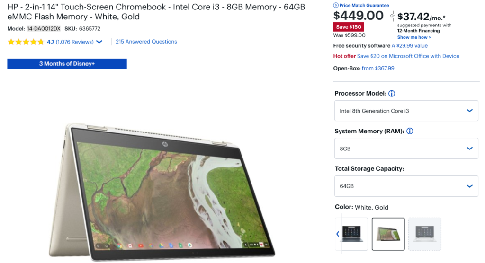
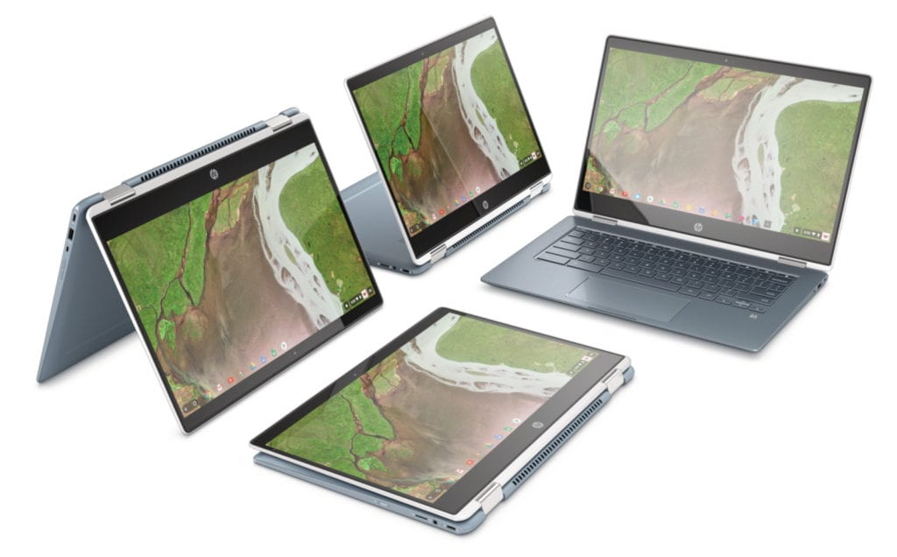

The HP Chromebook X360 with a 14-inch display comes in a number of configurations and the highest one available in retail stores is now [down to $449.00 thanks to a $150 discount at Best Buy](https://www.bestbuy.com/site/hp-2-in-1-14-touch-screen-chromebook-intel-core-i3-8gb-memory-64gb-emmc-flash-memory-white-gold/6365772.p?skuId=6365772). I'd consider this package to be one of the best mid-range Chromebooks that won't break the bank.

In fact, unless you're a developer or a heavy-duty user of Linux on Chromebooks, this 2-in-1 should easily handle any tasks you can throw at it. Part of that is due to the 8 GB of memory while another part is due to the higher-performing U-Series processor as compared to the typical Y-Series Intel chips found in many other Chromebooks at this price.

Here's a rundown of the HP Chromebook X360 specs:

<table class=""><tbody><tr><td>CPU</td><td>Dual-core Intel Core i3-8130U clocked at 2.2 GHz with 3.4 GHz boost</td></tr><tr><td>GPU</td><td>Intel UHD 620 Graphics</td></tr><tr><td>Memory</td><td>8 GB DDR4, 2133 MHz</td></tr><tr><td>Storage</td><td>64 GB eMMC, microSD card expansion</td></tr><tr><td>Display</td><td>14-inch, 1920 x 1080 IPS touchscreen</td></tr><tr><td>Connectivity</td><td>Intel Wireless-AC 7265 802.11ac (2x2) Wi-Fi and Bluetooth 4.2 Combo</td></tr><tr><td>Ports</td><td>Two USB Type-C (3.1), one USB Type-A (3.1), headphone/microphone</td></tr><tr><td>Input</td><td>Backlit keyboard, multi-touch trackpad</td></tr><tr><td>Audio</td><td>B&amp;O stereo speakers</td></tr><tr><td>Battery</td><td>60 WHr, up to 14 hours claimed run time</td></tr><tr><td>Software support</td><td>Automatic Chrome OS updates through June 2025</td></tr></tbody></table>

If there's a specific or universal downside to this particular model, I'd say its the surprising lack of an integrated webcam for video chat. Aside from that, however, this is a solid performer at a great price.

Yes, the HP Chromebook X360 uses an 8th-generation Intel processor and I expect we'll soon see some Chromebooks that run on either 9th- or 10th-gen silicon, perhaps as early as next week at the Consumer Electronics Show.

I'll be there with full reports but even if a few Chromebooks with newer chips are announced, I don't expect to see them available for at least three months, if not more. And it's not likely they'll have price tags as low as $449, at least not to start.
