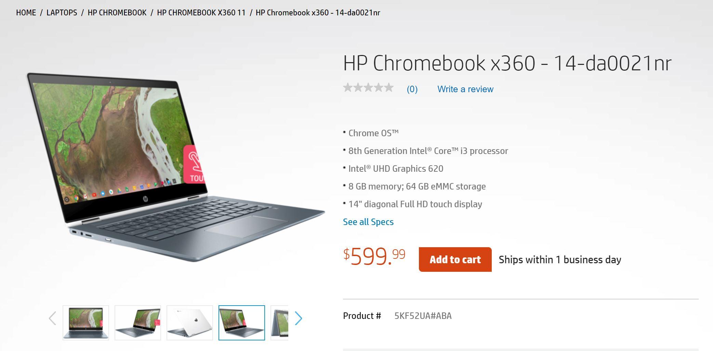

Earlier this week, the [HP Chromebook X360 debuted with a $599 base model price](https://www.aboutchromebooks.com/news/hp-chromebook-x360-release-date-price-specs/) and retail availability expected on October 21. Now the [HP.com store shows the 14-inch Chromebook for sale](https://store.hp.com/us/en/pdp/hp-chromebook-x360-14-da0021nr), saying it ships within one business day:

This price is for the base model and there aren't any upgrade configurations, such as the Core i5 HP says to expect, are not available as of now.

Here's what you get for $599: An 8th-gen [Intel Core i3-8130U](https://ark.intel.com/products/137977/Intel-Core-i3-8130U-Processor-4M-Cache-up-to-3-40-GHz-) with a 2.2 GHz base frequency, turbo-boost up to 4GHz; a 14-inch full HD touch display with thin bezels on the sides, 8GB of memory, 64GB of eMMC storage, 802.11ac Wi-Fi and Bluetooth. There are a pair of USB Type-C ports and one Type-A, plus a headphone/microphone jack and microSD card reader. HP says to expect 13.5 hours of run-time per charge.

It's interesting that this device is priced the same as the [HP Chromebook X2](https://www.aboutchromebooks.com/news/hp-chromebook-x2-8-gb-core-m5-configuration-availability/). While the X2 has a detachable, smaller display, the Core i3 of the X360 paired with double the memory and storage might be the better deal for those who don't need a true tablet.
