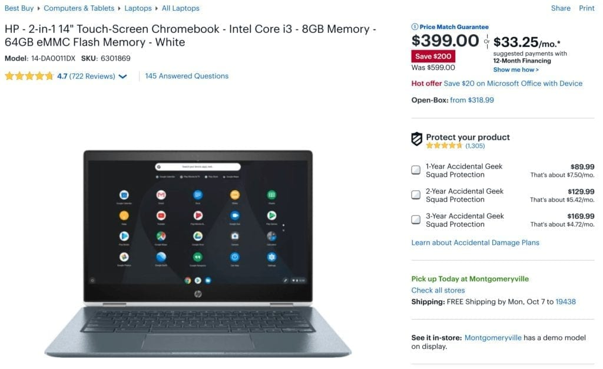

It seems like every six weeks or so Best Buy decides to remove some Chromebook inventory through sizable discounts. And it's been about six weeks for the [HP Chromebook X360 14, which can be had for $399](https://www.bestbuy.com/site/hp-2-in-1-14-touch-screen-chromebook-intel-core-i3-8gb-memory-64gb-emmc-flash-memory-white/6301869.p?skuId=6301869), or $200 off the $599 MSRP.

Truth be told, if I had a budget limitation of $400 and was in the market for a Chromebook right now, this is likely the one I would get. Also in the consideration would be the [Asus Chromebook Flip C434](https://amzn.to/2ogILRd) at the same price, although the HP has a higher performing processor in the U-Series Core i3 over the Y-Series m3 found in the Asus.

Here’s what you get if you go with the HP: An 8th-gen Intel Core i3-8130U with a 2.2 GHz base frequency, turbo-boost up to 4GHz; a 14-inch full HD touch display with thin bezels on the sides, 8GB of memory, 64GB of eMMC storage, 802.11ac Wi-Fi and Bluetooth. There are a pair of USB Type-C ports and one Type-A, plus a headphone/microphone jack and microSD card reader. HP says to expect 13.5 hours of run-time per charge.

Because the chip inside is a U-Series model, it can run longer at full capacity, unlike Y-Series chips found in the Pixel Slate, for example. The one possible downside? U-Series chips require fans to reduce the heat produced during those heavy-duty CPU cycles, so the HP Chromebook X360 does have a fan.
