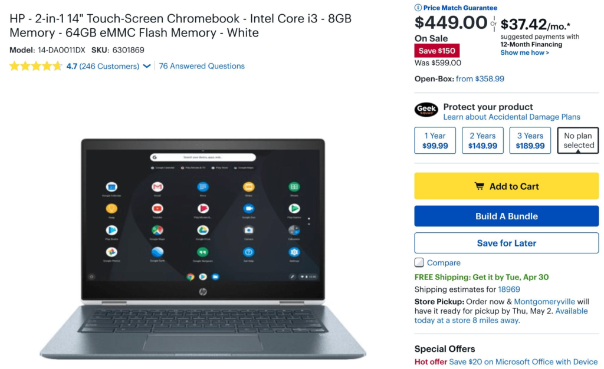
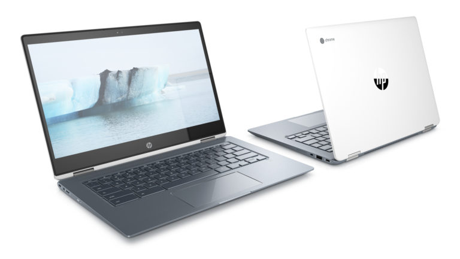

When I pointed out the [$399 sale price of the HP Chromebook X2 detachable](https://www.aboutchromebooks.com/news/hp-chromebook-x2-sale-399-best-buy-deal-discount/) last week, I asked readers who purchased it to share their experiences.

A few commenters pointed out that they opted for the $599 HP Chromebook X360 for better internals. I understand that choice and if that's a more appealing Chrome OS 2-in-1 to you, you're in luck: You can [save $150 on the HP Chromebook X360 all this week at Best Buy and pay $449 for it.](https://www.bestbuy.com/site/hp-2-in-1-14-touch-screen-chromebook-intel-core-i3-8gb-memory-64gb-emmc-flash-memory-white/6301869.p?skuId=6301869)

The design and materials of the HP Chromebook X360 are very similar to the X2. The main difference on the outside is the larger 14-inch display on the former, which doesn't detach, but does swivel 360-degrees when needed. And while the X2 doesn't have a backlit keyboard - a deal-breaker for some - the X360 does.

Inside there are more differences though: A better processor and double both the memory and storage, compared the to X2. Here's a rundown of the full specs:

- Intel Core i3-8130U, which is higher performing than the Core i3 Y-series processors found in other Chromebooks but does use a fan to dissipate heat.
- Intel UHD Graphics 620
- 8 GB of memory
- 64 GB of eMMC storage and integrated memory card slot for additional storage
- 14-inch 1920 x 1080 IPS touchscreen
- Backlit keyboard
- 802.11ac Wi-Fi and Bluetooth 4.2
- HD webcam with dual array microphone
- Two USB Type-C ports and one USB Type-A port (all are USB 3.1), microphone and headphone jack
- 60 WHr battery with runtime up to 13.5 hours, per HP
- Weight of 3.7 pounds

While you lose the higher-resolution detachable screen as well as stylus support, you're gaining much more in terms of processing speed, RAM and storage capacity, making the HP Chromebook X360 a great choice if you don't want a slate or digital pen. There is a fan inside this 2-in-1 processor but it should only run occasionally and under heavy load.

If you missed last week's $399 sale on the HP Chromebook X2 or simply didn't think it would meet your needs based on the hardware configuration, the HP Chromebook X360 is well worth the look at this price.

Need some additional insight on the pros and cons of the HP Chromebook X360? Check this detailed review from Chrome Unboxed:

https://youtu.be/U7mwqA7e\_A4
