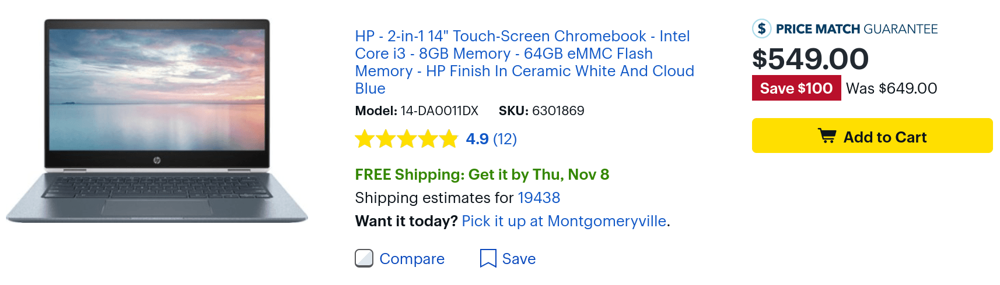
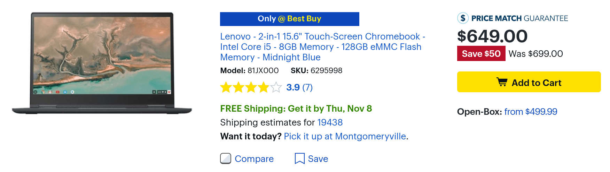

Not [pre-ordering a Pixel Slate](https://www.aboutchromebooks.com/news/pixel-slate-orders-available-release-date-november-22/) to keep your budget intact? That's OK because there are some good deals on two brand new Chromebooks today at Best Buy. Both have 8th generation Intel processors, full HD touchscreens and a generous amount of memory and storage.

First up is the [HP Chromebook X360](https://www.aboutchromebooks.com/news/hp-chromebook-x360-release-date-price-specs/), which is similar to the HP Chromebook X2 detachable device; this is a 2-in-1 though, so you can't remove the display for tablet mode. [HP normally sells the X360 for $59](https://store.hp.com/us/en/pdp/hp-chromebook-x360-14-da0021nr)9 while Best Buy ups the price to $649. However, I noticed [a $100 price drop on Best Buy's site this morning](https://www.bestbuy.com/site/hp-2-in-1-14-touch-screen-chromebook-intel-core-i3-8gb-memory-64gb-emmc-flash-memory-hp-finish-in-ceramic-white-and-cloud-blue/6301869.p?skuId=6301869), making the final price $549.

The processor is an [Intel Core i3-8310U](https://ark.intel.com/products/137977/Intel-Core-i3-8130U-Processor-4M-Cache-up-to-3-40-GHz-Core i3), which should be enough to handle typical Chromebook use for browsing and Android apps. I don't see why this 2-in-1 wouldn't have Linux app support either. That chip is paired with 8GB of memory and 64GB of flash storage as well. The 14-inch 1080p touch display also has smaller bezels on the side for a more "edge-to-edge" design. Overall, at this price, the HP Chromebook X360 might hit the sweet spot for a mid-range, modern Chromebook.

If you don't mind spending $100 more for a larger, more powerful device, [Best Buy has also cut the cost of Lenovo's Yoga Chromebook C630: it's down to $649](https://www.bestbuy.com/site/lenovo-2-in-1-15-6-touch-screen-chromebook-intel-core-i5-8gb-memory-128gb-emmc-flash-memory-midnight-blue/6295998.p?skuId=6295998) from its typical $699 price for this Best Buy exclusive configuration. [Lenovo sells the base model of this device direct for $599](https://www.lenovo.com/us/en/laptops/yoga/yoga-c-series/Yoga-Chromebook-C630/p/88YGCC61096?gclid=CjwKCAiAt4rfBRBKEiwAC678Kf83JTs5WdmI04yHGoRD0bjOPhEPc2KKHfqpGFldYrdNC-NT_P7KZhoCogIQAvD_BwE&cid=us:sem|se|google|553107797890|Lenovo+Yoga+Chromebook+C630|IIP_NX_Lenovo+Yoga+C+Series|1608826469&kw=lenovo%20yoga%20chromebook%20c630&adid=307353727371&addisttype=g&ef_id=CjwKCAiAt4rfBRBKEiwAC678Kf83JTs5WdmI04yHGoRD0bjOPhEPc2KKHfqpGFldYrdNC-NT_P7KZhoCogIQAvD_BwE:G:s&s_kwcid=AL!4030!3!307353727371!e!!g!!lenovo%20yoga%20chromebook%20c630), but the Best Buy version bumps up both the processor and storage. I'd probably drop the extra $50 for this model which gets you an [Intel Core i5-8250U](https://ark.intel.com/products/124967/Intel-Core-i5-8250U-Processor-6M-Cache-up-to-3-40-GHz-), 8GB of memory and 128GB of flash storage. The 15.6-inch touch display is also 1080p resolution.

With these specs, this device should handle use cases even for developers. In fact, these are nearly the same internals as the $999 Pixel Slate I just ordered, although the Lenovo has a U-series processor that can run longer under heavy loads than the expected Y-series in the Pixel Slate.
