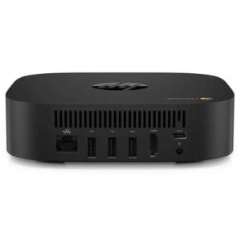

Earlier this month, we got word that the [HP Chromebox G2 would go on sale May 30](https://www.aboutchromebooks.com/news/hp-chromebox-g2-release-date-may-30-with-pre-orders-available-for-208/) and sure enough, today's the day: [HP is selling four different Chromebox G2 configurations](https://store.hp.com/us/en/vwa/desktops/opsy=Chrome-OS;ordr=Ready-to-Ship?jumpid=ma_dt_featured_na_6_170513) directly on its website and there's a fifth option from other resellers.

If you pre-ordered a base Chromebox G2 for $208 from a third-party, you may have paid a small premium because the [base model direct from HP can be ordered for $199](https://store.hp.com/us/en/pdp/hp-chromebox-g2), although it's currently out of stock. I expect that to change soon as the company builds up inventory. The base model is powered by an Intel Celeron 3865U and Intel HD Graphics 610 with 4 GB of memory in one slot (the other RAM slot is empty for upgrading), and a 32 GB SSD.

The price quickly jumps from there on HP's site as [the next configuration costs $549](https://store.hp.com/us/en/pdp/hp-chromebox-g2-p-3vd03ut-aba-1). You're getting quite a bit more performance though: A seventh-gen Intel Core i5-7300U with Intel HD Graphics 620, 8 GB of memory and 32 GB storage capacity. This model also shows as "out of stock" although like the Celeron model, HP says it ships in one business day. Confusing, I know.

[For $689 and availability now](https://store.hp.com/us/en/pdp/hp-chromebox-g2-p-3vd04ut-aba-1), you jump up to an eighth-generation Intel Core i7-8650U with Intel UHD Graphics 620 and the same 8 GB / 32 GB combo of memory and local storage. This model is available to ship now. [Also available for shipping is the $789 configuration](https://store.hp.com/us/en/pdp/hp-chromebox-g2-p-3vd05ut-aba-1) that keeps the Intel Core i7-8650U with Intel UHD Graphics 620 but doubles the memory and storage to 16 GB and 64 GB respectively.

Full specs of the product line are available in [HP's official data sheet for the Chromebox G2](http://www8.hp.com/h20195/v2/GetDocument.aspx?docname=4aa7-2083enuc); there's no mention of any included keyboard or mouse. I checked each option's "what's in the box" spec but there's just the power supply, documentation and the Chromebox. Looks like you'll have to provide your own keyboard and mouse, as well as a display of course.

If you want the base model with a Chrome keyboard and USB mouse, [Connection is showing the option for $224.88](https://www.connection.com/product/hp-chromebox-g2-usff-celeron-3865u-1.8ghz-4gb-32gb-ssd-hd610-ac-bt-microsd-chromeos/4fx16ut-aba/35656755?cac=Result), although the device is showing as temporarily out of stock. A better option may be [Promevo which also includes a USB keyboard and mouse for $219.00](https://shop.promevo.com/index.php/hp-chromebox-g2-4fx16ut-aba-4gb-32gb.html) for the Celeron-powered Chromebook G2.
