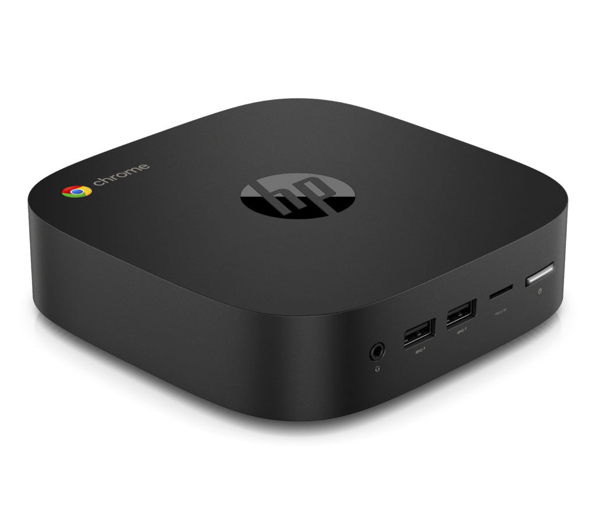
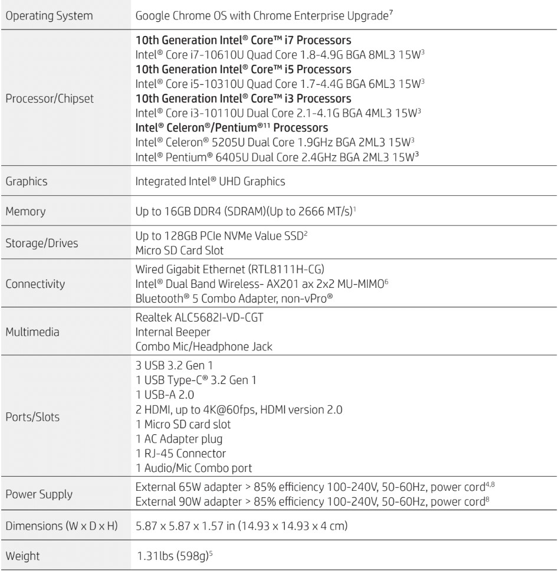
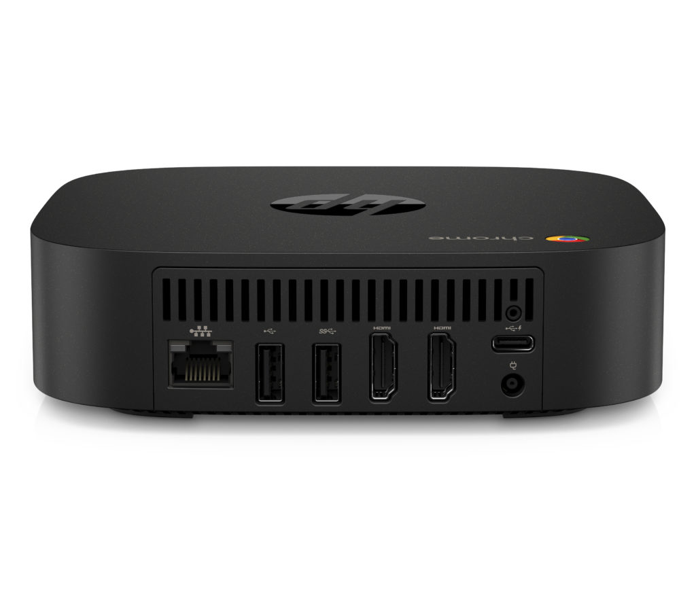
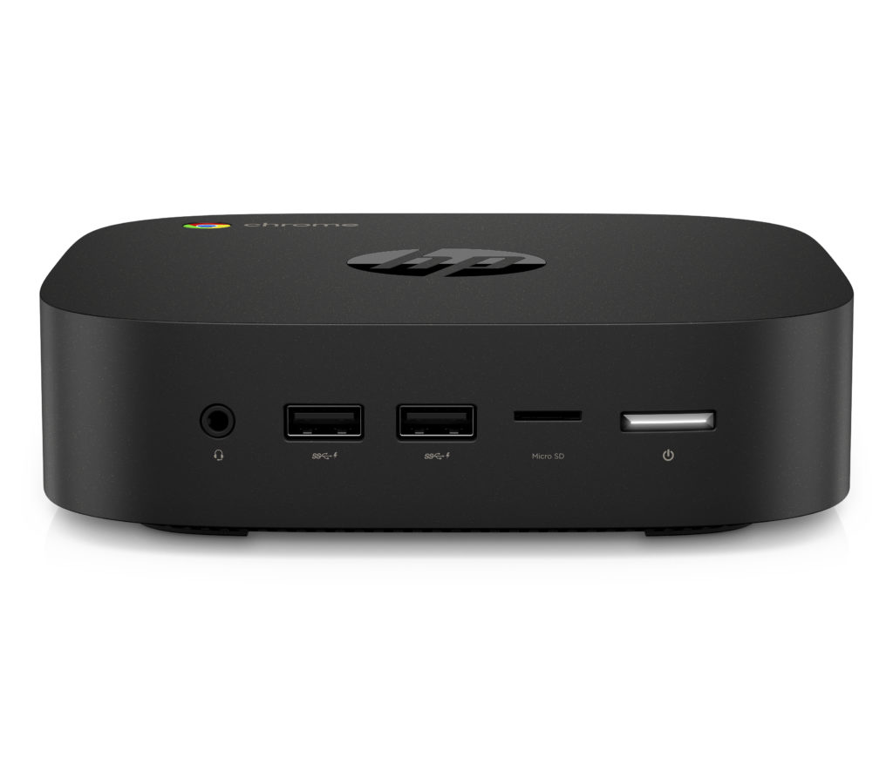

After announcing its [first AMD C-Series Chromebooks](https://www.aboutchromebooks.com/news/hp-pro-c645-chromebook-enterprise-amd-athlon-3000-c-series-ryzen/) on Tuesday morning, HP followed up with a new Chromebox. The HP Chromebox G3 Enterprise runs on 10th-generation Intel processors, can power a pair of 4K displays, and starts at just $254 when available in October.

Yes, it looks like any old Chromebox. To be fair, there's not much you can do to make the form-factor glitzy and glamorous: Chromeboxes are all about utility and based on the spec sheet, you'll get plenty of that depending on the configuration you select next month.

You can choose a chipset from a wide range of 10th-generation Intel U-Series processors, from a Celeron all the way up to a Core i7. You are limited to Intel's integrated UHD graphics, but for browsing, media playback, and work, that's plenty. Besides, with [streaming services such as Stadia and GeForce Now](https://www.aboutchromebooks.com/news/stadia-vs-geforce-now-chromebook-launch/), you don't need a super-powered GPU for gaming. Heck, even the $254 base model will handle that!

You're also getting some modern upgrades such as WiFi 6 (with a supported router, of course), Bluetooth 5 and NVMe storage options with capacities up to 128 GB. There's no lack of ports on the HP Chromebox G3 either: One USB Type C that can be used for data, charging external devices or video out, a pair of HDMI ports, and four USB Type-A ports as well as an Ethernet jack.

HP hasn't shared the full pricing for different configurations yet and I wouldn't be surprised to see that top-end Core i7 be in the $600 to $750 ballpark. We'll have to see next month when these go on sale to figure out which might be the best value.

