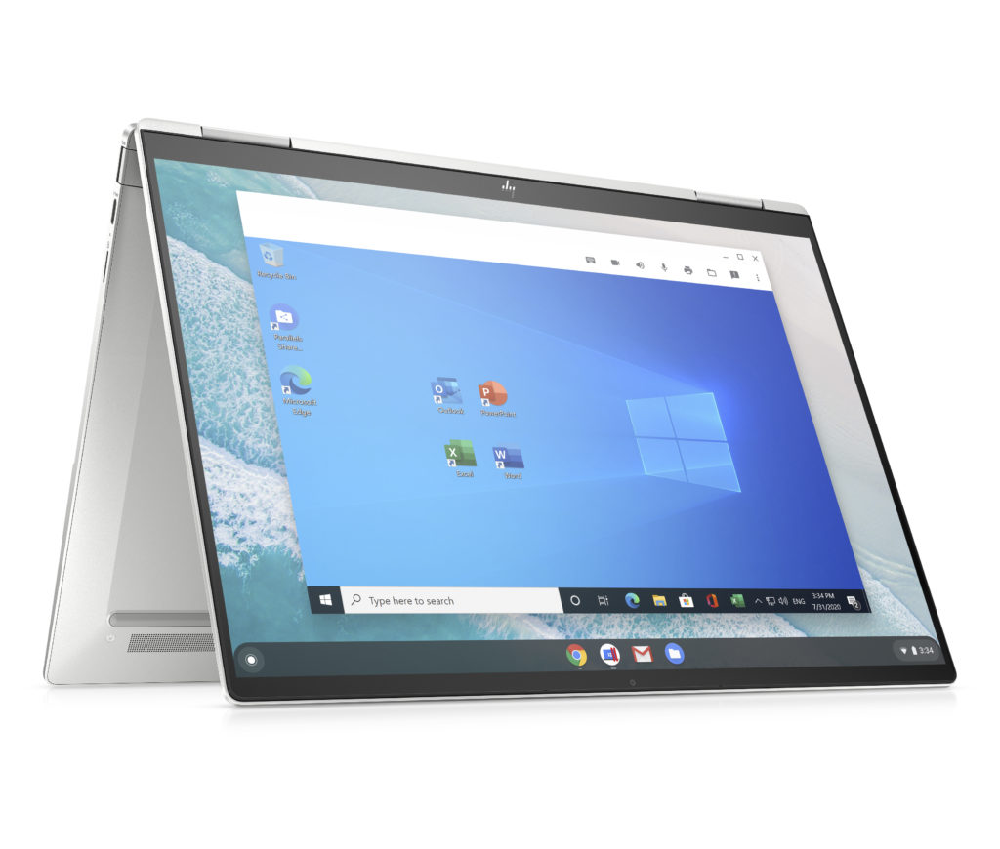
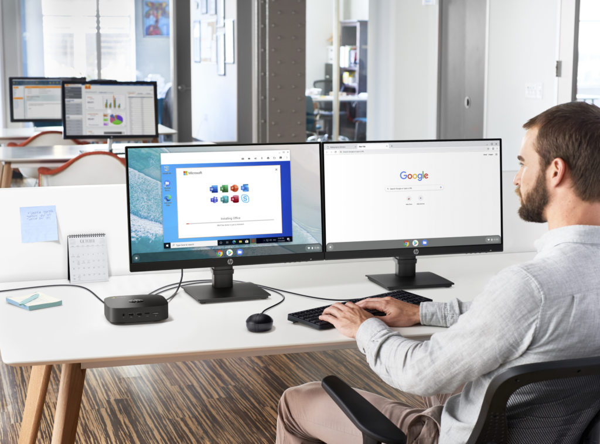

Back in June, we saw the news that [Google partnered with Parallels to bring Microsoft Windows to Chromebooks](https://www.aboutchromebooks.com/news/enterprise-chromebooks-windows-office-desktop-apps-parallels/). On Tuesday, [HP announced its first three devices that gain Windows support](https://press.hp.com/us/en/blogs/2020/elevating-cloud-experience-parallels-hp-chrome.html) vial Parallels Desktop and Chrome Enterprise: The [HP Pro c640 Chromebook Enterprise](https://www.aboutchromebooks.com/news/hp-pro-c645-chromebook-enterprise-amd-athlon-3000-c-series-ryzen/), [HP Elite c1030 Chromebook Enterprise](https://www.aboutchromebooks.com/news/hp-chromebook-c640-c1030-14-g6-lte-enterprise-price-release-date-specifications/), and [HP Chromebox Enterprise G3](https://www.aboutchromebooks.com/news/hp-chromebox-g3-price-specifications-availability/). The company says Parallels Desktop for HP Chrome Enterprise licenses will cost $69.95 per year.

As noted in [the initial news back in June](https://cloud.google.com/blog/products/chrome-enterprise/the-remote-work-revolution), this will allow businesses to run legacy apps, either on- or offline, using Windows 10 in a Parallels Desktop virtual machine on Chrome OS. And because this is tied to Chrome Enterprise, device administrators can manage the Parallels and Windows licenses direction through the Google Admin web console.

Additionally, HP is rolling its Chrome Device Enrollment Service, a zero-touch solution for automatic Chromebook and Chromebox enrollment on a company's domain upon user login. Between the two management tools, IT should spend much less time on device deployments and management during rollouts. The HP Elite c1030 Enterprise Chromebook gains support for HP's new enrollment service today, with additional product gaining support in the future.

From a security standpoint, since all Windows apps are running inside a Parallels Desktop virtual machine Chrome OS should be sandboxed from any potential threats on the Windows side. Likewise, Windows is protected from any Chrome OS browsing or web apps.

A few months back, I noted that while Windows support on Chromebooks would be nice for consumers, it really has to start in the enterprise first. There's a greater need in that environment for starters, and I knew that Windows support was tied to Chrome Enterprise licensing.

Indeed, that's exactly the case.

In order for a business user to run Windows on their Chromebook, HP is limiting this offering to its enterprise devices. Consumers will not be able to download and use Parallels from that company's website, nor from the Google Play Store for Windows support. The Chrome Enterprise Upgrade license is also required as well as a Windows 10 license for each device.

So even if you purchased one of the supported HP enterprise devices as a consumer, unless you have all of the required licenses, you won't be running Windows 10 on your machine. [Some consumer Chromebooks can run Windows in a virtual machine](https://www.aboutchromebooks.com/news/apparently-you-can-run-windows-10-in-a-linux-vm-on-some-chromebooks-now/), but it depends on if KVM and nested virtual machines are enabled.
