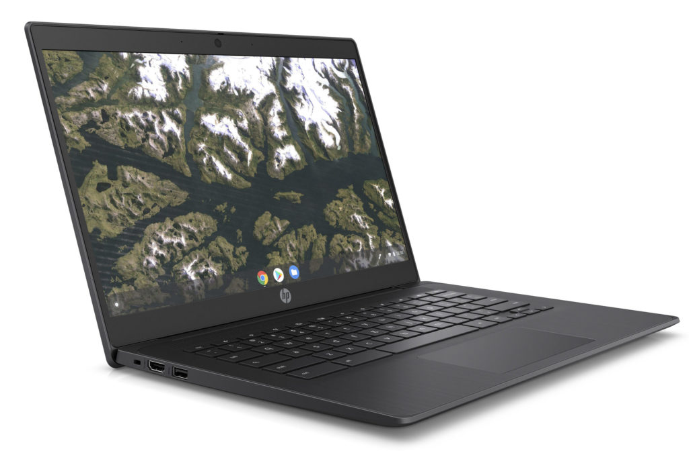
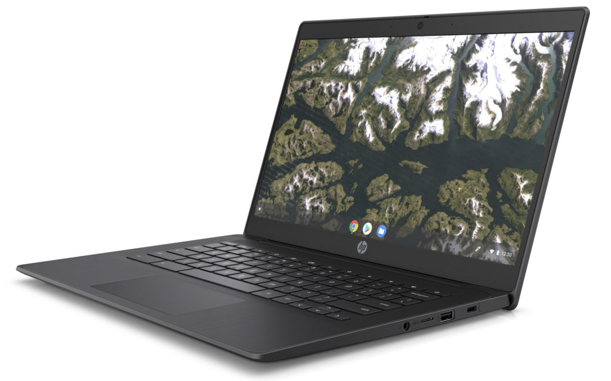
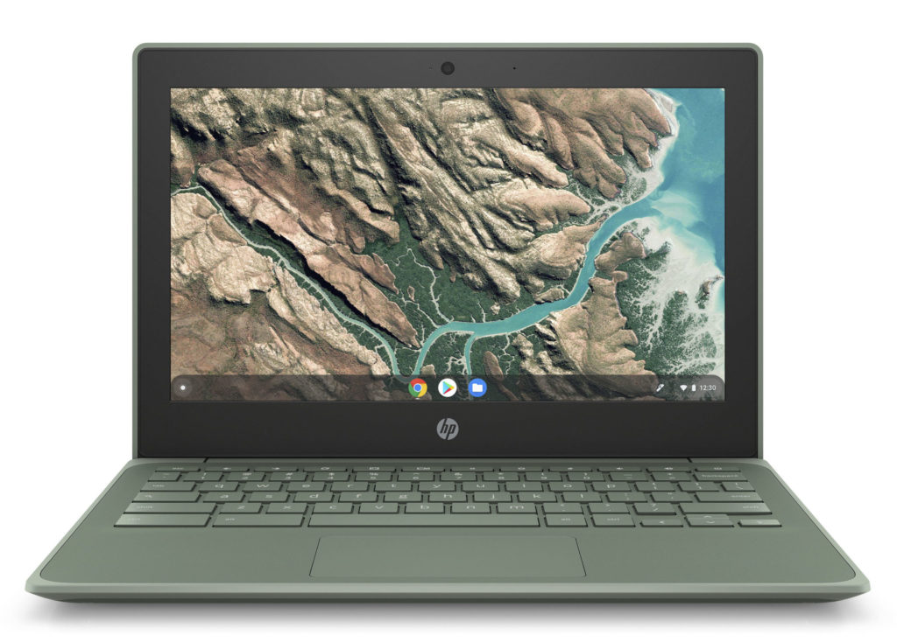
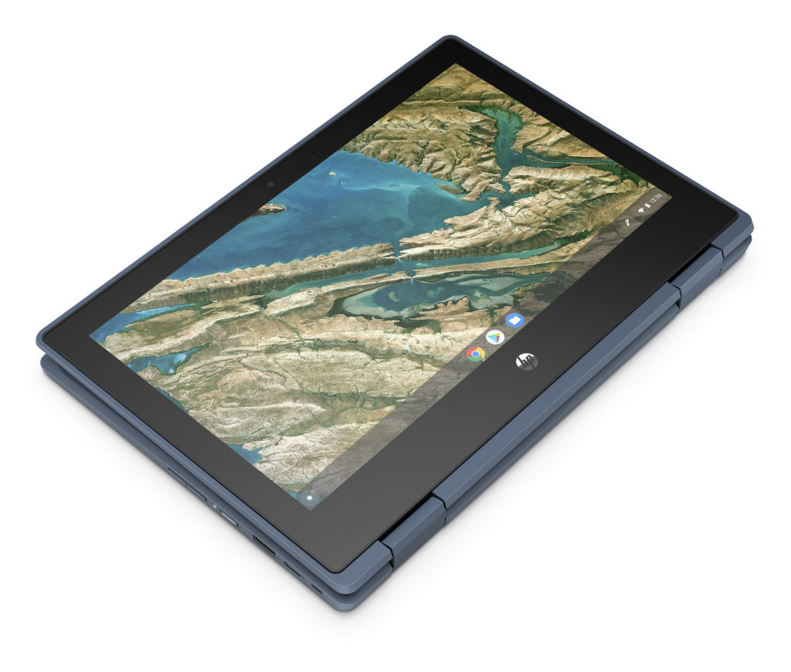
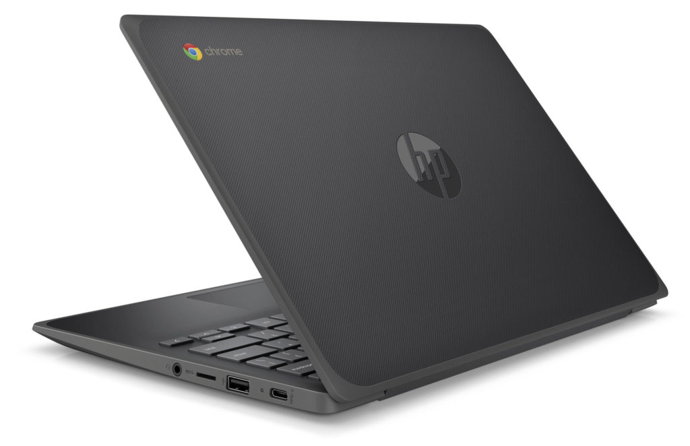

As I noted this morning, this annual BETT education event in London going on now typically brings a few new Chromebooks to the market. This morning we [saw the Acer Chromebook 712](https://www.aboutchromebooks.com/news/acer-chromebook-712-with-32-display-and-ruggedized-features-announced-for-education-market/) and now HP is following that up with four new Chromebooks of its own: Three HP Chromebook 11 G8 variants and one HP Chromebook 14 G6 model.

The starting price for three of these are between $259 and $299, while the fourth one, which is the only device powered by AMD chips, doesn't yet have a price tag but arrives in February, so we shouldn't have to wait long. The remaining three are "available now" according to HP, all use Intel Celeron processors with two having an 11.6-inch screen and the remaining model using a 14-inch display.

I'll start with that one first from a specification perspective, although you'll see similarities throughout the line-up. Here's what you can choose from for the HP Chromebook 14 G6, which starts at $289:

<table class=""><tbody><tr><td>CPU</td><td>Intel Celeron N4000 Intel Celeron N4020 Intel Celeron N4100 Intel Celeron N4120</td></tr><tr><td>GPU</td><td>Intel UHD Graphics 600</td></tr><tr><td>Display</td><td>14-inch, 1366 x 768 or 1920 x 1080 resolution, 45% NTSC, 220 to 250 nits, touch and non-touch options</td></tr><tr><td>Memory</td><td>Up to 8 GB RAM</td></tr><tr><td>Storage</td><td>16 to 128 GB eMMC 5.0, multi-format card reader</td></tr><tr><td>Connectivity</td><td>WiFi 5, Bluetooth 5.0</td></tr><tr><td>Input</td><td>Backlit keyboard optional, multitouch trackpad, 720p webcam, dual-array microphone</td></tr><tr><td>Ports</td><td>One USB Type-C, two USB Type-A (3.1), combo headphone/microphone, HDMI</td></tr><tr><td>Battery</td><td>47.36 WHrs, claimed runtime up to 13.5 hours</td></tr><tr><td>Weight</td><td>3.38 pounds</td></tr><tr><td>Software</td><td>Chrome OS automatic update support through June 2026</td></tr></tbody></table>

I don't really see a lot of innovation here and since the chipsets are a little old, you're only getting Chrome OS software updates for the next 6.5 years.

Just today [Google announced that all new Chromebooks would see 8 years of updates](https://www.aboutchromebooks.com/news/google-announces-8-years-of-chrome-os-software-updates-aue-for-new-chromebooks/), but it appears this a bit of an exception; [this Celeron family debuted two years ago](https://ark.intel.com/content/www/us/en/ark/products/128988/intel-celeron-processor-n4000-4m-cache-up-to-2-60-ghz.html) although the N4020 and N4120 debuted last quarter. And even stranger, this is the only model that HP provided a Chrome OS AUE date for.

Like the new Acer device for education, all of these HP Chromebooks are ruggedized and have a spill-proof keyboard.

Next up are the $259 HP Chromebook 11 G8 EE and $299 HP Chromebook 11 x360 G3 EE.

These are extremely similar but the former is a clamshell while the latter is a 2-in-1 with 360-degree hinge; I've called out differences below:

<table class=""><tbody><tr><td>CPU</td><td>Intel Celeron N4000 Intel Celeron N4020 Intel Celeron N4100 Intel Celeron N4120</td></tr><tr><td>GPU</td><td>Intel UHD Graphics 600</td></tr><tr><td>Display</td><td>11.6-inch, 1366 x 768 resolution, 45% to 50% NTSC, 250 nits, touch and non-touch options, Gorilla Glass (2-in-1)</td></tr><tr><td>Memory</td><td>Up to 8 GB RAM</td></tr><tr><td>Storage</td><td>16 to 64 GB eMMC 5.0 (clamshell) 32 to 64 GB eMMC 5.0 (2-in-1), memory card slot</td></tr><tr><td>Connectivity</td><td>WiFi 5, Bluetooth 5.0</td></tr><tr><td>Input</td><td>Non-backlit keyboard, multitouch trackpad, 720p webcam, dual-array microphone, HP Wacom EMR pen (2-in-1)</td></tr><tr><td>Ports</td><td>Two USB Type-C, two USB Type-A (3.1), combo headphone/microphone</td></tr><tr><td>Battery</td><td>47.36 WHr</td></tr><tr><td>Weight</td><td>2.91 pounds (clamshell) 3.19 pounds (2-in-1)</td></tr><tr><td>Software</td><td>Chrome OS automatic update support: TBD</td></tr></tbody></table>

Again, with Celeron processors and 720p displays, these are ruggedized educational devices for schools on a budget. (And aren't they all?)

Lastly is the HP Chromebook 11A G8 EE model, which is essentially the same as the "non-A" version with the exception of AMD chips in lieu of Intel.

Configurations will include either an AMD A4-9120C APU with Radeon R4 graphics or an AMD A6-9220C APU with Radeon R5. This is the model that arrives in February and has no price as of now.

HP claims that the two clamshell 11.6-inch models are the thinnest ruggedized devices on the market and also touts being the number one Chromebook vendor in the world from Q3 of 2018 to the same quarter last year. Assuming that's true, that trend may continue given the price points of the new models for schools that are ready for a Chromebook refresh.
