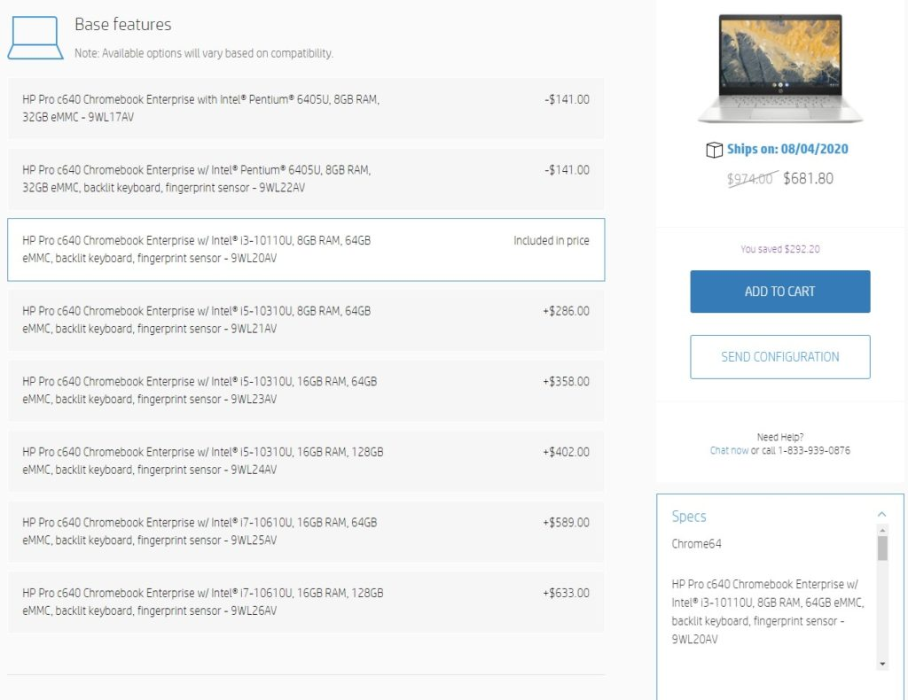
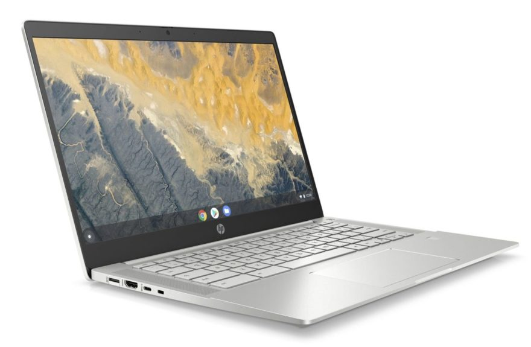
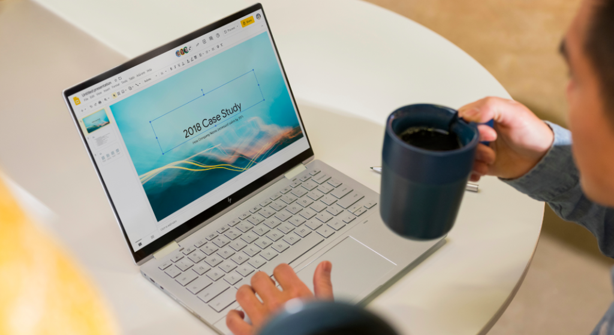

Back in May, HP put its own hat in the Project Athena ring, [announcing the HP Pro C640 Chromebook Enterprise](https://www.aboutchromebooks.com/news/hp-chromebook-c640-c1030-14-g6-lte-enterprise-price-release-date-specifications/) to compete against the [$799 Asus Chromebook Flip C436](https://www.aboutchromebooks.com/news/asus-chromebook-flip-c436-specifications-release-date-price-ces-2020/) and the [$999 Samsung Galaxy Chromebook](https://www.aboutchromebooks.com/news/samsung-galaxy-chromebook-specifications-release-date-price-ces-2020/).

While the HP device is aimed at business workers, many consumers have been waiting to purchase this 2-in-1 and the wait is over. Thanks to a tip from Mike, who already ordered his own, [you can customize and buy the HP Pro C640 Chromebook Enterprise](https://store.hp.com/us/en/pdp/hp-pro-c640-chromebook-customizable-9wl20av-mb), starting at $555 with a current sale and shipment dates of August 4.

Before you get too excited about that price tag, which is noticeably lower than the _other_ two Project Athena Chromebooks you can currently purchase, keep in mind that's a base model with lower-powered internals.

For example, with the Acer or Samsung, you get a 10th-generation Intel Core i3 or i5, depending on the model. The base HP Pro C640 is powered by an Intel Pentium 6405U processor. You still get 8 GB of memory with the HP, just like the Asus and Samsung, which is appreciated.

There's only 32 GB of local storage on the base HP model as well; Asus and Samsung offer more generous amounts of storage capacity ranging from 128 GB to 256 GB. And they use faster storage as well; the HP uses eMMC storage for all of its available models.

To get a more like-for-like comparison then, the HP Pro C640 Chromebook Enterprise with Core i3 and 64 GB of storage currently retails for $681.80. That's about less than the Asus model with the same chip but double the storage.

And if you want the HP with a Core i5 like the Samsung Galaxy Chromebook, you're looking at $882, which is less than the $999 price of Samsung's latest and greatest. You'll miss out on that [stunning 4K OLED display of the Samsung](https://www.aboutchromebooks.com/news/samsung-galaxy-chromebook-hands-on-yes-its-as-nice-as-it-looks/) though if that matters to you.

After reviewing the several configurations available, the sweet spot for most people looks to be the aforementioned Core i3 model. It's a $286 jump to the Core i5 version with the same memory and storage; that seems too much cost for too little gain to me.

For power users who need lots of lots of RAM, there are some 16 GB options for the Core i5 as well as the two Core i7 models. Depending on your processor and storage capacity choice, prices range from $932.40 to $1,124.90 for the top end device.

Regardless of model, all share a built-in fingerprint reader and backlit keyboard (unless you don't want that on your Pentium since there's the same price option with or without these), choice of HD or FHD 14-inch display (splurge $31 on the 1080p option, you'll thank me later) that folds flat, WiFi 6, Bluetooth 5, 60 WHr battery, 720p webcam with privacy shutter, a pair each of USB Type-A and Type-C ports, full-sized HDMI out, and microSD card reader.

Now that the full info on pricing and models are out, was this worth the wait for you, or are you passing by on the HP Pro C640 Chromebook Enterprise for a different Chromebook?
