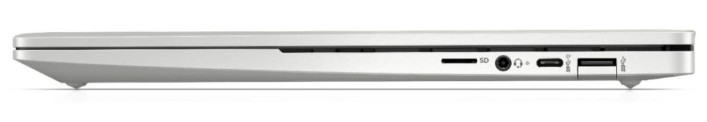
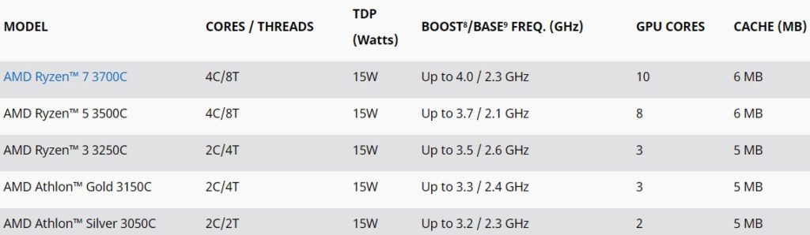
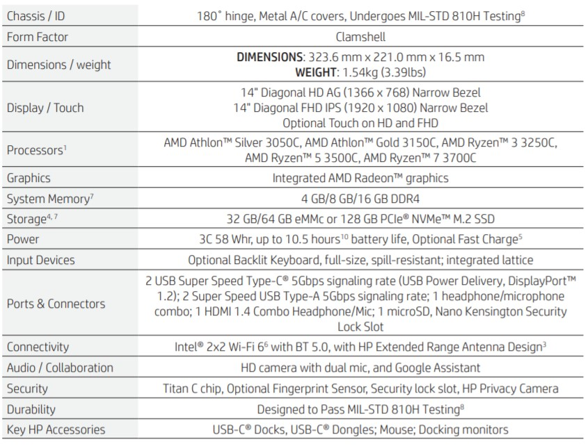
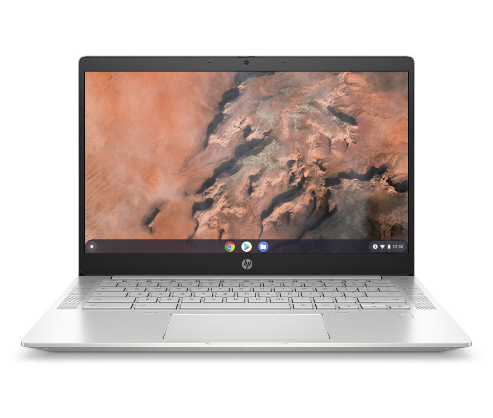
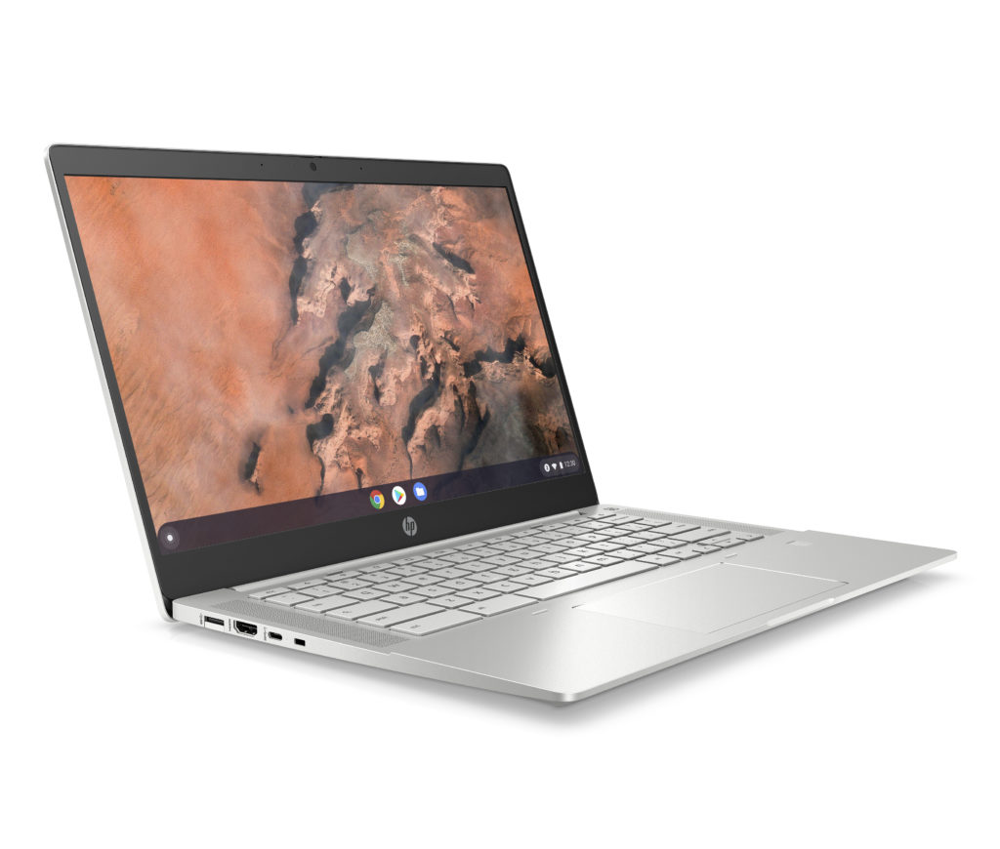
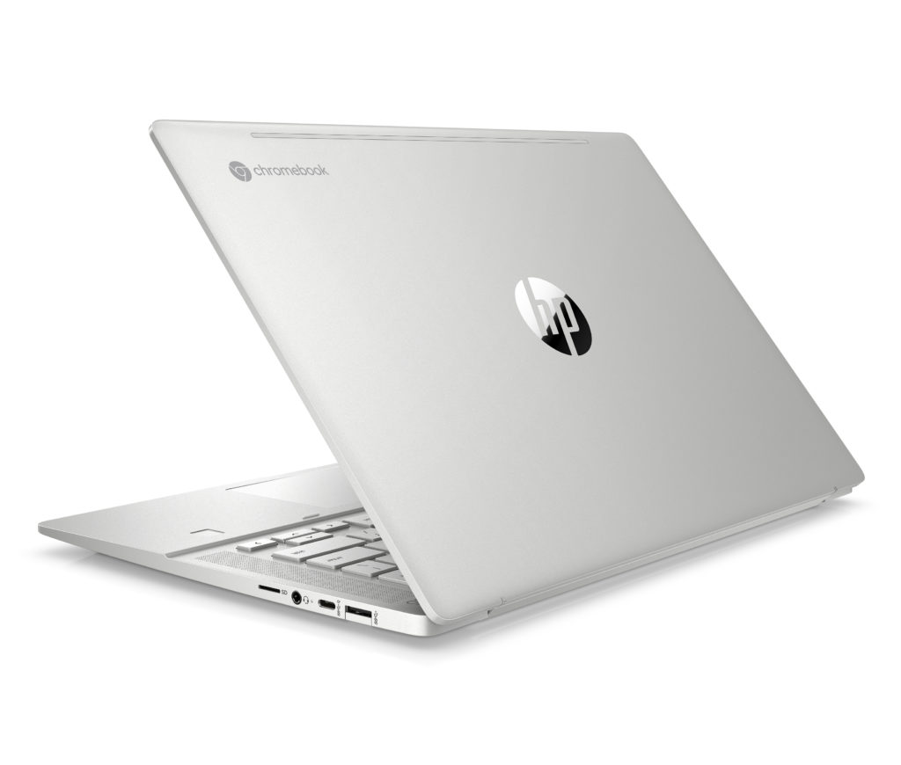

Back in May, HP announced its Project Athena-based Chromebook, [the HP Pro C640 Chromebook Enterprise](https://www.aboutchromebooks.com/news/hp-pro-c640-chromebook-enterprise-release-date-specifications-now-available/). On Tuesday, the company followed up with the [HP Pro C645 Chromebook for business](https://www8.hp.com/us/en/cloud-computing/chrome-enterprise/hp-pro-c645-chromebook.html). What's the difference between a C640 and C645? If you said "5", you'd be right. More importantly, though, the new C645 lineup is powered by brand-new AMD processors in a range of capabilities and prices.

Indeed, you'd be hard pressed to see a visual difference in these two Chromebooks.

Like the previously announced model, the HP Pro C640 Chromebook Enterprise has a 14-inch display in a choice of HD or FHD resolution either with or without touch support. The dual speakers are placed on both sides of the spill-resistant keyboard, which has a backlit option. And you'll see the same configuration of ports: two USB Type-C, two USB Type-A ports with drop-down cover, microSD card slot, and full-sized HDMI output. Plus you get the webcam with privacy shutter first seen on the C640. One key external difference is that this is not a fully convertible Chromebook: The display will go back 180-degrees only.

The inside is where you'll find the most changes, with processors from AMD. For the budget-conscious, there are choices between the [just-announced AMD Athlon Silver 3050C or AMD Athlon Gold 3150C](https://www.amd.com/en/press-releases/2020-09-22-amd-launches-first-zen-based-chromebook-mobile-processors-for-faster-web). Folks looking to spend more money on a processor boost can go with the new AMD Ryzen 3 3250C, AMD Ryzen 5 3500C, or AMD Ryzen 7 3700C. This processor family is part of AMD's push to get into more mid-range Chromebooks, so expect some price and performance competition in upcoming devices.

You can tell that from AMD's press release earlier today:

> Designed in collaboration with Google, the AMD Ryzen and Athlon 3000 C-Series Mobile Processor lineup introduces the first-ever “Zen” architecture-powered Chromebooks with systems from Acer, ASUS, HP, and Lenovo launching in Q4 2020. The AMD Ryzen 3000 C Series Mobile Processors offer up to 212% better performance for multitasking and content creation compared to the previous generation of AMD Chromebooks. With built-in AMD Radeon™ Graphics, AMD Ryzen 3000 C-Series Mobile processors include the most powerful graphics available in a Chromebook.

Here's a run-down on the chipset options and their specifications:

All HP Pro c645 Chromebooks will have AMD Ryzen graphics as a result of these choices; ideally, that will bring improved graphics performance over competing devices. Memory options will include 4, 8, and 16 GB of DDR4 RAM, while storage choices are 32 or 64 GB of eMMC or 128 GB of NVMe M2.

HP says to expect 10.5 hours of battery life on a charge, while you can go from zero to 90% charge in 90 minutes. What HP isn't saying, however, is the pricing. We'll have to wait until we get closer to December availability for the costs.

Here are the full specs and some additional images:

