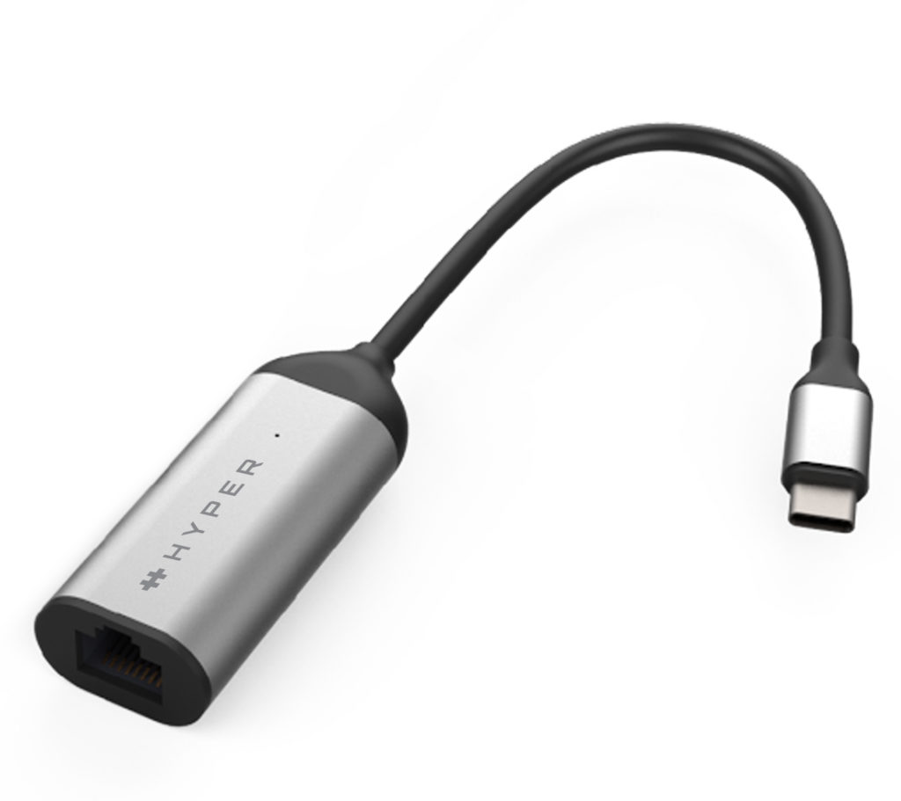
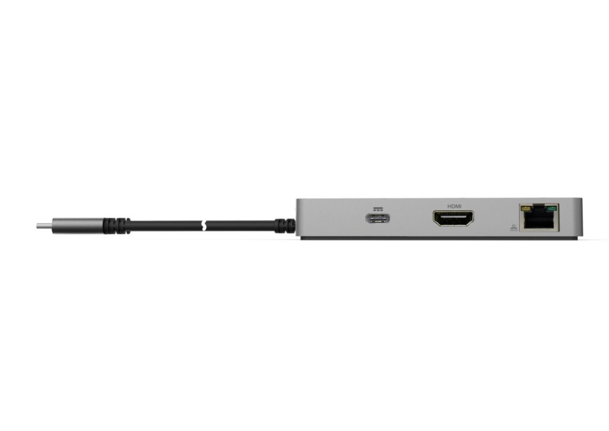
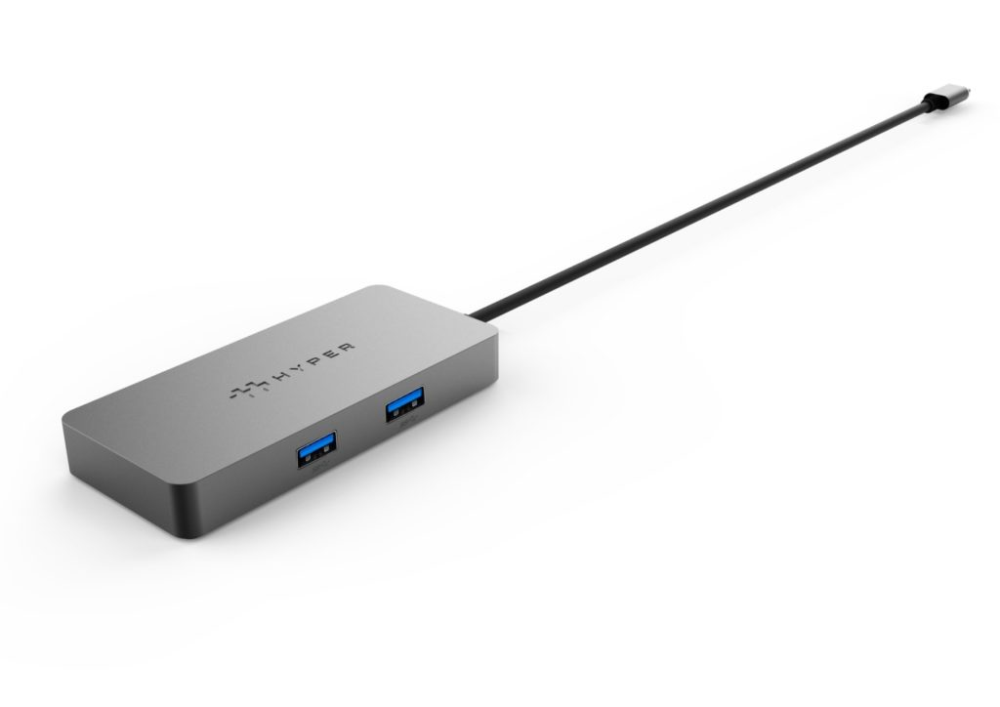
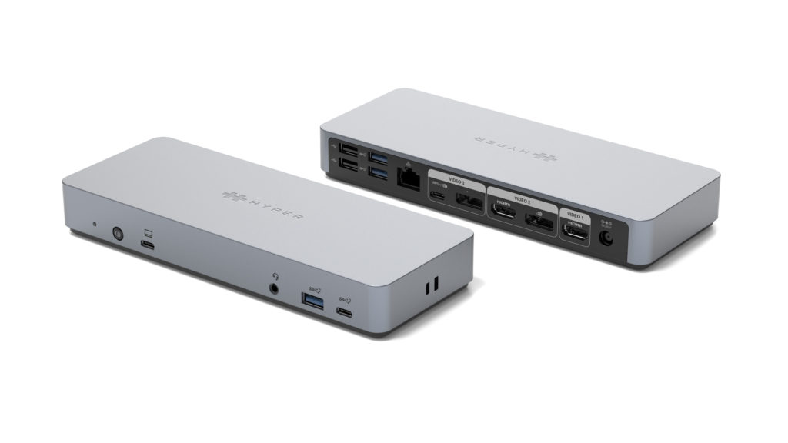

I often hear from Chromebook owners that their device doesn't have enough ports for them. I can sympathize, [having bought a USB-C hub myself that I use daily with my Chromebook](https://www.aboutchromebooks.com/news/the-best-home-and-travel-accessory-for-my-pixel-slate-is-this-usb-c-hub/). You now have more choices that offer guaranteed compatibility as [Hyper has 3 "Works with Chromebook" USB-C](https://www.hypershop.com/blogs/news/hyper-announces-chromebook-usb-c-connectivity-solutions) that were recently certified. All of the new hubs will be available in August.

[Hyper, which earlier this week was acquired by Targus,](https://www.hypershop.com/blogs/news/targus-to-acquire-hyper-by-sanho-corporation) has [previously offered USB-C hubs for Chromebooks](https://www.hypershop.com/collections/usb-c-hubs-for-chromebook), as well as other computers. But these are the first to be certified specifically for Chromebooks through [Google's standard](https://cloud.google.com/blog/products/chrome-enterprise/introducing-works-with-chromebook-docking-stations).

If you just need a faster internet connection and you can have an Ethernet port available, the HyperDrive USB-C 2.5Gbps Ethernet Adapter will do the job. It has an MSRP of $49.99 and supports connections speeds up to 2.5 Gbps.

If you don't mind a slower Ethernet connection and want additional ports, the $79.99 HyperDrive 5-port USB-C Hub for Chromebook fits the bill. You'll have a 1 Gbps wired connection as well as a pair of USB Type-A ports, an HDMI output at HDMI 4K30Hz, and one USB-C with 60W of power delivery.

And for the person that attaches a dozen (or more!) peripherals to their Chromebook, the $239.99 HyperDrive 14-port USB-C Docking Station for Chromebook is for you. I can't see much left out of this hub, although its definitely meant for desk work while the prior two models are easier to tote around.

Here's what you get:

- Supports dual 4K 60Hz or triple 4K 30Hz video output
- Triple USB-A 10Gbps and dual USB-C 10Gbps ports
- 85W USB-C Power Delivery to Chromebook
- Kensington lock
- Optional vertical stand and VEGA mount
- Ports: 2 x HDMI 4K60Hz, 2 x DP 4K60Hz, USB-C 4K60Hz 10Gbps, USB-C 10Gbps, USB-C Upstream PD 65W, 3 x USB-A 10Gbps, 2 x USB-A 2.0, Gigabit Ethernet, 3.5mm Audio Jack, DC 135W

Yeah, that's quite an array of ports and features.

I may order the 5-in-1 model and give it a try as I only use one external monitor. I find that handy [when I'm coding on my Chromebook](https://www.aboutchromebooks.com/news/can-you-learn-to-code-in-a-college-computer-science-program-with-a-chromebook/) or doing a bunch of research where I need a ton of open tabs visible at the same time. My current hub doesn't have an Ethernet port either, and I could easily tap into my mesh WiFi access point in the home office with this model from Hyper.
