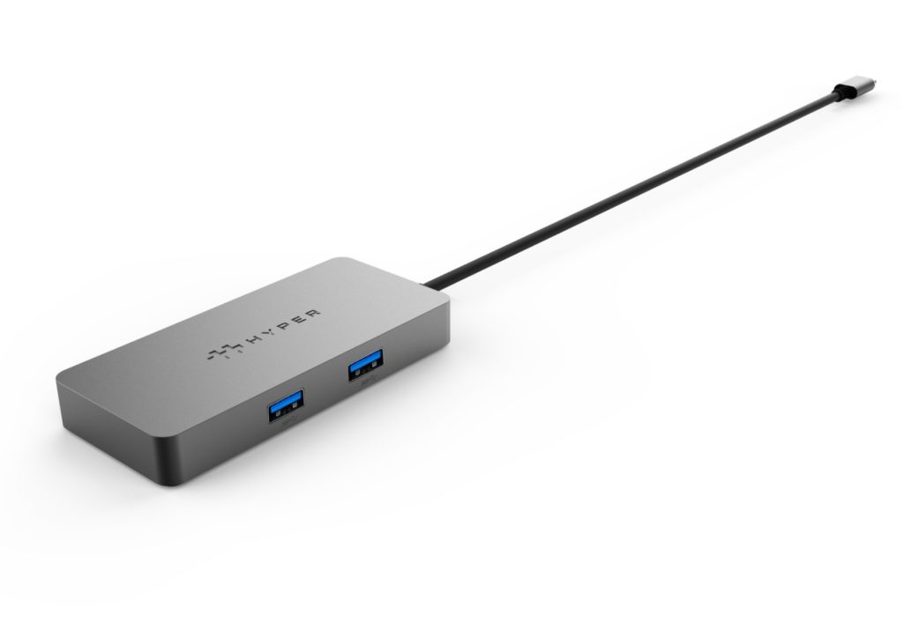

Earlier this year [Hyper introduced some of the first Works with Chromebook docks](https://www.aboutchromebooks.com/news/hyper-has-3-works-with-chromebook-usb-c-hubs/), and now the company is expanding the product line. On Thursday, [Hyper introduced two USB Type-C adapters](https://www.hypershop.com/pages/adapters-docks-and-usb-c-hubs-for-chromebook) that add more capabilities to your Chromebook. One is a USB Type-C to Type-A 10Gbps Adapter while the other is a USB-Type C 4K 60Hz HDMI Adapter. Both products are available today, says Hyper.

The Type-C to Type-A adapter will set you back $19.99 and would definitely be handy for a Chromebook or Chrome OS tablet that either doesn't have a Type-A port or only has one, which is fairly common. So in this case, if you wanted to use a Type-A wired mouse, keyboard, or another accessory such as a USB microphone, this converts a Type-C port for you.

Since the adapter can handle up to 10 Gbps of data transfer, it's also speedy for moving files around between a Chromebook and a camera or external drive that uses a Type-A port.

For $39.99, the USB-Type C 4K 60Hz HDMI Adapter [pipes your Chromebook display to an external monitor](https://support.google.com/chromebook/answer/1060909?hl=en). While that's definitely a good use case, most newer Chromebooks with USB Type-C natively support HDMI or DisplayPort.

So, depending on the Chromebook model you have, you _may_ not need this adapter. Definitely check your device's particular specifications to see if you can already use an external monitor over USB Type-C either with or without a special cable. If you have an older Chromebook, as well as a monitor that uses HDMI for input, this little adapter will let you add that second screen.

With these new adapters, Hyper now has five Works with Chromebook docks, hubs, and adapters.

The previously announced 14-in-1 USB docking station for Chromebooks will be available in November for $239.99. And the $79.99 5-in-1 dock, also announced in May, arrives next month. If you need the USB Type-C 2.5 Gbps Ethernet Adapter for faster, wired network access that Hyper introduced a few months back, that's now ready for purchase at $49.99.

Since all of these are certified under Google's Works with Chromebook program, you don't have to worry about any driver installations. They should just work after connecting them to your Chromebook.

I won't lie: I'm a fan of Hyper products. I don't have any of their Works with Chromebook products, but I did purchase a similar USB Type-C dock for a MacBook Air. The fit and finish are impeccable and all of the ports work as advertised.
