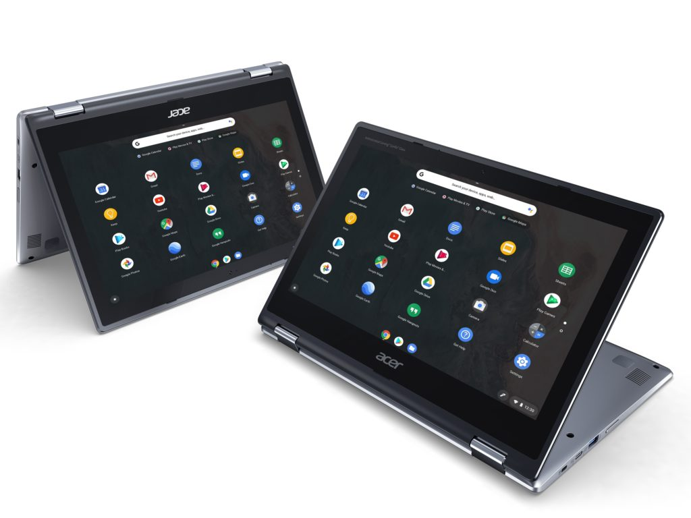
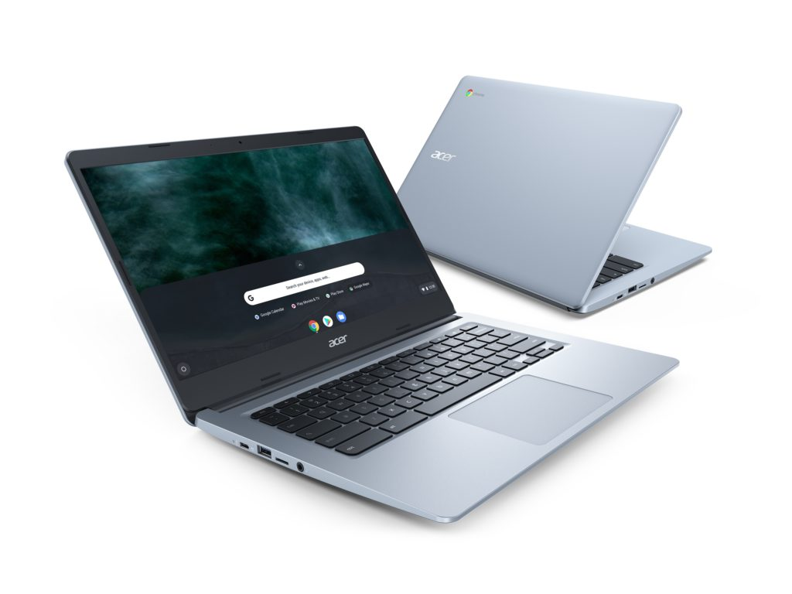
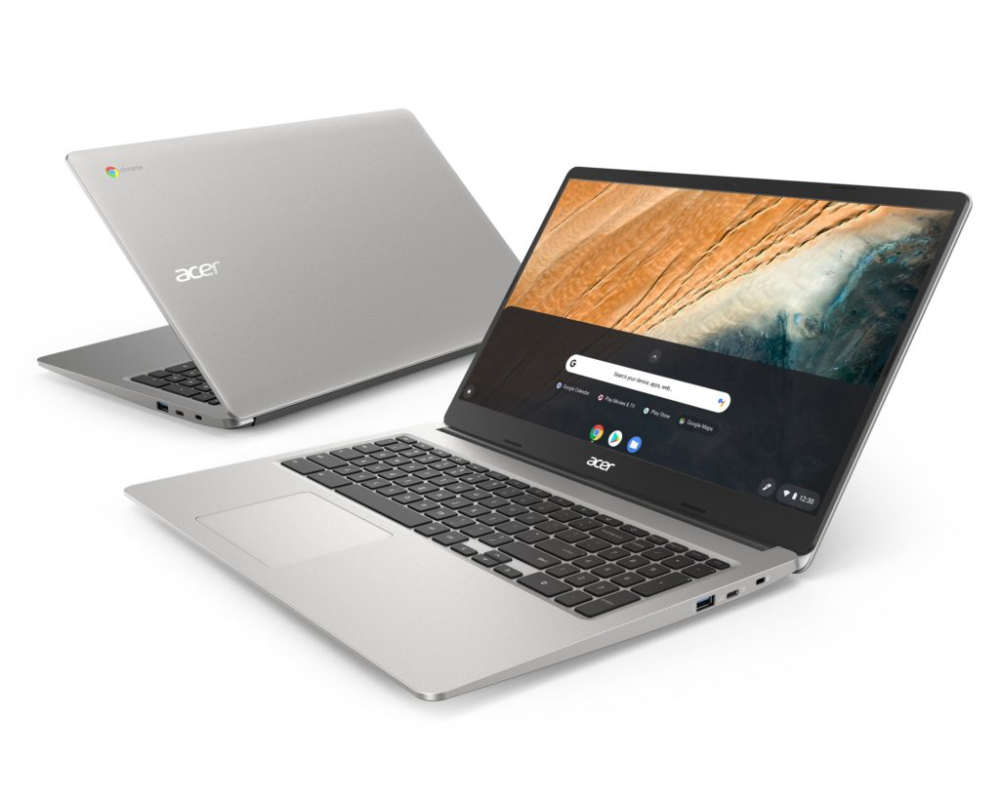

Based on some FCC filings I found earlier this week but didn't report, I knew Acer would have at least one new Chromebook announcement at the IFA 2019 show. I didn't know there would be four, but there are.

[These range in size from 11.6- to 14- to 15.6-inches](https://www.prnewswire.com/news-releases/acer-delivers-full-lineup-of-chromebooks-for-family-fun-entertainment-productivity-300910893.html) with availability in December for the U.S. and a starting price of $249.99. EMEA regions will see these Chromebooks go on sale next month.

First up is the updated Acer Chromebook 311 clamshell with 11.6-inch HD display, available with either touch or non-touch options.

Other specs provided by Acer:

- Intel Celeron Processor
- Google Assistant
- Gigabit Wi-Fi
- Dual-band MU-MIMO
- 10-hour Battery

Next is the similarly sized Acer Chromebook Spin 311, which adds a 2-in-1 mode, shares many of the same specs but includes a Wacom EMR pen.

The new Acer Chromebook Flip 311 will start at $329.99 in the U.S.

Moving up in size and price is the Acer Chromebook 314 which starts at $279.99.

It has a 14-inch HD display, has touch and non-touch options and can be configured with a 1080p screen. Other specs include:

- Intel Celeron Processor
- Google Assistant
- Narrow 7.3mm Bezel & Optional Touchscreen
- 12.5-hour Battery
- Gigabit Wi-Fi

And finally, there's the behemoth: The Acer Chromebook 315 with a full numeric keypad.

Like the 14-inch model, this updated 15.6-inch Chromebook can be configured with a 1080p display, with or without touch. Pricing starts at the same $279.99 for the base model. Official specs are:

- Intel Pentium and Celeron Processor
- Google Assistant
- 12.5-hour Battery
- Built-in Numeric Keypad
- Gigabit Wi-Fi

Note that the smallest three devices can be had with a dual-core Intel Celeron N4000 or quad-core Intel Celeron N4100 processor. You can configure up to 8 GB of memory and 64 GB storage on the 311 and 314, while the Spin 311 tops out at half those capacities.

The Acer Chromebook 315 can be had with 8 GB of RAM and 128 GB of eMMC storage. And you can bump the processor up to an Intel Pentium Silver N5000.

All models have a front-facing HD webcam, Bluetooth 5.0, a pair of USB Type-C ports, two USB Type-A and a microSD card slot. Optionally, you can add a rear camera to the Spin 311.

Since these are in the 300-model series, you can tell by the specs and pricing that these are considered entry-level devices. And we don't yet know the pricing of anything beyond the base configurations shown above. But there's definitely a market for the low-cost Chromebook, whether its for school, basic browsing, and general use.
