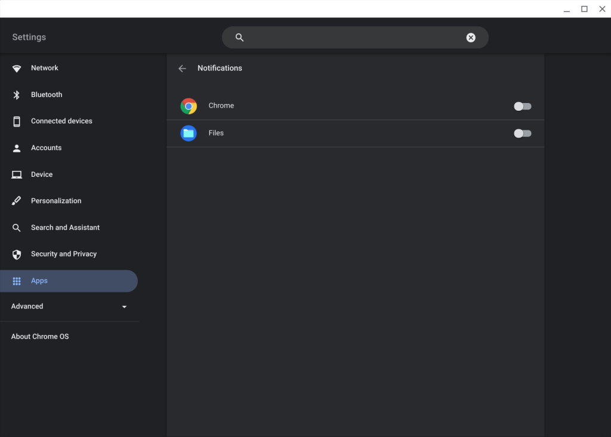

Tired of app notification overload on your Chromebook? Yeah, I'm right there with you. However, that may change in an upcoming software update. According to [Chrome Story,](https://www.chromestory.com/2021/07/manage-notifications-chromebook/) a future version of Chrome OS may get individual app notification settings baked right into the system.

In this screenshot, you can see how this would work, much as it does with Android applications. You'd be able to enable or enable individual app notification settings direction in the Chrome OS settings of your Chromebook.

Granted, there aren't many system apps on a Chromebook, but at least you'd be able to mute notifications you don't want from the browser, Files or other system apps. And as far as web apps go, if they're Progressive Web Apps, or PWAs, this should be an option for that specific web app.

After heavy-duty searching,I [tracked down the bug and code](https://chromium-review.googlesource.com/c/chromium/src/+/3049512) for this effort, finding some of the details. Here you can see that system apps will be registered as part of the new setting service:

Unfortunately, the bug related to all of this code is internal to the Google and Chromium teams. So I can't be sure what Chrome OS version we might expect to see this feature.

My _**hope**_ is that if the basic framework is there, which it appears to be, and testing goes well, we could see individual app notification settings by Chrome OS 94. That's currently scheduled to land on or around October 14, 2021. After that, we skip Chrome OS 95 and go right to Chrome OS 96 as part of the move to a four-week software update cycle. So if the October date is missed, the next window is the end of November.

Oh and I still say the [Chrome](https://www.aboutchromebooks.com/news/opinion-its-time-to-reconfigure-chrome-os-version-numbers/) OS version numbering scheme needs to be recalibrated to something more informational. But that's just me. ;)
