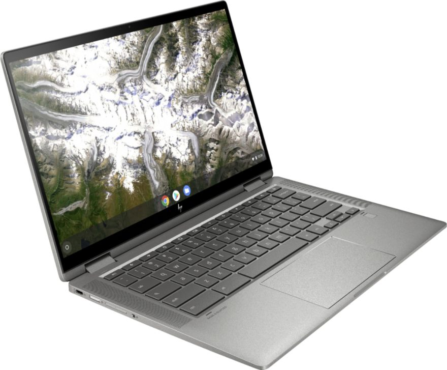
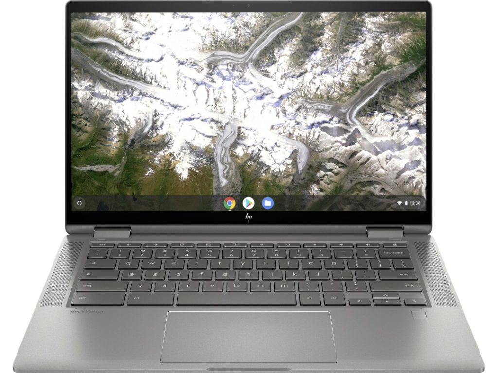

This is about the lowest price I've seen on the [HP Chromebook X360 14c](https://www.aboutchromebooks.com/news/premium-hp-chromebook-x360-14c-launching-this-month-models-priced-from-499-to-629/) and $200 off is a hefty discount for a solid mid-range Chromebook. Normally priced at $629, [the Core i3 HP Chromebook X360 14c is discounted to $429](https://www.bestbuy.com/site/hp-2-in-1-14-touch-screen-chromebook-intel-core-i3-8gb-memory-64gb-emmc-flash-memory-mineral-silver/6407695.p?skuId=6407695), making it a steal for what you get.

If you recall when HP announced the starting price of $499 for this 14-inch 2-in-1, I said to pay attention to the device specifications.

That base model uses a dual-core [Intel Pentium Gold 6405U](https://ark.intel.com/content/www/us/en/ark/products/197888/intel-pentium-gold-6405u-processor-2m-cache-2-40-ghz.html) processor, 4 GB of memory, and 64 GB of local storage.

By getting the $429 special deal, this HP Chromebook X360 14c gets beefier hardware: **a 10th-generation dual-core Intel Core i3-10110U processor, 8 GB of memory, and the same 64 GB of eMMC storage.**

Along with the updated processor and memory, this model has a 14-inch IPS 1920×1080 touch panel with an average but decent 250 nits of brightness and 45% NTSC support. It also has WiFi 6 and Bluetooth 5 support, plus a trio of USB ports: 2 SuperSpeed Type-C and one SuperSpeed Type-A.

The keyboard is backlit and you can add additional local storage via a memory card slot.

The 2-in-1 laptop supports an optional USI stylus and charges over USB-C with an included 45W charger. And it has a handy fingerprint sensor under the right corner of the keyboard as well.

It's hard to find a Chromebook at this price with a Core i3 processor, let alone 8 GB of memory, which I generally recommend as the minimum if possible.

Having more than double the relatively standard 4 GB of RAM offers more headroom to open up dozens of browser tabs or run Android apps alongside the browser. It's not a "must-have" for most Chromebook users but definitely nice to have.

Bear in mind that [HP just announced new, 11th generation Intel Core versions of the 14c](https://www.aboutchromebooks.com/news/new-hp-chromebook-x360-14c-gets-beefed-up-with-11th-gen-core-i3-and-i5-processors/), although that shouldn't scare anyone away. Getting last year's CPU inside the same device at a discount this large is still a good deal. This same device with a newer Core i3 will set you back $649.

[Get this HP Chromebook X360 14c deal](https://www.bestbuy.com/site/hp-2-in-1-14-touch-screen-chromebook-intel-core-i3-8gb-memory-64gb-emmc-flash-memory-mineral-silver/6407695.p?skuId=6407695 "Get this HP Chromebook X360 14c deal")

_**Update**: This post was originally published on Dec. 19, 2020 and the deal is back today._
