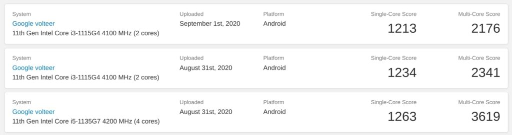

Earlier this year, a new Chrome OS reference board for Chromebooks called Volteer was spotted. Chrome Unboxed, for example, [noted this back in July](https://chromeunboxed.com/chromebooks-webcam-1080p-hdr-low-light-volteer-tiger-lake-intel/). Code commits to the Volteer line-up indicated that Chromebooks built on this board would use new [11th-gen Intel Tiger Lake processors, which debuted earlier this month](https://newsroom.intel.com/news-releases/11th-gen-tiger-lake-evo/#gs.hi6q8m). Within the past month, [three Geekbench results for Chromebooks running on the Volteer reference board have appeared](https://browser.geekbench.com/v5/cpu/search?utf8=%E2%9C%93&q=volteer), giving us a possible glimpse into the performance gains, as well as the types of processors and memory options we can expect.

Both systems under test are the latest Core i3 and Core i5 variants of Intel's Tiger Lake CPUs, which are the new Intel EVO chipsets, and they compare quite favorably over the [highest, most recent Geekbench results from the Samsung Galaxy Chromebook](https://browser.geekbench.com/v5/cpu/search?utf8=%E2%9C%93&q=kohaku) as a reference:

Essentially, you're looking at roughly a 40% performance boost in this single-core benchmark and more than a 55% percent higher multi-core score.

Oh and that Intel Core i5-1135G7 processor in the results? It integrates the new Intel Iris Xe GPU.

Intel says devices built with the EVO processor line have these minimum benchmarks:

- Consistent responsiveness on battery
- System wake from sleep in less than 1 second
- Nine or more hours of real-world battery life on systems with FHD displays
- Fast charging with up to a four-hour charge in under 30 minutes on systems with FHD displays

Now, these are early benchmarks so you can't equate these figures to the total performance gain to be expected from Tiger Lake Chromebooks. There are also other factors involved. However, it _should_ be safe to expect at least a 20 to 25% performance gain when these Chromebooks arrive.

And I do mean Chromebooks, as in plural.

The Volteer reference board now has 10 potential Chromebook variants, [per the Chromium code repository](https://chromium-review.googlesource.com/c/chromiumos/platform/ec/+/2420469): Delbin, Eldrid, Halvor, Lindar, Lingcod, Malefor, Terrador, Todor, Trondo, and Voxel.

That sounds like too many considering there are only a handful of hardware partners that make Chromebooks: Acer, Asus, Dell, HP, Lenovo, and Samsung plus Google itself. But add in a few variants of the same device, such as both a clamshell and convertible, and the options add up quickly.

Aside from the potential performance boost, Tiger Lake chips built on Intel's 10nm process will add a number of other features currently unique to Chromebooks.

I've seen [code commits for Thunderbolt support, for example, as well as USB 4.0](https://chromium-review.googlesource.com/c/chromiumos/platform/ec/+/2420469/4/board/volteer/board.h), which can transfer data at up to 40 Gbps.

So we know that Volteer-based Chromebooks will be a generational jump in terms of performance and capabilities. The next question is: When can we expect them?

Well, Chromium team is still configuring code for the boards as of this week. And it's not uncommon to see early Geekbench scores just to get a sense of performance expectations, with product launches at least 3 to 6 months out. So I'd say between those two data points, we're looking at March or April at the earliest.

Having said that, I wouldn't be surprised to see a repeat of what happened at the 2020 Consumer Electronics Show.

Several of Google's hardware partners introduced new high-end Chromebooks in January with availability to follow a few months later. I'm specifically thinking of the [Samsung Galaxy Chromebook](https://www.aboutchromebooks.com/news/samsung-galaxy-chromebook-specifications-release-date-price-ces-2020/) and the [Acer Chromebook Flip 436](https://www.aboutchromebooks.com/news/asus-chromebook-flip-c436-specifications-release-date-price-ces-2020/). CES is a virtual event this coming January so perhaps together we'll get to see some new Tiger Lake Chromebooks debut.
