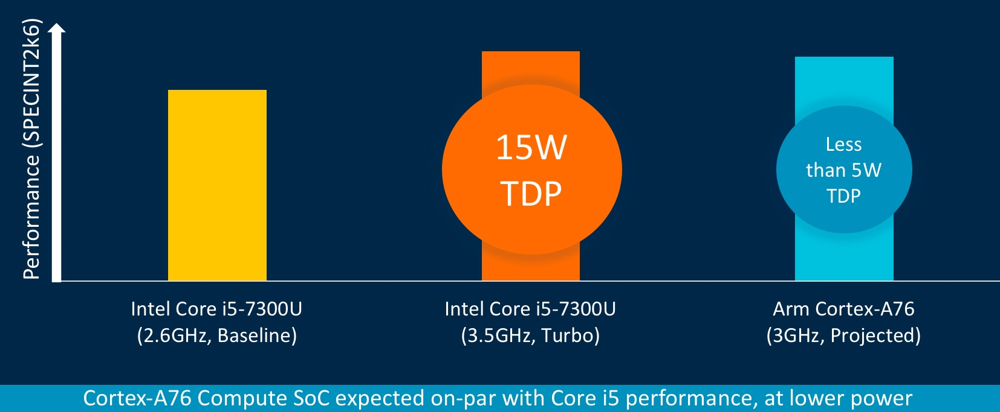
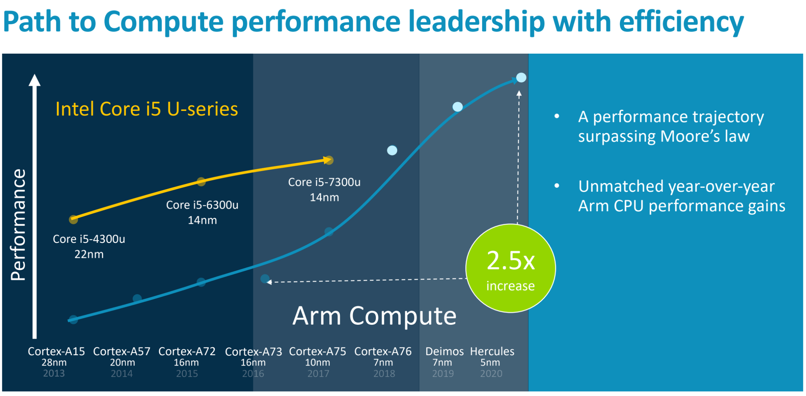

While most of today's Chromebook models are powered by Intel processors, there could be a rise in device choices using Arm chips very soon. That's what I get out of [Arm's public roadmap](https://www.arm.com/company/news/2018/08/accelerating-mobile-and-laptop-performance), which suggests its Cortex-A76 architecture should perform like an Intel Core i5 processor while using much less power.

To be fair, the graphic showing this is a _little_ disingenuous if you don't carefully inspect the information. For example, the Core i5 processor in the above comparison is a seventh-generation chip; that was introduced by Intel back in the first quarter of 2017, i.e.: roughly 18 months ago. Intel now has eight-gen chips available.

Additionally, the power usage of the Intel chip is shown in Turbo mode. The [Core i5-7300U](https://ark.intel.com/products/97472/Intel-Core-i5-7300U-Processor-3M-Cache-up-to-3_50-GHz) can be ratcheted down to 800MHz during times of lighter processing scenarios, in which case the TDP of the chip is 7.5W.

Even so, this is a positive step for Arm processors and illustrates the difference in how we got here.

Intel spent years adding more cores and faster clock speeds at the price of power requirements, which negatively affect run time on a battery charge. Arm started from the bottom up by slowly increasing performance while maintaining low-power requirements. Now we're effectively starting to meet in the middle.

Indeed, Arm is predicting its chips will surpass Intel's in terms of performance while still having devices with longer battery life, all things being equal.

So what does this all mean when it comes to Chromebooks?

I'd anticipate that more Chrome OS hardware partners consider using Arm-based processors in their Chromebooks over the next 12 to 24 months. That may not impact device pricing: In some cases, Arm chips have steadily increased costs for device makers while Intel has generally held cost increases down.

But it would still be a win for Chromebook buyers who wouldn't be sacrificing much -- if any -- performance while getting longer battery life on an Arm-powered Chromebook. We'll get a better sense of that theory when testing the [Cheza Chromebook](https://www.aboutchromebooks.com/news/cheza-lte-chromebook-detachable-snapdragon-845/) -- powered by Qualcomm's Snapdragon 845 Arm-architected chip -- hits markets, possibly by the end of this year.
