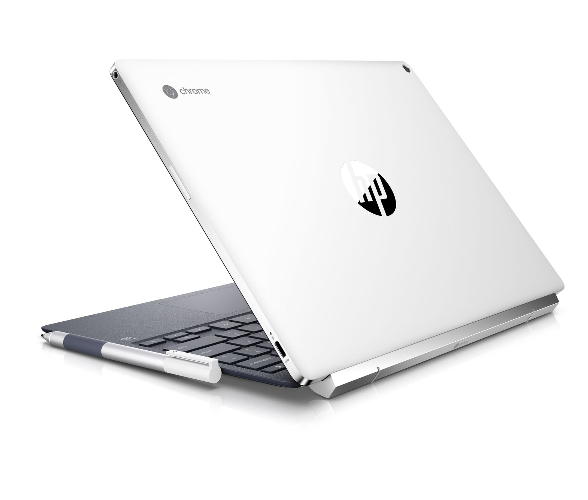

It appears that Chrome tablets will have a range of keyboard docks and bases in the near future and that they'll have slightly different keyboards that we see on Chromebooks today. Even better: These [keyboards may be interchangeable between a single Chrome tablet](https://chromium-review.googlesource.com/c/chromiumos/overlays/chromiumos-overlay/+/1194661/5) according to this code commit description which was first spotted [by 9to5 Google earlier this month](https://9to5google.com/2018/09/05/premium-tablet-keyboard-maker-brydge-making-a-third-party-chromebook-model-w-assistant-key/):

> Add mappings for "Hamburger" and "Assistant" keys on Hammer, Wand, Whiskers, and Wallaby bases. Given that they are either external or detachable and can be shared between devices it makes sense to keep the mappings in a central place instead of keeping adding them to overlays.

So there are two things going on here, with the first being dedicated keys for the "Hamburger" menu choice that provides more options in an app or brings up the Chrome OS control panel. And of course, the "Assistant" key is for Google Assistant, which is supported on the Pixelbook and has [been in the works for non-Google Chromebooks since earlier this year](https://www.xda-developers.com/google-pixelbook-google-assistant-chrome-os/).

The second bit is more exciting, at least to me. It suggests that future Chrome tablets will work with USB or Bluetooth keyboard bases as well as those like the one on the HP Chromebook X2, which uses pogo pins for data and power between the screen and keyboard.

I don't want to read into this too much but Hammer, Wand, and Whiskers all use USB and have both a keyboard and trackpad, per the code. Strangely, Wallaby has no Hamburger key -- at least not yet -- but does have the Assistant key. There's no mention of USB with Wallaby, either, which suggests a wireless connection. Some of these bases could include some kind of stand for the tablet section or as we saw earlier this week, [a stand could be integrated into the Chrome OS tablet](https://www.aboutchromebooks.com/news/nocturne-chromebook-hp-x2-lte/).

There's also the interesting "can be shared between devices" mention in the code commentary. Instead of having a single keyboard accessory choice for a Chrome OS tablet, it sounds like we'll have multiple options, likely from multiple vendors. Think [Belkin](https://www.aboutchromebooks.com/news/acer-chromebook-tab-10-usb-keyboard-stand-belkin/), Logitech and others, including Brydge, which makes keyboards for Apple's iPad line and [is working on at least one for Chrome OS devices](https://9to5google.com/2018/09/05/premium-tablet-keyboard-maker-brydge-making-a-third-party-chromebook-model-w-assistant-key/).

One other note: If you use the browser forward key on your Chromebook today, you might not be happy with the new keyboard bases due to [another change in development](https://chromium-review.googlesource.com/c/chromiumos/overlays/chromiumos-overlay/+/1222789) (emphasis mine):

> Hammer, Wand, Whiskers, and Wallaby have the updated top row keys, with **browser forward removed** and play/pause added.

I tend to use my touchscreen or trackpad for moving forward and back through web pages but it's nice to have a keyboard option. My guess is that the browser back button is used far more often so if one key has to go for a new play/pause button, the forward one isn't a terrible choice.
