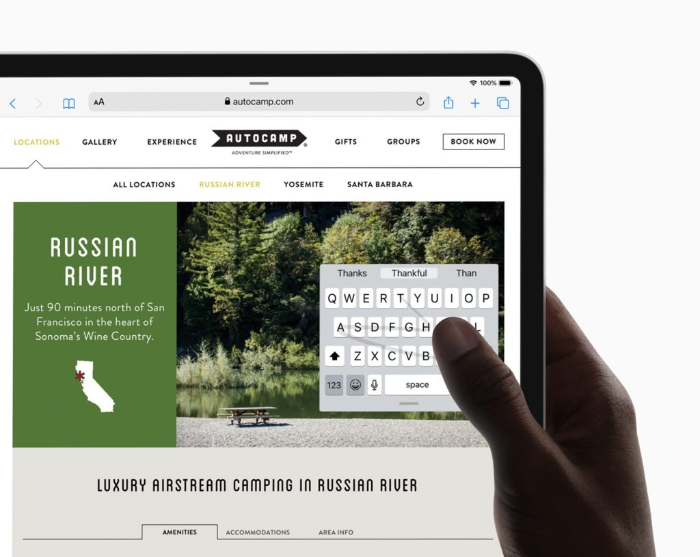

Ask someone why they chose a Chromebook over an iPad and I'm betting the most common answer has to do with the browser. Why? Because iPads run a mobile version of Safari while Chromebooks run the full desktop version of the Chrome browser.

There are plenty of other rational answers to the question, but this one is among the most, if not the most, prevalent.

That key difference between an iPad and a Chromebook is about to disappear, however.

[On Monday, Apple introduced iPadOS](https://www.apple.com/newsroom/2019/06/the-new-ipados-powers-unique-experiences-designed-for-ipad/): A version of its mobile software platform specific to the larger display of iPads. And one of the key features is what Apple calls "desktop-class browsing":

> Safari is more powerful than ever on iPad. iPadOS automatically presents the desktop version of the website, scaled appropriately for the iPad display, and optimizes it for touch, so web apps like Google Docs (_shown above_), Squarespace and Wordpress work great in Safari on iPad. Safari also supports significant new features such as a download manager, 30 new keyboard shortcuts and enhancements to tab management.

Now I obviously haven't used iPadOS yet. It's only just now available for members of the Apple Developer Program and will arrive in a public beta later this month. So I can't yet say if the new iPad browser delivers on the "desktop-class" promise.

I can say that I've owned many iPads and I couldn't do my work as effectively as possible on them because they didn't provide the desktop browsing experience found on a Chromebook. That's the main reason I moved from the original iPad Pro 12.9 to a Chromebook about two years ago.

But now, it's possible -- likely, even -- that someone like me actually could be just as productive on an iPad as on a Chromebook when it comes to using a browser. Both iPadOS and Chrome OS offer a mobile app experience too: iOS apps for the former and Android apps on the latter.

Assuming that Safari on iPadOS is equivalent to Safari on a Mac or Windows device then, some potential Chromebook buyers could decide an iPad is better for them.

I could see this in the mainstream audience as well as enterprise users, for example. I don't think this will move the needle for Chromebook sales in education though. Schools aren't passing up iPads in the classroom because of the browser; it's more about not having a hardware keyboard on the tablets without incurring additional costs.

So why might a Chromebook still be a better option than an iPad? You might think security, but to be fair, Apple's iPad hardware and software are actually designed similar to Chrome OS from that perspective. [Here's an Apple PDF for the curious on that front](https://www.apple.com/business/site/docs/iOS_Security_Guide.pdf).

I'd start with this list to answer my own question:

- Native integration with Google software and services, although [you can happily use an iOS device with Google apps](https://www.aboutchromebooks.com/opinion/can-you-happily-use-a-chromebook-and-an-iphone-yup/).
- Multi-user account profiles; you still can't "share" an iPad the way you can with a Chromebook.
- Linux app support for true desktop apps. This likely only matters to a small percentage of Chromebook buyers, although it's now a new requirement for me so that [I can code for my CompSci classes](https://www.aboutchromebooks.com/news/how-to-code-on-a-chromebook-crostini-pixel-slate/).
- A wider range of form-factor and hardware choices.
- Far faster and seamless software updates.

Obviously, we all have different use cases and device needs, so if an iPad is best suited to meet them, you should buy an iPad. For now, a Chromebook ticks off all the right boxes on my list. It will be interesting to see, however, how many people deciding between the two opt for Apple's tablet over a Chrome OS device.

Chime in and let me know what other advantages or reasons you'd go with a Chromebook over an iPad. Or better yet: Does this change what your next device might be?
