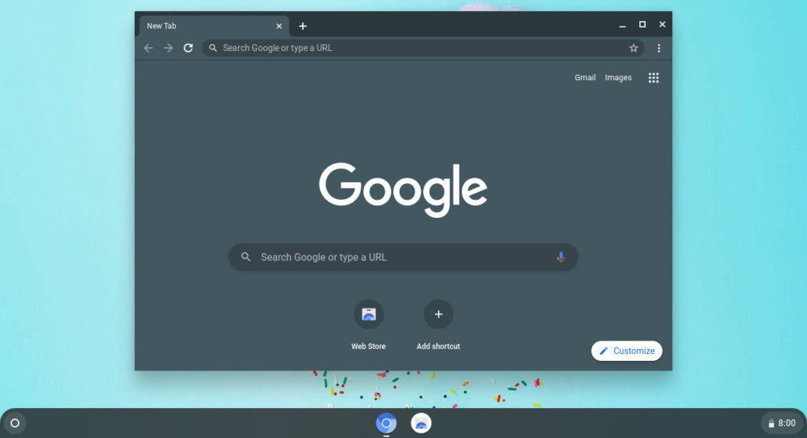
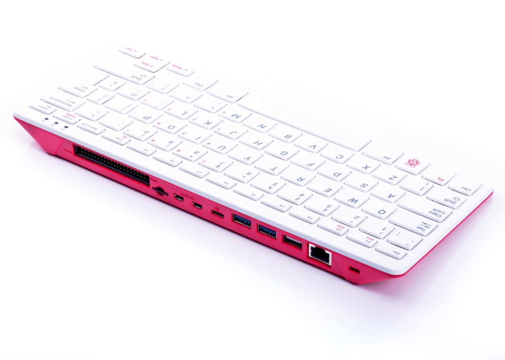
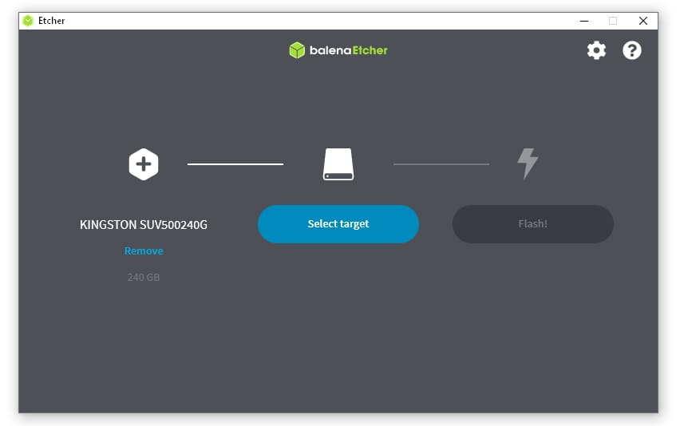

By The Chromium Authors/Google - My screenshot of the desktop, CC BY-SA 4.0, https://commons.wikimedia.org/w/index.php?curid=91120137

Given that I can't still for long, I tend not to use [stationary computers such as Chromeboxes](https://www.aboutchromebooks.com/tag/chromeboxes/). Still, these small desktop machines offer the same Chrome OS experience as their mobile counterparts: Chromebooks and Chrome OS tablets. And yet some people aren't sure about the Chrome OS on a desktop device. How can you answer the question of is a Chromebox right for you without actually spending hundreds of dollars? There's an inexpensive way to try Chromium OS on a Raspberry Pi to find out.

I was reminded of this by [Craig McGinty on Twitter](https://twitter.com/craigmcginty/status/1445014019958583304?s=20). Earlier this week he shared this fantastic video tutorial for installing the open-source Chromium OS platform on a Raspberry Pi:

https://www.youtube.com/watch?v=0dVd5M04u20

Christopher Barnatt put in the effort here and deserves all the credit; you can [follow his work on YouTube](https://www.youtube.com/c/explainingcomputers/) or his site, [Explaining Computers](https://www.explainingcomputers.com/).

Before you either watch the video or dive into building your own Chromebox (of sorts), just a few caveats.

First, because this is Chromium OS on a Raspberry Pi and not Chrome OS, some of the Google proprietary features won't be available. For example, Android app support is unique to Chrome OS, so you won't be able to use or test any mobile apps. The Linux container option is part of Chromium OS if that's important to you, although you'll be constrained by your hardware. This will be good for basic Linux testing but not for hard-core usage that requires a powerful device.

Second, you may need to invest a little in some hardware because this solution is officially supported on four Raspberry Pi products: The 3B, 3B+, 4B, and the Raspberry Pi 400 computer.

If you recall, [that's the low-cost all-in-one Raspberry Pi computer I suggested for younger students when Chromebooks were hard to find in stock.](https://www.aboutchromebooks.com/news/school-chromebooks-sold-out-alternative-options-cloudready-raspberry-pi/) You can pick up a 4 GB Raspberry Pi 400 computer for just under $100 on Amazon but don't forget to add a power supply. Or, if you already have a keyboard and mouse, the Raspberry Pi 4B kit with 8 GB of memory, a case, microSD card, and power supply [can be had for just under $150](https://amzn.to/3BupXhK).

Considering base model Chromeboxes start around $250 to $300, this can save you some money for trying Chromium OS and you can always use the Raspberry Pi hardware for any other computing project in the future. Then again, you might have a spare Raspberry Pi lying around; I have a few as they're handy little devices!

FydeOS, the folks behind a Chromium-based distro of the same name, [has a downloadable Chromium OS image here](https://github.com/FydeOS/chromium_os-raspberry_pi/releases/tag/r92). You'll need that as well as an app to flash the image to a microSD card; Barnatt recommends [Balena Etcher](https://www.balena.io/etcher/), which I second. I've used that app many times in the past to create bootable system images. With your bootable microSD card flashed, you just insert it to your Pi, boot up, and you'll see what looks like the standard Chrome OS setup screen.

You'll have to enter a Gmail address, just like on Chrome OS, to use Chromium OS. And both the interface and experience are practically the exact same as using a standard Chromebox, Chromebook, or Chrome OS tablet. The only differences are the Google proprietary bits that I mentioned previously.

Note that in the above video, you'll see this setup is capable of streaming a full Windows desktop if you [subscribe to Microsoft's Windows 365 service](https://www.microsoft.com/en-us/windows-365). The only downside there if you wanted to try that is that it's currently meant for businesses and enterprises. Given that [Google Stadia may work on Chromium-based browsers](https://support.google.com/stadia/answer/9598981?hl=en), I'm betting you might be able to do some high-resolution cloud gaming though.

As you can see in Barnatt's hands-on video, this gets you a solid test bed for the Chromebox experience. With a minimal amount of elbow grease and a low-cost hardware investment, this approach might help determine to answer the question: Is a Chromebox right for you? Or maybe this would give you just enough performance and flexibility to use as a Chromium OS-based "Chromebox" for a while. Either way, it's an option.
