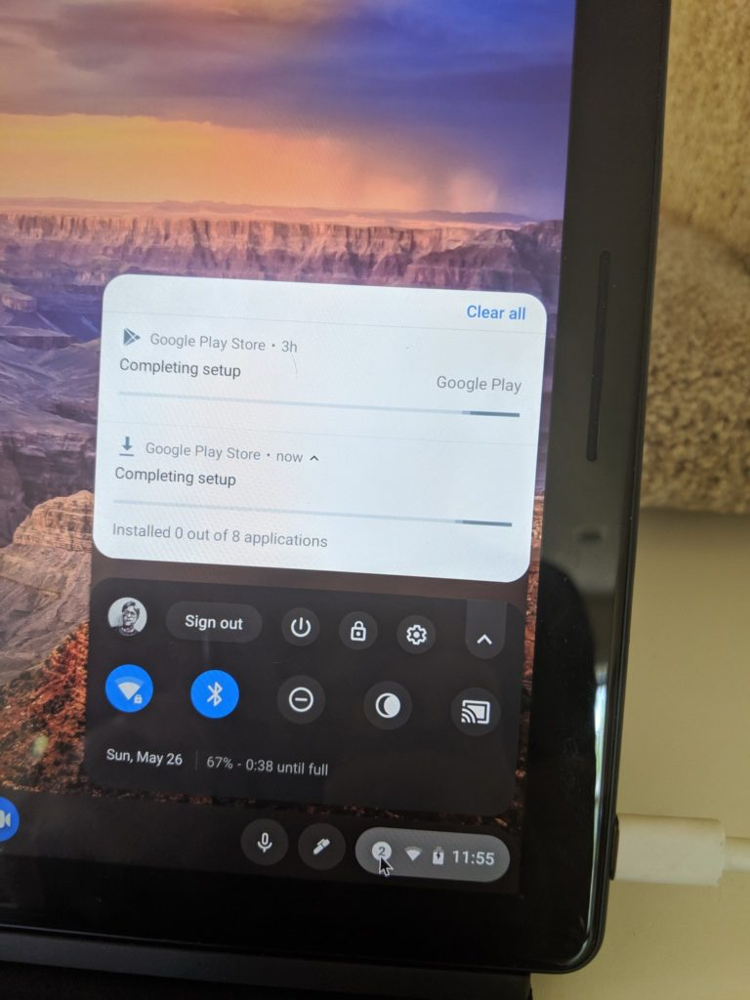
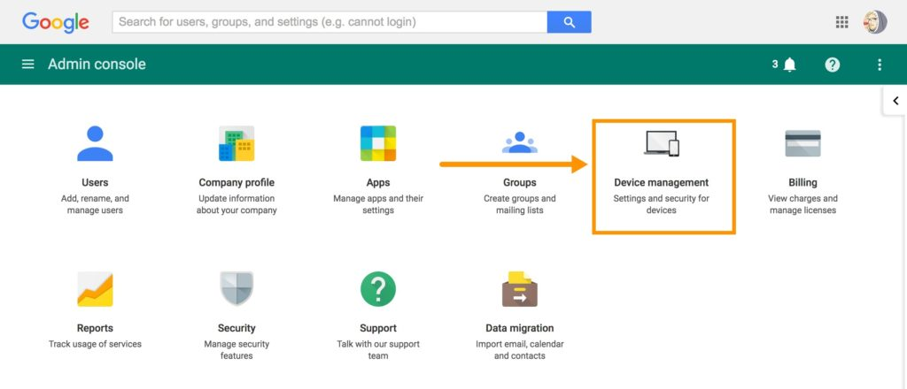
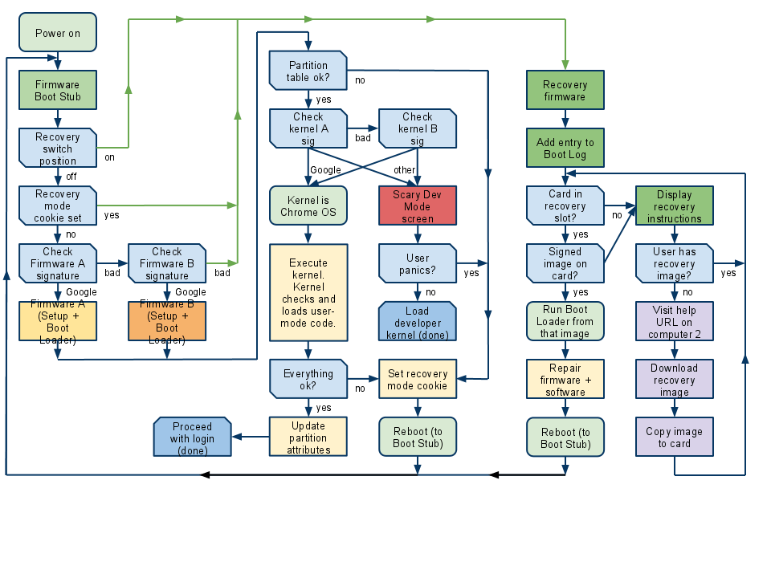

The release of the [Chrome OS 75 Stable Channel](https://www.aboutchromebooks.com/news/chrome-os-75-stable-version-released-what-you-need-to-know/) has opened my eyes to something: Chrome OS automatic updates may be a little too automatic, and not in a good way.

Chrome OS 75 was first delayed from its expected release date by about two weeks. Almost immediately after the update started hitting Chromebooks, [it was paused](https://www.aboutchromebooks.com/news/chrome-os-75-stable-channel-update-release-rollout-paused-for-chromebooks/), presumably to fix some major issue or issues, and [then arrived on a single device](https://www.aboutchromebooks.com/news/chrome-os-75-stable-channel-version-rollout-resumes-on-a-limited-basis/), likely for testing purposes. Finally, it arrived for all still supported Chrome OS devices.

Here's the thing. While automatic updates in the background are generally a good thing - heck, they're one of the key selling points of a Chromebook - situations like this remind us that no system is perfect. Therefore, there needs to be some type of customer mitigation option.

I say that because I read dozens of complaints from Chromebook owners during this release rollout. Many had major issues during the Dev and Beta timeframe, which of course, is to be expected. But by major, I mean major: [The Google Play Store couldn't access the web](https://www.reddit.com/r/chromeos/comments/ccbekv/android_apps_suddenly_say_they_have_no_network/), for example; a situation I myself experienced. Removing and re-installing the Play Store didn't help and that process took several hours.

Some folks also lost access to their Crostini container, meaning they could run their Linux apps or get at any data files stored there.

What's the recourse for problems like that? You can always hop on to the Stable Channel. But, as Google notes on its relevant support page, this is a "powerwash":

> Switching from an experimental channel to a more stable channel will delete everything from your Chromebook, like downloaded files, photos, owner permissions, and saved networks for all accounts.

So while it's an option, it's not ideal for some. This is the perfect time for me to raise a few of my pro-tips.

First, I wouldn't run the Dev or Beta Channels on a primary device. I have several Chromebooks, so I run one with Dev or Beta and one with Stable, for example.

Second, don't store any files locally that you just couldn't live without. My Downloads folder is literally a temporary storage facility and each night, I clean it out. Anything I need to save beyond one day goes right up into Google Drive as soon as it can because that's how I roll.

Back to automatic updates. Once they're downloaded and you restart you Chromebook, you boot up into a drive partition with the updated platform. There's no real recourse other than the powerwash. Well, I guess you could simply never shut down your Chromebook, but that's not a great strategy.

So here's what I'd like to see.

Similar to how [managed Chromebooks can be flagged not to automatically update Chrome OS](https://support.google.com/chrome/a/answer/3168106?hl=en), non-managed devices should get that option too. By managed Chromebooks, I mean those tied to GSuite, not Google, accounts and are managed centrally in a work or education setting.

After all, not every consumer wants to immediately have their software platform changed; at least not for a few days or a week in case of any issues such as those we saw with Chrome OS 75. Give device owners a clearly explained setting to delay automatic updates for up to a week. Even if that setting expires after seven days, it's a better option than _not_ having an option.

And although I'm sure there's more going on behind the scenes with the dual partition process that Google uses to "instantly" update Chrome OS, why not have a revert option? If the secondary partition holds the old Chrome OS system software, provide a user choice to reboot back into it; essentially flipping environments at boot time?

Again, there may be technical limitations in the way the update process is currently designed to handle this idea, but I'm sure it's possible. And it would potentially eliminate any powerwashing or data loss, getting people back to their Chromebook activities in under a minute.

It seems to me, based on the Chromium OS documentation, that this could be part of the [rollback protection after update](https://www.chromium.org/chromium-os/chromiumos-design-docs/boot-design#TOC-Interactions-with-Install-Recovery-and-Update) flow. Currently, once there's a successful boot up in the updated software partition, the old one is expired and can't be used, as I understand it.

Am I off my rocker and only making the situation worse by adding complexity to one of the simplest operating systems on the market? Chime and let me know what you think or if the Chrome OS 75 rollout caused you any downtime or other issues. Maybe if there's enough of us on board for some changes, we can open up a bug and make a good system even better.
