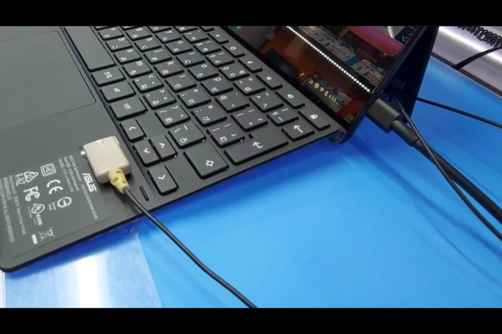
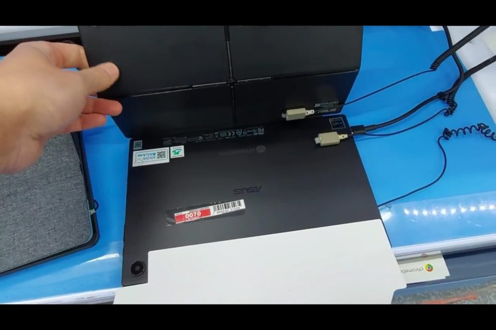

We're still waiting for the [Asus Chromebook Flip CM3 detachable](https://www.aboutchromebooks.com/news/asus-chromebook-flip-cm3-tablet-is-official/ "Asus Chromebook Flip CM3 tablet is official"), and [the CM3 convertible for that matter](https://www.aboutchromebooks.com/news/asus-chromebook-flip-cm3-convertible-specs-show-few-surprises/ "Asus Chromebook Flip CM3 convertible specs show few surprises"). However, [a Redditor got a sneak peek at the detachable CM3](https://www.reddit.com/r/chromeos/comments/mhyuhm/not_professional_lenovo_duet_and_asus_cm3/) meant for Asian markets. He got a look at it next to its closest competitor. Have a look at the keyboards on video with Lenovo Duet Chromebook vs Asus Chromebook Flip CM3.

There are a few things to notice right off the bat between these two detachable keyboards.

First, the key travel on the Asus Chromebook Flip CM3 appears to be greater. I've used the Lenovo Duet Chromebook keyboard quite a bit and while it works fine, I'd personally prefer a little more key travel. I don't want to feel like I'm barely tapping the keys downward before bottoming out.

That's just me though and a personal preference. Many people are more than happy with the Lenovo Duet Chromebook keyboard feel when typing.

Second, however, is something that I think we can almost universally agree upon. The Microsoft Surface-like magnetic attachment mechanism on the CM3 keyboard will add much more stability on a lap.

The Lenovo keyboard attaches to the base of its companion display through a few small magnets. So too does the Asus keyboard but it also has more magnets in the hinge section.

That lets you attach the back of the keyboard to the bottom bezel of the display for additional stability. There should be less "wobble" when using the Asus Chromebook Flip CM3 away from a table or flat surface.

You also get a slight keyboard incline too since the keyboard front is now lower than the back.

As an extra bonus, we get to see the innovative dual-orientation stand for the Asus Chromebook Flip CM3.

It hinges in both landscape and portrait mode so you can watch content or have a video chat hands-free in either direction with this Chrome OS tablet. Keep in mind, however, that the video camera is set up for video chats in landscape mode, unlike Apple iPads.

Personally, I'm more interested in this detachable CM3 model after seeing the [lesser specs of the similar convertible option](https://www.aboutchromebooks.com/news/asus-chromebook-flip-cm3-convertible-specs-show-few-surprises/ "Asus Chromebook Flip CM3 convertible specs show few surprises"). And I'd rather have a tablet when I want for content and basic browsing, but the ability to add a keyboard as needed for getting work done. We just have to wait on price and availability before any of us can make a decision.
