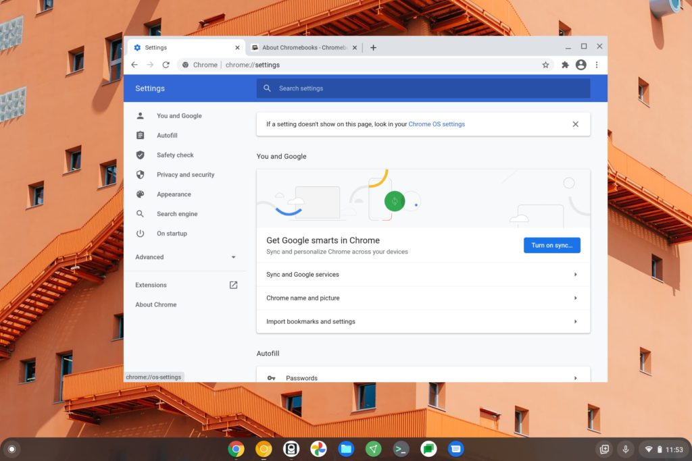
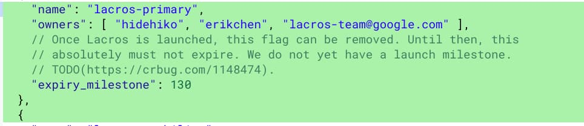

A new experimental flag to make [Lacros](https://www.aboutchromebooks.com/news/what-is-lacros-for-chromebooks-and-why-does-it-matter/ "What is LaCrOS for Chromebooks and why does it matter?") the primary browser on a Chromebook was found this week. [Chrome Story reports that the flag isn't yet available](https://www.chromestory.com/2021/03/lacros-primary-chromebook/) but should be soon, at least in the Canary Channel. Before you search for the flag to enable it once it arrives, it's work taking a look at Lacros vs Chrome and Chrome OS on Chromebooks.

## What is Lacros?

If you haven't heard of it before, Lacros is a standalone browser that runs on Chrome OS, and therefore, on Chromebooks.

That may sound odd because Chrome is the default way to browse the web on these devices. But it makes more sense when you realize that LaCrOS is essentially the Linux version of Chrome.

That means it offers the same experience as running Chrome on a Linux desktop or laptop. And it means that Google can make good on its promise to decouple the Chrome browser from ChromeOS. At some point, Lacros will be the default or primary browser on Chromebooks.

[Google's own documents on Lacros](https://chromium.googlesource.com/chromium/src.git/+/master/docs/lacros.md "https://chromium.googlesource.com/chromium/src.git/+/master/docs/lacros.md") spell this out:

> Lacros is an architecture project to decouple the Chrome browser from the Chrome OS window manager and system UI. The name comes from **L**inux **A**nd **C**h**R**ome **OS**.

It's likely that you won't even notice during most activities other than configuring different settings on your device. Once Lacros is generally available, you'll configure browser-specific settings in the browser and Chrome OS settings in the current Settings app. There's even a link in the Lacros settings to the Chrome OS settings to remind of you this.

Browser only settings in Lacros

## Why is Google doing this?

Simply put, by decoupling the browser from Chrome OS, [Google gains some logistical advantages](https://www.aboutchromebooks.com/news/what-is-lacros-for-chromebooks-and-why-does-it-matter/ "What is LaCrOS for Chromebooks and why does it matter?").

As Chrome OS stands today, any Chrome browser updates for new features, bug fixes, or security reasons, must be integrated into a Chrome OS release. That adds complexity since Chrome OS itself is changing every six weeks or so. Some of the browser bits might impact Chrome OS or block upcoming features. So this model isn't efficient.

Once the browser is separate from the operating system, efficiencies are gained. Google can push browser-only updates to Chromebooks at any time, just as it does for Chrome on Windows, macOS, and Linux.

Additionally, this will enable Chromebooks to run different versions of Chrome OS and the browser, again, per the official documentation.

This _could_ potentially extend the life of some older Chromebooks that are beyond their [Chrome OS support expiration date](https://www.aboutchromebooks.com/news/google-announces-8-years-of-chrome-os-software-updates-aue-for-new-chromebooks/). While the operating system wouldn't receive updates, the browser could. And that would support safer browsing on such devices. I personally don't think that's Google's long-term strategy but I could be wrong. My thought is that the [Neverware purchase has a better chance of delivering more updates to older devices](https://www.aboutchromebooks.com/news/google-acquires-neverware-cloudready-chrome-os-chromebooks/ "Google acquires Neverware, the company that brings Chrome OS to older laptops with CloudReady").

## Can I try Lacros now?

In short, yes.

However, the Lacros browser isn't enabled by default and won't likely be for some time. I say that because when looking at code commits and comments for the new Lacros primary browser flag, I noticed that there specifically hasn't been a target release date for Lacros.

Indeed, the current flag to use Lacros at all isn't set to expire until Chrome OS 98, which is at least 6 to 9 months away.

Still, you can try the browser now. Simply head over to [chrome://flags/#lacros-support](//flags/#lacros-support "chrome://flags/#lacros-support") to enable it. Once you restart your browser, you'll see a second browser icon.

Lacros is in yellow, while your standard Chrome icon is multicolored. You can run instances of both at the same time as they're completely separate applications. You can also sign in with your Google account and have your browser settings synchronize over.

## Will there be a real difference between Chrome and Lacros on Chrome OS?

As I mentioned, most people won't really experience a difference once Lacros is the one and only browser on Chrome OS, aside from the settings. All Chrome functionality on a Chromebook should be the same at that point. However, this is also the reason Lacros isn't yet the default browser on Chromebooks.

There are tons of APIs and hooks between the Chrome browser and the Chrome OS system. Google is essentially rebuilding those into Lacros, and even changing up some of the rendering methods. That kind of effort takes time to make and test all of the changes. And it's particularly challenging as Chrome OS itself is a moving target with new stable releases every 6 weeks.

In the end, however, end users won't be radically affected. Lacros will likely be called "Chrome" instead of the project code name. The browser icon will look just like the current Chrome browser once the transition is over and we'll go from two native browsers back to one.

Of course, you can still download other browsers using the Linux container on a supported Chromebook. That won't change. You can install Brave, Firefox or whatever you want to browse the web as long as it has Linux support. Just remember that any alternative browser won't be your default or native browser on a Chromebook.
