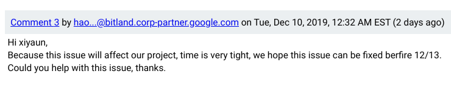
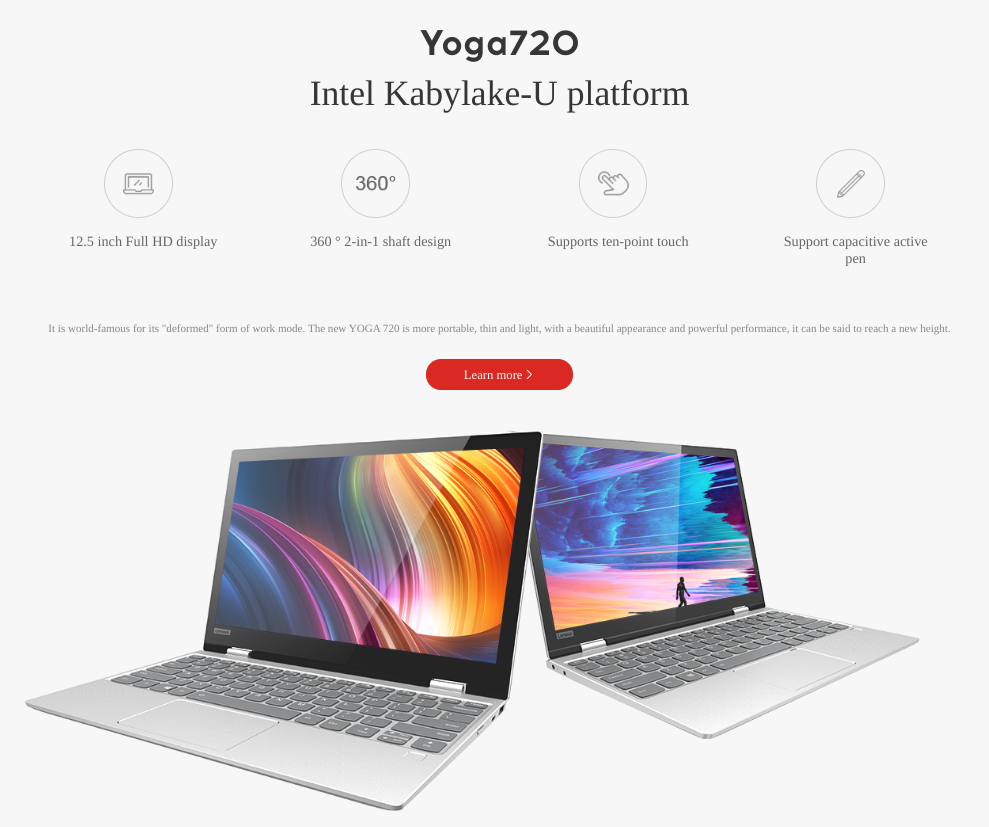
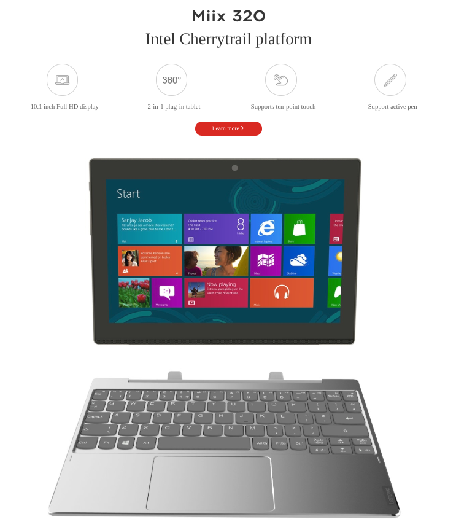
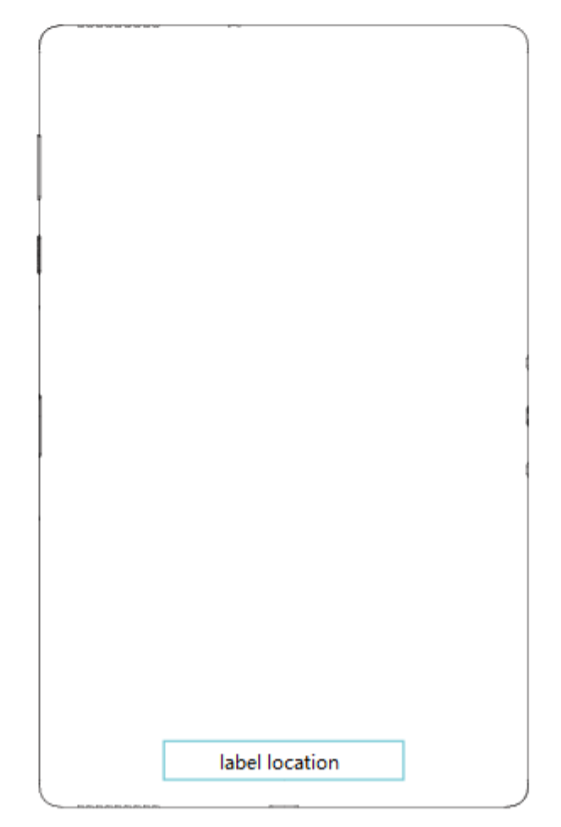
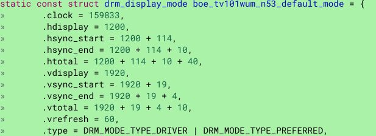

Over the summer, details of a MediaTek-powered Chrome OS tablet codenamed Kodama appeared, and there's strong evidence to suggest that this new tablet will be brought to market by Lenovo. Back in August, [Chrome Unboxed found the first code commits for Kodama](https://chromeunboxed.com/kodama-may-be-the-first-detachable-arm-chromebook/), noting it could be the first ARM-powered detachable Chrome OS tablet. Keep in mind the image above is an old Lenovo 10.1-inch Windows tablet, not the actual Kodama device.

Based on a number of code commits and some other circumstances, I believe that the August report is correct. And I've found some additional information.

Let's talk about the circumstances first and then go over some of the device details.

Earlier this month, [a Chrome OS subreddit showed a post asking for beta testers for an upcoming Lenovo Chrome tablet](https://9to5google.com/2019/12/03/lenovo-chrome-os-tablet-testers/). The original post came from an official Lenovo email account and was found to be verified by Reddit. The post has been removed, but not after many folks signed up to be a tester.

Today I found a Chrome OS bug for Kodama. The issue has to do with screen orientation when the device is connected to external monitors, but that's not the important part. Of interest are the email addresses of the Google hardware partners. They're all from Bitland. More on that in a second. This comment from a Bitland employee caught my eye:

Now the "very tight" timeline and date of 12/13 could mean anything. But when taken into consideration with the recent request for beta testers on a Lenovo Chrome tablet, I smell smoke. And when there's smoke, there's usually a fire. So I did a little more sniffing around.

Searching for Bitland on the web yielded a China-based hardware manufacturer, which doesn't mean much on its own. But when I looked around for what [products and brands that Bitland has produced devices for](http://www.bitland.com.cn/product/bjbdnjpbdn.html), I found these two products, which hit the market with Lenovo branding:

And although I can't confirm that this is Kodama form the test reports or other documents, it's worth noting that [Lenovo received FCC certification just yesterday for "Portable Tablet Computer"](https://apps.fcc.gov/oetcf/eas/reports/ViewExhibitReport.cfm?mode=Exhibits&RequestTimeout=500&calledFromFrame=N&application_id=bvjEQjQqTG%2BWmbIbOxUqrQ%3D%3D&fcc_id=O57TB8705F) that looks like this. I'd say those look like pogo pins on the right side of the image -- the bottom of the tablet in landscape mode -- for a detachable keyboard, something we've long known Kodama will support.

That's a bunch of timely evidence suggesting that Kodama will come from Lenovo in my book.

So what else do we know of Kodama, regardless of the brand that gets slapped on it?

Yes, it will have a detachable keyboard, as previously noted. The touchscreen may use one of two different TFT panels from a pair of vendors, but [both are 1920 x 1200 resolution](https://chromium-review.googlesource.com/c/chromiumos/third_party/kernel/+/1763988/55/drivers/gpu/drm/panel/panel-boe-tv101wum-nl6.c#856):

There will [not be an ambient light sensor on the tablet](https://chromium-review.googlesource.com/c/chromiumos/overlays/board-overlays/+/1826800/3/overlay-kukui/chromeos-base/chromeos-config-bsp-kukui/files/model.yaml). And powering it all will be a MediaTek MT8193 eight-core processor. There's no doubt about that since the CPU number is listed in numerous related commits, most of which show MediaTek email addresses in the listings.

I haven't yet been able to confirm other important aspects such as memory, storage and more, although I've seen clues that this will have 4 GB of memory. That wouldn't be surprising as a device this size, powered by an ARM processor isn't likely to have super high-end internals such as 16 GB of memory or 128 GB of storage, for example.

All of the evidence I've seen so far suggests that this will be a Lenovo tablet in the low- to mid-range pricing. Given that we haven't seen many other new Chrome OS tablets hit the market, color me intrigued.
