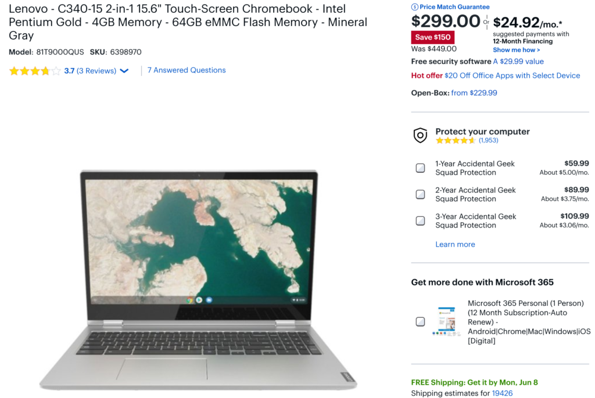
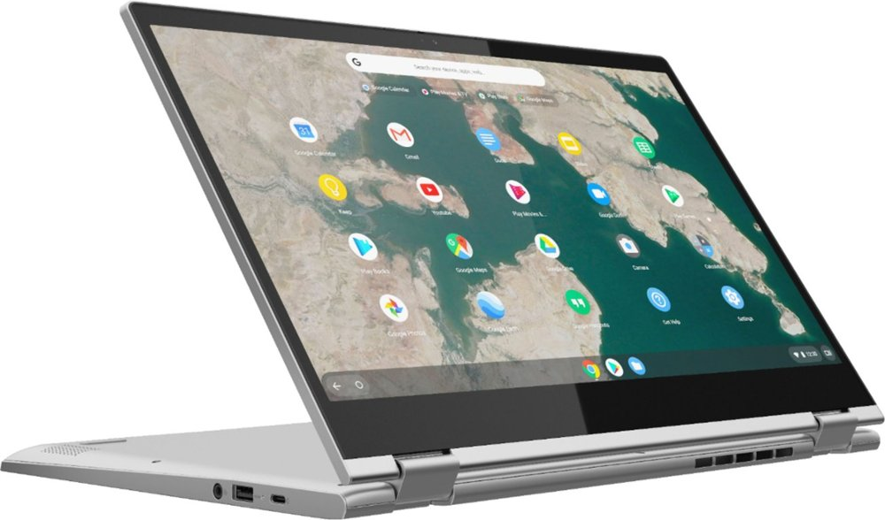

Another day brings another Chromebook sale and this time it's the 15.6-inch Lenovo Chromebook C340, which is $150 off at Best Buy. You can [add this large 2-in-1 convertible with 1080p display to your home or office for just $299.00 right now](https://www.bestbuy.com/site/lenovo-c340-15-2-in-1-15-6-touch-screen-chromebook-intel-pentium-gold-4gb-memory-64gb-emmc-flash-memory-mineral-gray/6398970.p?skuId=6398970).

To be honest, I think the $449.99 suggested retail price is a bit high to begin with as we're seeing new entry-level Chromebooks come in around the $300 to $350 price mark. So the discounted price is more in line with those.

And although I say "entry-level" when describing the Lenovo Chromebook C340, that's mainly due to the Intel Pentium Gold 4417U processor, 4 GB of memory and lack of a backlit keyboard. You still get 64 GB of local storage and that 15.6-inch 1920 x 1080 IPS touch display that folds into tent / presentation mode or tablet mode, although I wouldn't suggest using this as a tablet for long: It weights just over 4 pounds.

Lenovo Chromebook C340 presentation

Also included are three USB ports (one Type-A and two Type-C jacks), a 720p webcam, WiFi 5 and Bluetooth 4.2 support, a pair of 2 Watt speakers and a full number pad on that keyboard. Lenovo claims up to 10 hours of run-time on the 45 Whr battery.

This isn't a Chromebook I'd want to carry around all day but would make for a nice home or office experience to tackle every day web tasks and Android apps, not to mention video content consumption on the large screen.

I should note that the [official product page for this Chromebook on Lenovo's site](https://www.lenovo.com/us/en/laptops/lenovo/student-chromebooks/Lenovo-Chromebook-C340-15/p/88LGCC31290) says "This product is no longer available", suggesting that the company is no longer producing it. That may matter to you if you're worried about any future service or repairs. Of course, if the display breaks, that's [an inexpensive fix you can do yourself in minutes](https://www.aboutchromebooks.com/news/pro-tip-you-can-easily-replace-or-even-upgrade-a-broken-laptop-or-chromebook-display-for-not-much-money/). But if you are worried about future hardware support, you'll probably want to skip this deal. If not, you can get a solid, large-screened Chromebook at a nice discount.
