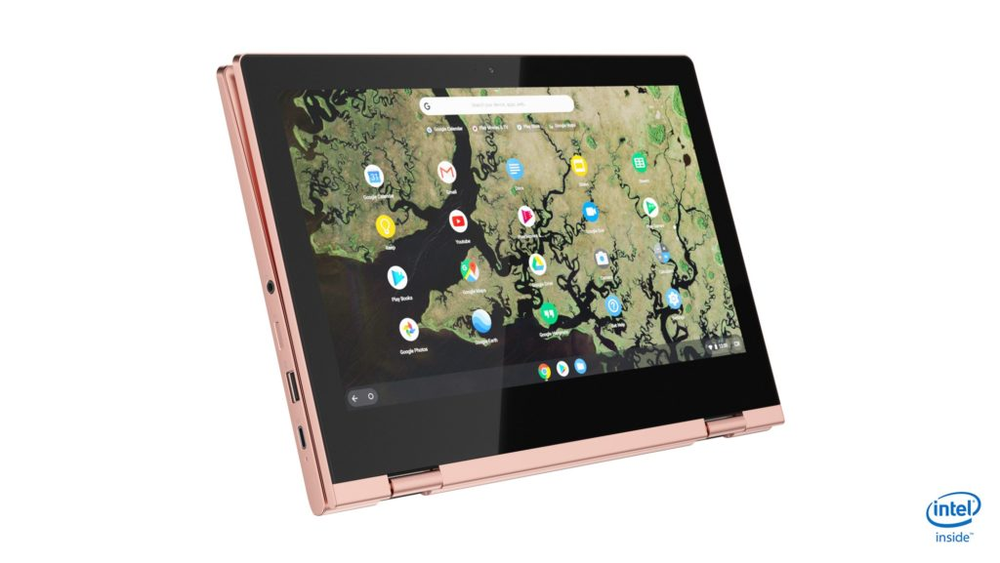

I routinely scour Amazon and Best Buy for Chromebook deals and thought I found one on the 11.6-inch Lenovo Chromebook C340. [Best Buy has dropped the price from $299 to $259](https://www.bestbuy.com/site/lenovo-c340-2-in-1-11-6-touch-screen-chromebook-intel-celeron-4gb-memory-32gb-emmc-flash-memory-platinum-gray/6367806.p?skuId=6367806). But I wouldn't buy that model, even though it has a $40 discount, unless you have to have your new gadget right away.

Instead, Lenovo is directly selling a [slightly better configuration of Lenovo Chromebook C340 in Platinum Gr](https://www.lenovo.com/us/en/laptops/lenovo/student-chromebooks/Lenovo-Chromebook-C340-11/p/88LGCC31288)[e](https://www.lenovo.com/us/en/laptops/lenovo/student-chromebooks/Lenovo-Chromebook-C340-11/p/88LGCC31288)[y for $249.99](https://www.lenovo.com/us/en/laptops/lenovo/student-chromebooks/Lenovo-Chromebook-C340-11/p/88LGCC31288). You'll get double the local storage on this entry-level 2-in-1 for $10 less if you order it direct. The only potential downside is that Lenovo says these are shipping in 10-12 business days.

Although this is a low-end device, it is fairly new with [Lenovo announcing the model in August of last year, with availability a month later](https://www.aboutchromebooks.com/news/lenovo-chromebook-c340-s340-release-date-specs-pricing/). Still you should keep in mind that this is a small, Celeron-powered model with just 4 GB of memory. So it's best suited for students, basic browsing and the occasional Android app based on these specs:

<table class=""><tbody><tr><td>CPU</td><td>Intel Celeron N4000 dual-core</td></tr><tr><td>GPU</td><td>Intel UHD 600</td></tr><tr><td>Memory</td><td>4 GB LPDDR4-2400</td></tr><tr><td>Storage</td><td>64 GB eMMC 5.1 storage and microSD card slot</td></tr><tr><td>Display</td><td>11.6-inch 1366 x 768 IPS glossy touchscreen, 250 nits</td></tr><tr><td>Connectivity</td><td>Intel 9560 802.11AC (2 x 2) and Bluetooth 4.2</td></tr><tr><td>Ports</td><td>Two USB Type-C (3.1) and two USB Type-A (3.1), combo mic/headphone</td></tr><tr><td>Input</td><td>Non-backlit keyboard, multi-touch trackpad, 720p webcam</td></tr><tr><td>Audio</td><td>2 x 2W speakers</td></tr><tr><td>Battery</td><td>42 WHr battery, claimed runtime up to 10 hours</td></tr><tr><td>Software support</td><td>Automatic Chrome OS updates through June 2026</td></tr></tbody></table>

If you'd rather have the [same configuration in Sand Pink, you can order that directly for $269.99](https://www.lenovo.com/us/en/laptops/lenovo/student-chromebooks/Lenovo-Chromebook-C340-11/p/88LGCC31288). I have that version in house and it's a fairly light pink; stay tuned for a review later this week.
