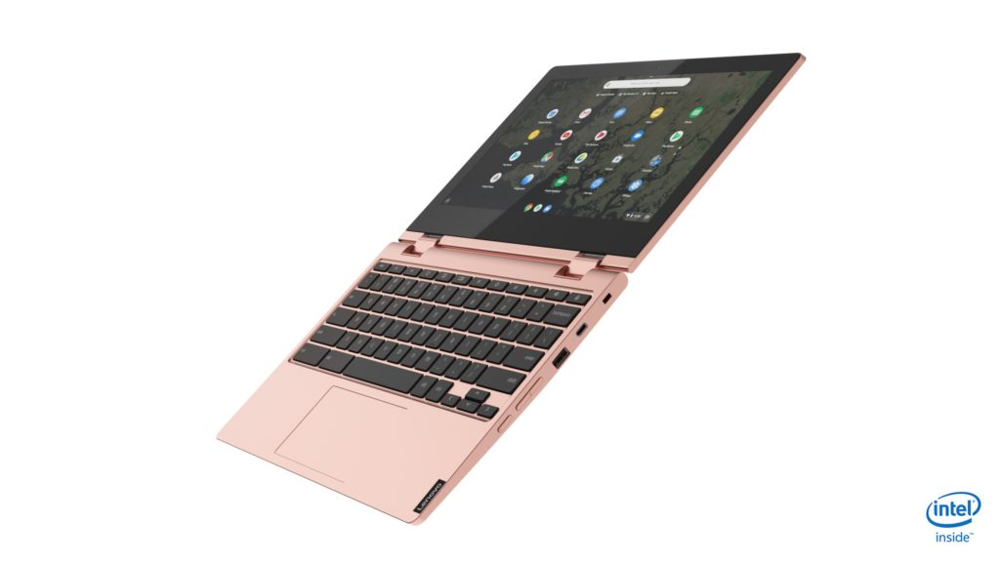

Unofficial news of the [Lenovo Chromebook S340 landed late last month](https://www.aboutchromebooks.com/news/lenovo-chromebook-s340-specifications-specs-price-estimate/) but now Lenovo has officially taken the wraps off of this model, as well as a new Lenovo Chromebook C340.

However, we previously heard about both a 14- and a 15-inch variant S340; as of today, only one is official: The Lenovo Chromebook S340-14. This laptop starts at $249.99, with expected availability next month.

- 
    
- 
    
- 
    
- 
    
- 
    
- 
    
- 
    
- 
    

Lenovo didn't share detailed specifications in its news release, so, for now, I'll list what we saw prior for this clamshell that folds flat. There are likely multiple configuration options but these specs line up with the base model starting price _**(Update: see official specs below post)**_:

- Intel Celeron N4000 dual-core processor
- Integrated Intel UHD Graphics 600
- 4GB LPDDR4-2400
- 14-inch full-HD touch display
- 32GB eMMC 5.1 storage and microSD card reader
- 802.11ac Wi-Fi and Bluetooth 4.2
- 720p webcam
- Non-backlit keyboard
- 42 WHr battery

What was previously thought to be an 11-inch version of the S340 looks to be the Lenovo Chromebook C340 announced today.

- 
    
- 
    
- 
    
- 
    
- 
    
- 
    
- 
    
- 
    
- 
    
- 
    
- 
    
- 
    

This 2-in-1 convertible will start at $289.99 with September availability, and again, I'll share the previously reported specs as they too line up with that price point _**(Update: see official specs below post)**_:

- Intel Celeron N4000 dual-core processor
- Integrated Intel UHD Graphics 600
- 4GB LPDDR4-2400
- 11.6-inch 1366×768 IPS touch display with 250nits and glossy finish
- 32GB eMMC 5.1 storage and microSD card reader
- 802.11ac Wi-Fi and Bluetooth 4.2
- 720p webcam
- Non-backlit keyboard
- 42 WHr battery

There is also a larger version of the Lenovo Chromebook C340 coming in at 15-inches. This bigger 2-in-1 starts at $429.99 when it goes on sale in October.

- 
    
- 
    
- 
    
- 
    
- 
    

And continuing the match-up of leaked specs for a 15-inch Lenovo device from last month here's what I expect the base model to have _**(Update: see official specs below post)**_:

- Intel Core i3-8130U dual-core processor
- Integrated Intel UHD Graphics 620
- 4GB LPDDR4-2400
- 15.6-inch 1920×1080 IPS touch display with 250 nits and glossy finish
- 64GB eMMC 5.1 storage and microSD card reader
- 802.11ac Wi-Fi and Bluetooth 4.2
- 720p webcam
- Backlit keyboard with number pad
- 56 WHr battery

I'll update these specs here and/or in a separate post once I get confirmation from Lenovo or see the devices on Lenovo's site.

While there's always a market for basic, low-cost Chromebooks, I'm intrigued by the Lenovo Chromebook C340-15 model. Based on the price and potential configuration options, it appears to be a lower-cost sibling to the current [Lenovo Chromebook Yoga C630](https://www.aboutchromebooks.com/news/lenovo-yoga-chromebook-c630-price-availability-4k/) thanks to the U-Series Intel processor.

**_Update: Official specs from Lenovo below._**

