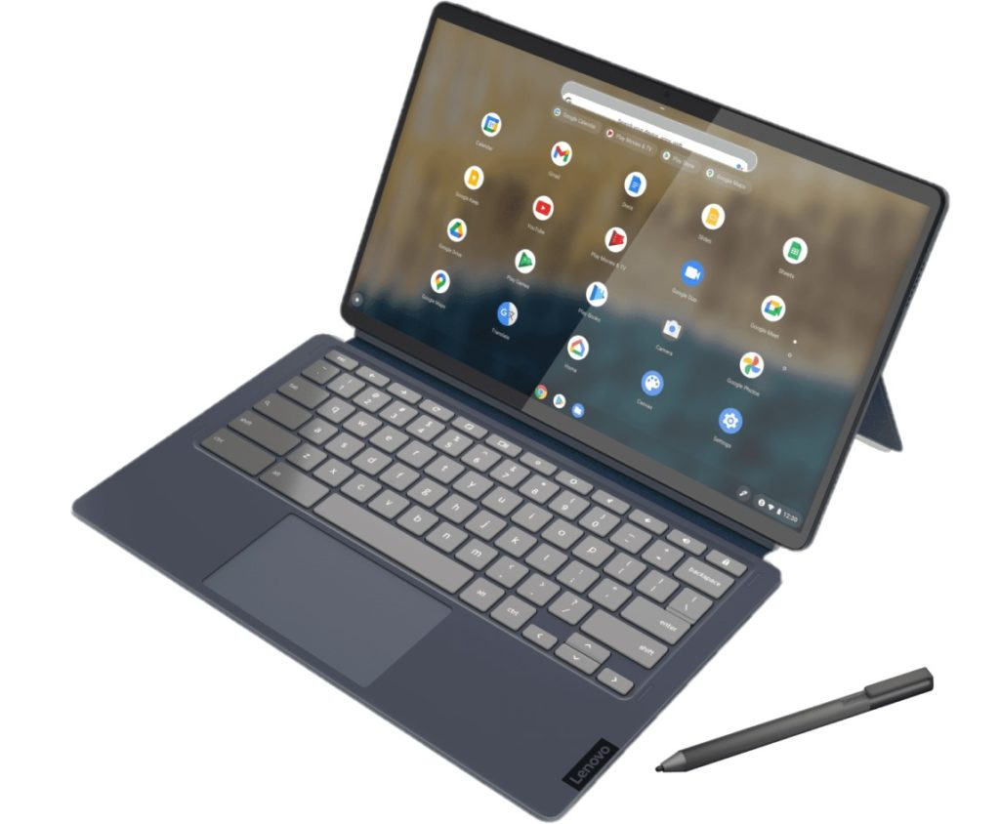

The [HP Chromebook x2 11 detachable](https://www.aboutchromebooks.com/news/hp-chromebook-x2-11-detachable-lte-chrome-os-tablet-and-hp-chromebase-21-5-debut/) has only been on sale for a week and it's already being upstaged in some ways. [On Wednesday](https://news.lenovo.com/pressroom/press-releases/lenovo-leads-in-launching-windows-11-on-new-yoga-laptops/), the Lenovo Chromebook Duet 5 debuted with the second-gen Qualcomm Snapdragon 7c chip, a newer version than used in the HP. On top of that, Lenovo's new tablet with keyboard and kickstand uses a brighter OLED display. Oh, and it's less expensive too, starting at $429.99 when it goes on sale next month.

Just to be clear upfront: The popular, low-cost Lenovo Chromebook Duet tablet _isn't_ going away, as this new model isn't a replacement.

On a briefing call last week, Lenovo said the larger 13.3-inch Lenovo Chromebook Duet 5 offers an experience more tuned for productivity, like a full-sized Chromebook. That's why this is the "Duet 5", which represents the tablet's place alongside the [Lenovo Chromebook 5/5i](https://www.aboutchromebooks.com/news/lenovo-ideapad-5i-chromebook-review-a-potent-pentium-powered-laptop/) and Flex 5/5i.

With that out of the way, let's talk about this detachable Chromebook tablet because I see a lot of appealing checkboxes marked off.

As mentioned, this slim tablet has a 13.3-inch OLED display offering 400 nits of brightness. It's a FullHD panel, or 1920 x 1080 resolution, and supports 100% of the DCI-P3 color gamut. In other words: I expect it to look fantastic.

Speaking of looks, it has a similar design language to the Apple iPad Pro. I own one of those so I don't think that's a bad thing. You get the rounded display corners with harder edges that feel good on your hand. And there are the quad-speakers for sound. Given the large screen size, this won't be the lightest tablet around: Even without the keyboard and kickstand attached, it weighs 1.5 pounds.

Much as Lenovo might have borrowed from Apple, it also borrowed at least one of the right things from Microsoft's Surface products.

The detachable kickstand is Surface-like too with a hinge that can hold the slate in nearly any position. Unfortunately, the magnetic keyboard doesn't appear to attach to the bottom of the display for a more stable typing experience.

Both of these accessories, along with a stylus that magnetically attaches to the kickstand portion are included.

Unlike most Chrome oS tablets, the Lenovo Chromebook Duet 5 has a pair of USB Type-C ports, one on each side. There's no LTE option like the HP Chromebook x2 11 offers, so it's WiFi only. And it's WiFi 5, as well as Bluetooth 5.1. You can blame the lack of WiFi 6 on the Snapdragon 7c product line, which debuted in 2019.

However, this is the [second-generation Qualcomm Snapdragon 7c compute platform](https://www.aboutchromebooks.com/news/chromebooks-with-qualcomms-snapdragon-7c-gen-2-to-eke-out-more-performance/), which should offer a smidge more performance than the first-generation chipset. You can have up to 8 GB of memory and max out at 256 GB of eMMC storage. I suspect the base model comes with 4 GB of RAM and 64, or maybe 128 GB, of storage capacity. And I don't see a microSD card slot here, something HP does include.

Lenovo says the 42 WHr battery can last for 15 hours. I say maybe in perfect conditions based on my testing of the first-generation Snapdragon 7c inside the [Acer Chromebook 513 LTE model which I'm testing](https://www.aboutchromebooks.com/news/hands-on-acer-chromebook-spin-513-lte-first-impressions/). I'd still expect a good 10 or 11 hours though from the Lenovo.

The Lenovo Chromebook Duet 5 will be available in two colors: Abyss Blue and Storm Grey. I'm partial to the former but folks who are into the monochrome thing will appreciate the latter.

Aside from the keyboard not attaching to the bottom bezel, there's a ton to like here. Especially at the base price of $469, although again, that's not likely to have the most memory or storage capacity. I don't believe the keyboard is backlit either. Outside of those two aspects, this Chrome OS tablet looks well suited for folks who want a detachable Chromebook in a larger size and with a bright OLED display.
