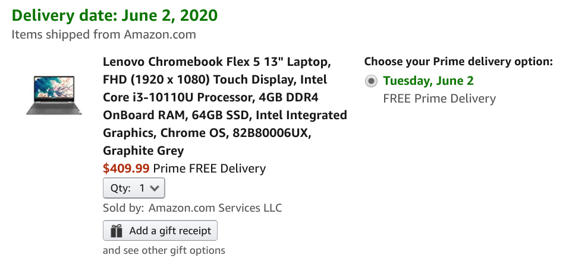
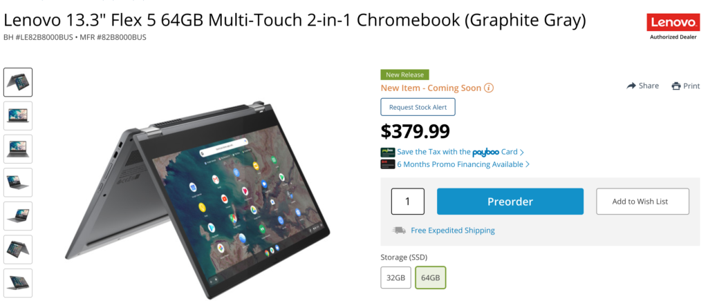
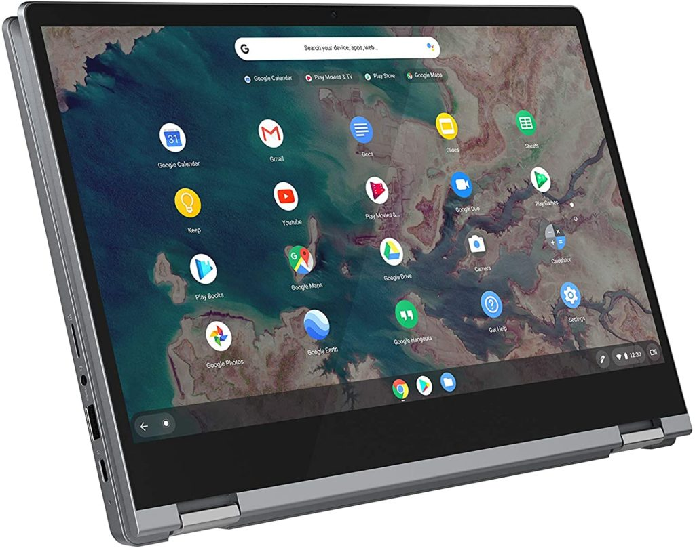

<iframe style="width:120px;height:240px;" marginwidth="0" marginheight="0" scrolling="no" align="right" frameborder="0" src="//ws-na.amazon-adsystem.com/widgets/q?ServiceVersion=20070822&amp;OneJS=1&amp;Operation=GetAdHtml&amp;MarketPlace=US&amp;source=ss&amp;ref=as_ss_li_til&amp;ad_type=product_link&amp;tracking_id=aboutchromebo-20&amp;language=en_US&amp;marketplace=amazon&amp;region=US&amp;placement=B086383HC7&amp;asins=B086383HC7&amp;linkId=e99c455445a22062477a4b4c1ded9548&amp;show_border=true&amp;link_opens_in_new_window=true"></iframe>

While the Samsung Galaxy Chromebook, Asus Chromebook Flip C436, and Lenovo Chromebook Duet stole the show at CES in January, I reminded everyone that month about the [upcoming Lenovo Chromebook Flex 5](https://www.aboutchromebooks.com/news/did-you-miss-the-new-lenovo-chromebook-flex-5-at-ces-2020/) as well: An entry-level to mid-range 2-in-1 Chromebook, depending on the configuration.

Lenovo hasn't yet announced availability for the Flex 5 but two online retailers are already showing the price or taking orders.

[Amazon, for example, will let you purchase the Core i3 model of the Lenovo Chromebook Flex 5](https://www.amazon.com/Lenovo-Chromebook-i3-10110U-Integrated-82B80006UX/dp/B086383HC7/ref=sr_1_6?dchild=1&keywords=Lenovo+Chromebook+Flex+5&qid=1590074450&s=electronics&sr=1-6) with 4 GB of memory, 64 GB of internal storage and the full-HD 13.3-inch touch display for $409.99.

I put one in my cart and the soonest delivery date was June 2, so if you choose this device now, you'll have to wait a little bit before the order is fulfilled.

On paper, you're getting some good hardware for the price, particularly since that Core i3 processor is a 10th-generation U-Series chipset. I can't say I'm thrilled with the 4 GB of memory, but my Chrome OS computing needs are higher than most users.

[B&H Photo Video is currently showing a lower-specified model as "coming soon" for 379.99](https://www.bhphotovideo.com/c/product/1558830-REG/lenovo_82b8000bus_5205u_4gb_ddr4.html). Everything about this version of the Lenovo Chromebook Flex 5 is identical to the higher-priced model that Amazon is selling, save for the processor.

You'll save $30 with this configuration and drop your Intel chipset to a 1.9 GHz Intel Celeron 5205U Dual-Core. If you want to save an additional $20, you can get the Celeron version with 32 GB of internal storage for $359.99.

Having not tested any device with this new dual-thread Celeron, I can't yet speak to the performance difference between it and the Intel Core i3-10110U: The latter has a higher base frequency of 2.1 GHz and four threads so I'd guess around a 15 percent performance boost with the i3 model.

Both options share a 13.3-inch 1080p touch display, with 16:9 aspect ratio, one USB Type-A port, two USB Type-C ports, 4 GB of memory, 64 GB of storage, microSD card slot, have Wi-Fi 6 and Bluetooth 5.0 on-board, and just under three pounds.

These 2-in-1 Chromebooks are also expected to get 10 hours of run-time on a charge, although real-world usage will skew that down a little. I can't confirm a backlit keyboard on the Celeron model, but Amazon says the Core i3 unit does have a backlit keyboard.

I know the Lenovo Chromebook Flex 5 was overshadowed by other devices at CES, but many readers have been waiting for new options in the $350 to $450 price range. Your wait is almost over!
