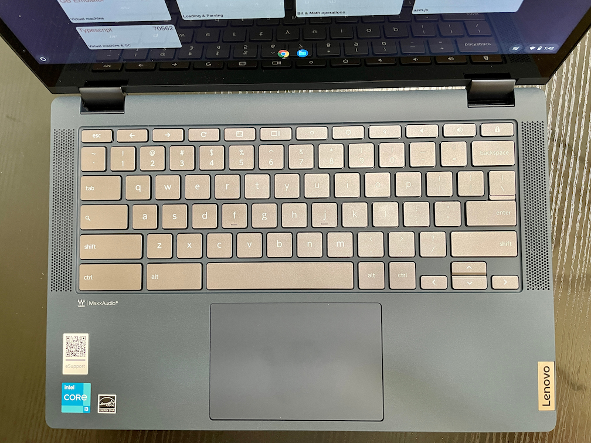

After reviewing the [Lenovo IdeaPad 5i Chromebook](https://www.aboutchromebooks.com/news/lenovo-ideapad-5i-chromebook-review-a-potent-pentium-powered-laptop/) and being impressed by the new Pentium processor, I'm curious how the convertible version with 11th-gen Intel Core i3 is to use. Luckily, Lenovo provided me a review unit of the newest Lenovo Chromebook Flex 5i and I'm sharing some first impressions now that it has arrived. There will be several configurations available, but the one I have is [now available at Costco for $549.99](https://www.costco.com/lenovo-flex-5-13.3%22-2-in-1-touchscreen-chromebook---11th-gen-intel-i3-1115g4---1080p.product.100744753.html).

## What's inside the Lenovo Chromebook Flex 5i?

To be clear, this 2-in-1 is a slightly smaller and lighter version of the IdeaPad 5i Chromebook. You could _almost_ mistake one for the other, although it's easy to tell them apart because the Lenovo Chromebook Flex 5i isn't a clamshell device. You can rotate the display a full 360-degrees for tablet use, or less if you need tent or presentation mode.

One of those configurations changes up the 13.3-inch IPS touch panel and its average 250 nits of brightness to an OLED display with 400 nits of brightness. Unfortunately for my eyes, I don't have that model.

Lenovo sent me a configuration with the following specifications:

<table><tbody><tr><td>CPU</td><td>Dual-core <a href="https://ark.intel.com/content/www/us/en/ark/products/208652/intel-core-i3-1115g4-processor-6m-cache-up-to-4-10-ghz.html" target="_blank" rel="noreferrer noopener">Intel Core i3-1115G4</a> (3.0 / 4.1GHz)&nbsp;</td></tr><tr><td>GPU</td><td>Intel Integrated UHD Graphics</td></tr><tr><td>Display</td><td>13.3"&nbsp;IPS 1920 x 1080) IPS multi-touch with an anti-glare finish, 16:9 aspect ratio, 250 nits brightness</td></tr><tr><td>Memory</td><td>8GB LPDDR4x memory, 3733MHz speed)&nbsp;</td></tr><tr><td>Storage</td><td>128GB SSD M.2 PCIe 3.0 NVMe, microSD card slot for expansion</td></tr><tr><td>Connectivity</td><td>802.11ax (2x2) WiFi 6, Bluetooth 5.0</td></tr><tr><td>Input</td><td>Backlit spill-resistant keyboard, Mylar trackpad 720p webcam with physical privacy shutter, USI stylus supported, but pen not included</td></tr><tr><td>Ports</td><td>1 USB Type-A 3.2 (Gen 1), 2 USB Type-C 3.2 (Gen 1) supporting PD 3.0, data and DisplayPort 1.4, headphone/microphone combo jack</td></tr><tr><td>Battery</td><td>51 WHr, expected run-time up to 10 hours</td></tr><tr><td>Weight</td><td>2.97 pounds</td></tr><tr><td>Software</td><td>Chrome OS automatic updates through June 2029</td></tr></tbody></table>

## Lenovo Chromebook Flex 5i build quality and size

Overall, the build quality of the Lenovo Chromebook Flex 5i is on par with its clamshell counterpart. That is to say, it's good. Yes, there is some plastic here. The chassis is made of a plastic and ABS compound but there's not much chassis flex. The top cover is made from aluminum to offer a little high-end device feel.

One thing worth noting is the size difference between the 14-inch clamshell version and this 13.3-inch convertible model. The Lenovo Chromebook Flex 5i definitely has a smaller footprint and is nearly the same thickness. The Lenovo IdeaPad 5i Chromebook measures in at 0.65" x 8.7" x 12.75". This Lenovo Chromebook Flex 5i? It's 0.67" x 8.43" x 12.2". Aside from the thickness, this convertible Chromebook is roughly the same size as the svelte [Google Pixelbook Go](https://store.google.com/us/product/pixelbook_go_specs?hl=en-US).

I know on paper these variances don't seem like much, but my family has commented on how small this device is. So they noticed. Of course, I noticed that although the display bezels aren't too thin (save for the bottom one), I feel constrained by the 16:9 aspect ratio. That's just me, as I prefer taller displays with a 3:2 ratio. Aside from what I'd call the bare minimum of 250 nits brightness at this price point, the IPS panel is great for viewing content and web pages.

Even with these trimmed down dimensions and a widescreen, there's still plenty of room for a comfortable keyboard, dual top-firing 2W speakers with Waves MaxxAudio tuning, and a reasonably sized mylar trackpad. The keyboard is backlit and I don't see any immediate input issues when using it. And as much as I like glass trackpads, this one is smooth and responsive, if not a bit "clicky" sounding.

Just like on the clamshell version, the Lenovo Chromebook Flex 5i has the expected range of input ports. And I'm happy to see that Lenovo has kept the split USB Type-C design. There's one on both the left and right sides of the chassis so you can choose which side to charge from.

## Is there a performance bump compared to last year's model?

I was surprised by the performance of the latest Pentium inside the IdeaPad 5i Chromebook, so with an 11-th generation Core i3 inside this model, I'm hoping to see that trend continue.

So far, with just limited usage, it appears to. This convertible Chromebook feels much faster in just about every task than my personal Chromebook which is an Acer Chromebook Spin 13 powered by the 8th-generation Intel Core i5.

A quick Octane benchmark for perspective and comparison suggests that my experience isn't just perceived:

<table><tbody><tr><td>Lenovo Chromebook Flex 5i (11th-gen Core i3)</td><td>57,191</td></tr><tr><td>Lenovo IdeaPad 5i Chromebook (11th-gen Pentium)</td><td>47,152</td></tr><tr><td>Lenovo Chromebook Flex 5 (10th-gen Core i3)</td><td>42,429</td></tr><tr><td>Acer Chromebook Spin 13 (8th-gen Core i5)</td><td>35,116</td></tr></tbody></table>

Octane 2.0 scores, higher is better

You _could_ extrapolate these numbers to suggest that I could upgrade my old Spin 13 for around a 65% performance increase. Or that this year's Flex 5i is around 30% faster than last year's Flex 5. I doubt the figures are exact as benchmarks are general indicators. Even so, I can see how much faster this device is with the latest Intel Core i5. Every activity is snappy, to the point of providing an older high-end experience with a current mid-range device.

That may be why the price of this year's Flex 5i has seen a bump up from last year's model.

With 8 GB of memory, which is super nice to have, the retail price is about $80 to $90 more for this Chromebook. I can't tell you if it's worth the premium yet because I have to fully test this device by using it as my daily driver for at least a week. And you can certainly find last year's model on sale, so the price difference is even more these days.

## It looks great for you, but not for me. And that's OK

Having said that, I'm really liking the Lenovo Chromebook Flex 5i for what it offers.

It's not a device that I would purchase for myself because my workflow is more effective with a taller display. And I want a bit more power, yes even more than what I've seen so far here because [I use my Chromebook for a graduate computer science program](https://www.aboutchromebooks.com/news/linux-on-chromebooks-just-might-get-me-through-a-masters-in-computer-science/). Some of the apps and coding interfaces I use do better with more memory.

But most people _aren't_ like me. And I can see that based on what I've seen so far, they'll mostly be impressed by the Lenovo Chromebook Flex 5i.

Stay tuned for a full review, and please don't hesitate to ask any questions in advance in the comments below.
