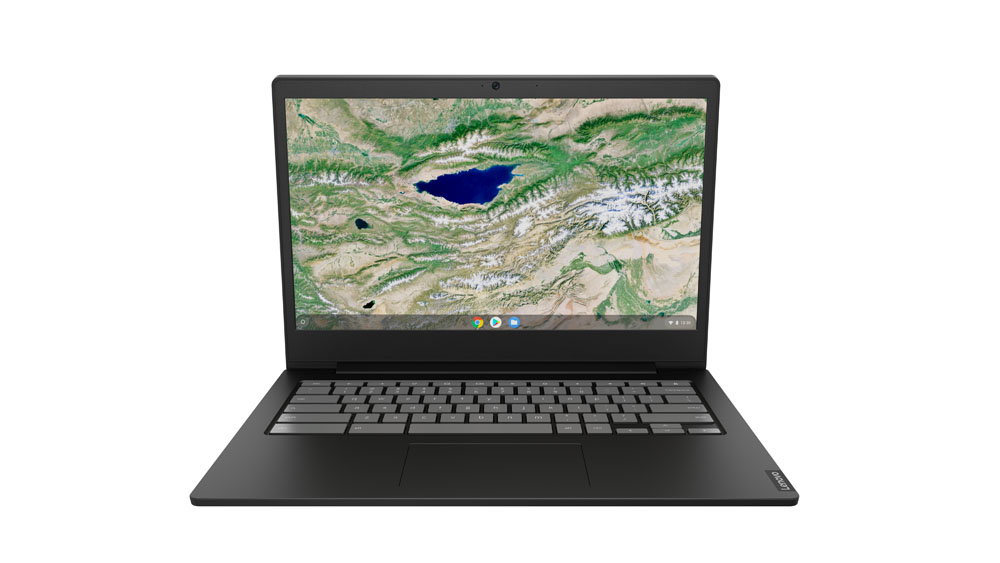

Well, this is an odd way to not announced a new product line: Lenovo published a YouTube video showing off three new Chromebooks yesterday in multiple color options without an official press release. [Chrome Unboxed spotted the trio](https://chromeunboxed.com/lenovo-debuts-entirely-new-lineup-of-colorful-8th-gen-intel-chromebooks/) in the video, which you can watch below.

https://youtu.be/W\_PQBAVMGXM

All three models are part of a new Lenovo Chromebook S340 line, presumably taking the place of the current S330, which is a solid, low-cost device. The new Lenovo Chromebook S340 will be available in 11.6-, 14- and 15.6-inch display models. No pricing yet but here's a list of the model specs:

**Lenovo Chromebook S340-11**

- Intel Celeron N4000 dual-core processor
- Integrated Intel UHD Graphics 600
- 4GB LPDDR4-2400
- 11.6-inch 1366x768 IPS touch display with 250nits and glossy finish
- 32GB eMMC 5.1 storage and microSD card reader
- 802.11ac Wi-Fi and Bluetooth 4.2
- 720p webcam
- Non-backlit keyboard
- 42 WHr battery

**Lenovo Chromebook S340-14**

- Intel Celeron N4000 dual-core processor
- Integrated Intel UHD Graphics 600
- 4GB LPDDR4-2400
- 14-inch 1366x768 TN touch display with 220nits and anti-glare finish
- 32GB eMMC 5.1 storage and microSD card reader
- 802.11ac Wi-Fi and Bluetooth 4.2
- 720p webcam
- Non-backlit keyboard
- 42 WHr battery

**Lenovo Chromebook S340-1**5

- Intel Core i3-8130U dual-core processor
- Integrated Intel UHD Graphics 620
- 4GB LPDDR4-2400
- 15.6-inch 1920x1080 IPS touch display with 250 nits and glossy finish
- 64GB eMMC 5.1 storage and microSD card reader
- 802.11ac Wi-Fi and Bluetooth 4.2
- 720p webcam
- Backlit keyboard with number pad
- 56 WHr battery

My sources suggest that the 14-inch model may not be available in the US - at least, not initially - however, it will be for sale in numerous other regions.

Given the specs, if I had to guess on the price, I'd say roughly $250 to $300 for the 11.6-inch model and not much more for the very similar 14-inch version. I'm thinking the more powerful 15.6-inch Lenovo Chromebook S340 will have an MSRP of $500 or so, but will likely be on sale for less.
