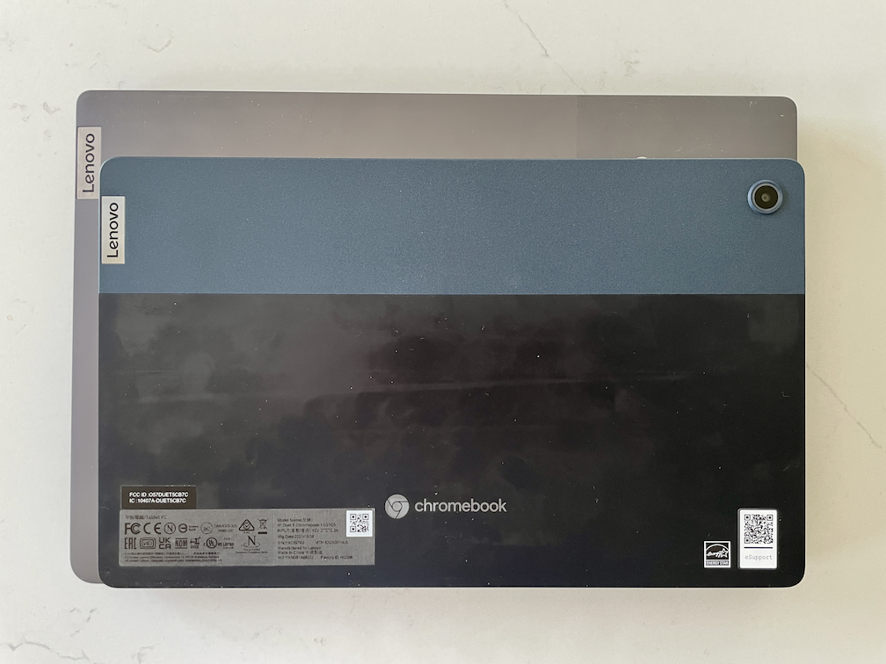

Although it's already available at retailers, I wasn't able to get a [Lenovo Duet 5 Chromebook](https://www.aboutchromebooks.com/news/lenovo-chromebook-duet-5-detachable-debuts-with-2nd-gen-snapdragon-7c-oled-screen/) review unit until this past weekend. Now that I have it, I'm going to use it for as much of my full-time computing as possible. I'll share that experience after a good week of usage. For now, here are my Lenovo Duet 5 Chromebook first impressions.

In case you're not familiar with this Chrome OS tablet, here's a quick rundown of what it is.

I was loaned the [$499 configuration available at Best Buy](https://www.bestbuy.com/site/lenovo-ideapad-duet-5-13-3-oled-chromebook-snapdragon-sc7180-qualcomm-adreno-graphics-8gb-memory-128gb-ssd-abyss-blue/6477625.p?skuId=6477625). The tablet has a 13.3-inch 1920 x 1080 OLED touch display with up to 400 nits of brightness. Inside is the second generation Qualcomm Snapdragon 7c compute platform paired with 8 GB of memory and

## Solid, well-built hardware with nice accessories

Having [just reviewed the HP Chromebook X2 11](https://www.aboutchromebooks.com/news/hp-chromebook-x2-11-review-a-good-value-when-on-sale/), which I thought was very well built overall, I thought it set the bar. I'd immediately say that Lenovo has either met that bar or perhaps raised it. This is a solid slate that's only 7.23 millimeters thin, er... thick.

The display can render 100-percent of the DCI-P3 color gamut and looks fantastic. Thanks to the OLED panel, pixels representing black aren't lit, so the contrast ratio is excellent. I watched some 1080p60 HDR videos on YouTube and they looked amazing. No, this screen isn't HDR-capable but the brightness, color gamut, and high contrast ratio make videos look HDR-like.

Admittedly, I'm not a fan of the 16:9 aspect ratio on laptops in general. And for a tablet, I dislike it even more. The main reason: I have to scroll vertically to read content and there is often wasted space on the sides of a web page. Here's a simple example on a 4:3 iPad Pro by comparison using the same font size in Reader Mode for the same web page:

Note: I removed the color from this photo in edits because the Lenovo display had a purple hue picked up by the camera. It's not visible to the naked eye. Also, both displays are lined up to be the same distance from the camera. The difference in distance is due to the different keyboard attachments.

In true tablet mode, this widescreen format does have benefits though. Holding the Lenovo Duet 5 Chromebook vertically shows a ton of web content without scrolling. Anyway, that's just me. And most of Lenovo's recent Chromebooks use the same 16:9 ratio.

This is what the Lenovo Duet 5 Chromebook looks like compared to the [Lenovo IdeaPad Chromebook 5i that I recently reviewed](https://www.aboutchromebooks.com/news/lenovo-ideapad-5i-chromebook-review-a-potent-pentium-powered-laptop/):

You're getting the same screen space and nearly the same sized keyboard in the Duet 5 but in a smaller overall package and footprint

Lenovo Duet 5 on top of the Lenovo IdeaPad Chromebook 5i

As far as the accessories go, these are quite good so far as well. The detachable keyboard has good key travel and the trackpad is responsive so far. Additionally, there's not a lot of flex in the keyboard, so using it on a lap doesn't introduce [errant mouse clicks like the HP Chromebook X2 11 did for me.](https://www.aboutchromebooks.com/news/hp-chromebook-x2-11-review-a-good-value-when-on-sale/)

While the keyboard attachment only connects to the slate via magnets near the metal POGO pins and not also to the display's bottom bezel, it's fairly stable to use on a lap. Lenovo reinforced the "hinge" with heavy-duty, stiff fabric.

Notice the change in the top row of keys? Gone is the "Forward" button and added is a screen capture button over the "6"

That fabric is used on the back of the keyboard and on the kickstand attachment. With the kickstand, the Lenovo Duet 5 Chromebook viewing angle can be adjusted dynamically from roughly 100-degrees to nearly flat. Oh, and I love having the web cam centered atop the display in landscape mode. Other tablet makers could take a cue from that design choice.

The same can be said for offering a pair of USB Type-C ports, one on each side. It's nice to use either the left or right port to recharge the 42 Whr battery inside.

## Lenovo Duet 5 Chromebook performance with that second-gen Snapdragon 7c

I haven't run any benchmarks yet and I've only used this slate for a few hours. I really didn't expect much from the [next generation of the CPU and GPU inside this device. Essentially, it's the same as the first-generation](https://www.aboutchromebooks.com/news/chromebooks-with-qualcomms-snapdragon-7c-gen-2-to-eke-out-more-performance/) but with slightly faster clock speeds.

Even so, I have noticed a little more smoothness and snappiness during my initial browsing sessions. There are fewer instances of text stuttering and starting when scrolling down a full web page, for example, compared to the HP Chromebook X2 11. That Chrome OS tablet uses the first-generation 7c chipset. This is promising for a smartphone-based chip powering Chrome OS.

Still, you have to keep expectations in check. I'd still equate the experience to a Celeron or Pentium from a year ago or so. And that's fine for many Chrome OS users to browse the web, use web apps and some Android apps.

I haven't encountered any Chrome OS software bugs up to this point on the device. I'm running Chrome OS 94, which is the current Stable Channel. And with 8 GB of memory, I haven't experienced any slowdowns either, even with around 10 tabs open. But I'll do a deeper performance dive in my full review. And I'll also use this device full time to get a broader experience.

I did note that Chrome OS supports the quad-speakers when it comes to [rotating the volume button functionality](https://www.aboutchromebooks.com/news/details-of-homestar-an-oled-chromebook-with-snapdragon-7c-and-usi-stylus-support/). This code change was spotted months ago for a Chrome OS board called "Homestar".

And the Lenovo Duet 5 Chromebook is indeed using that board. So when you rotate the display orientation, the volume buttons adjust for up and down levels based on that orientation. It works well, although the speakers are just one Watt and average at best so far.

So far, so good

Overall, I have favorable first impressions of the Lenovo Duet 5 Chromebook. I could see it used in a wide variety of use cases such as content consumption, game streaming, and productivity. I don't think heavy-duty Linux users are in the mix for this Chrome OS tablet but I will try some of my coding efforts on the device.

My main questions still revolve around general performance and battery life. Lenovo claims up to 15 hours of battery life, which I think is suspect. However, if I could get a solid 10 to 11 of hours usage on a single charge, I'd say that's good enough. I'll also test the quick charge capabilities to see if I can get the battery from 0 to 80 percent in one hour.

If you have questions about the Lenovo Duet Chromebook 5, drop them in the comments and I'll try to answer them along the way as I review this device.
