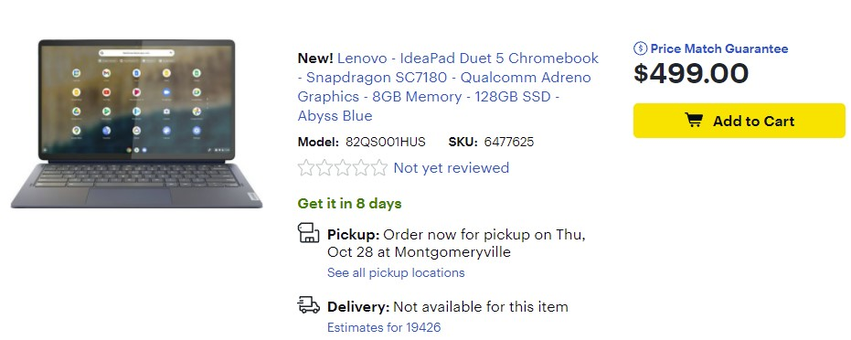

The largest Chrome OS tablet with a detachable keyboard is nearly here. Orders for the 13.3-inch Lenovo Duet 5 Chromebook have [started in the U.S. on Best Buy's site](https://www.bestbuy.com/site/lenovo-ideapad-duet-5-chromebook-snapdragon-sc7180-qualcomm-adreno-graphics-8gb-memory-128gb-ssd-abyss-blue/6477625.p?skuId=6477625), with availability for store pickup on October 28. Powered by a second-generation Qualcomm Snapdragon chipset, this well-equipped Chromebook is priced at $499.99.

I say well equipped to point out the differences between the [Lenovo Duet 5 Chromebook](https://www.aboutchromebooks.com/news/lenovo-chromebook-duet-5-detachable-debuts-with-2nd-gen-snapdragon-7c-oled-screen/) and the smaller [HP Chromebook X2 11](https://www.aboutchromebooks.com/news/hp-chromebook-x2-11-hands-on-and-first-impressions-of-the-newest-chrome-os-tablet/). Both tablets have 8 GB of memory while the Duet 5 has twice the onboard storage at 128 GB. Aside from that it also has a larger display that uses an OLED panel, although the 1920 x 1080 resolution is less than what you'll find on the Chromebook X2 11. However, the Lenovo Duet 5 Chromebook costs $100 less.

Regardless of that, on its own, this Chrome OS tablet is interesting because of that OLED display; a first for Chrome OS tablets.

It's also the first to have the second-generation Snapdragon inside, although I'm not sure that's a big deal. The main difference between the first and second-gen Snapdragons is a slightly higher maximum clock speed. Essentially, both are the same chipset.

Like most tablets these days can be used as a laptop with accessories.

The detachable kickstand is Surface-like too with a hinge that can hold the slate in nearly any position. Unfortunately, the magnetic keyboard doesn’t appear to attach to the bottom of the display for a more stable typing experience. Both of these accessories, along with a stylus that magnetically attaches to the kickstand portion are included.

Lenovo announced that the Duet 5 Chromebook would launch at $469.99, so I would guess that at that price, you lose half of your RAM, your storage, or both. Either way, for an extra $30 over whatever the base model provides, I'd say it's worth the add if you're interested in this device.
