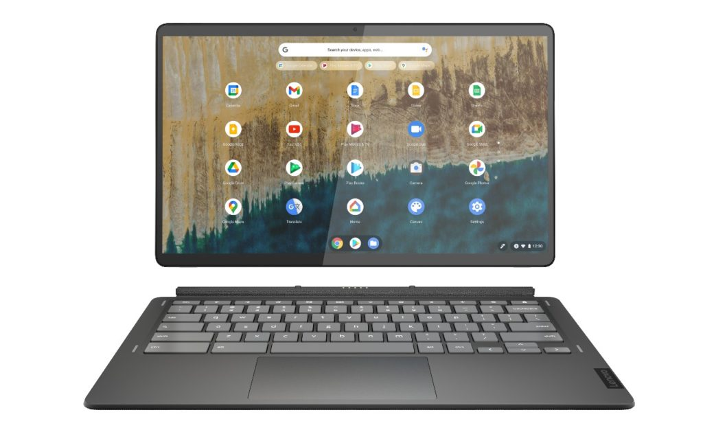
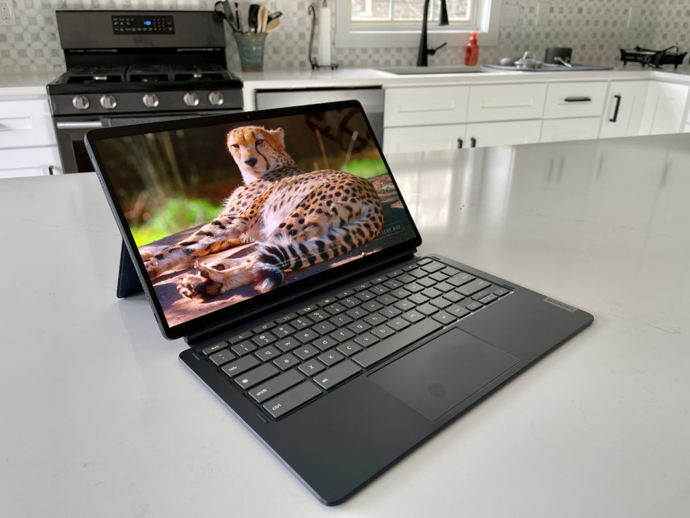
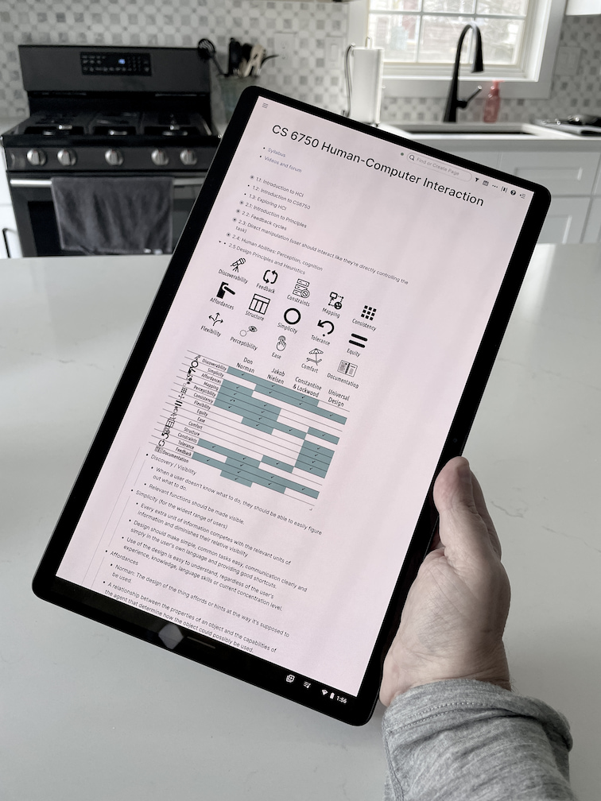
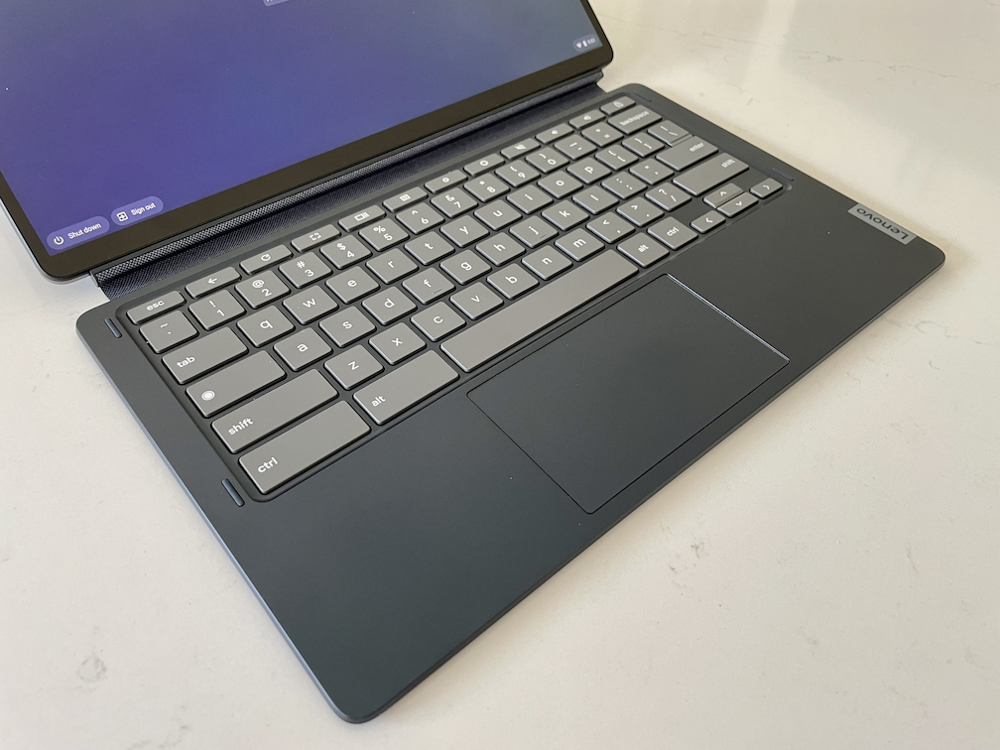

I've been using the [$499 Lenovo Duet 5 Chromebook](https://www.bestbuy.com/site/lenovo-ideapad-duet-5-13-3-oled-chromebook-snapdragon-sc7180-qualcomm-adreno-graphics-8gb-memory-128gb-ssd-abyss-blue/6477625.p?skuId=6477625) loaner device daily for more than a week now. Overall, I really like what it offers in terms of value, performance, and portability for the price. It's definitely for mainstream Chrome OS users though: If you're a "power user" that needs high-end hardware, this is a good secondary device. For everyone else? It's a better laptop than a tablet with enough performance for most people and a gorgeous 1080p OLED display.

The Lenovo Duet 5 Chromebook is a larger and less expensive choice than [the $599 HP Chromebook X2 11](https://www.aboutchromebooks.com/news/hp-chromebook-x2-11-review-a-good-value-when-on-sale/), although it's almost a wash when the HP is on sale. Additionally, the typing experience is much better on the Duet 5 in general and specifically when you don't have a flat surface to work on.

I should note that the configuration Lenovo provided me and linked above is available at Best Buy. There is a cheaper, [$429.99 model that Lenovo sells directly.](https://www.lenovo.com/us/en/p/laptops/lenovo/lenovo-edu-chromebooks/ideapad-duet-5-chromebook-gen-6-(13-inch-qcom)/len101i0023) One difference between that and the more expensive model is half of the memory and storage, just 4 GB of RAM and 64 GB of eMMC storage come with the less expensive model.

And the lower-priced version appears to use the first-generation Qualcomm Snapdragon 7c chipset, not [the second-gen CPU](https://www.aboutchromebooks.com/news/chromebooks-with-qualcomms-snapdragon-7c-gen-2-to-eke-out-more-performance/). As you'll see in the review, that older chip offers a similar, but slightly slower performance. I doubt you'd notice the difference. Without a microSD card slot on either model though, you may want to spend more for the extra storage space while getting double the RAM at the same time.

## High quality hardware out the outside, good enough on the inside

[Just like I was with the HP Chromebook X2 11](https://www.aboutchromebooks.com/news/hp-chromebook-x2-11-hands-on-and-first-impressions-of-the-newest-chrome-os-tablet/), the build quality of the Lenovo Duet 5 Chromebook is excellent. It looks and feels like a premium device. The edges of the 13.3-inch Chrome OS slate are metal while the back is a relatively rigid plastic with a nice feel. The power button is small but nicely placed and works well. And the volume buttons swap their up and down functions based on how you're holding the tablet.

That's great for a device with two speakers but this one has four. They're adequate but not impressively loud or bassy with just 1W of power each. However, doubling up on the speakers does add a little more sound separation. Note that there's no headphone jack; you'll either be using the speakers, or headphones over Bluetooth or USB Type-C.

The star of the show is definitely that widescreen 13.3-inch touch display. It's an OLED panel so black pixels don't light up at all, providing a better contrast ratio than an LCD screen. And it gets bright enough for just about any situation, up to 400 nits. Outdoors, the Lenovo Duet 5 Chromebook is usable but still not ideal at this brightness level.

Inside though, it's a stunner to look at when watching video content in particular. Personally, that's the only time I ever like a 16:9 display. I'd prefer something taller to look at while working, but that's a personal preference. I have been getting my work done on this device over the past week; I've just been scrolling up and down a little more often than usual.

As far as the rest of the hardware, short of a headphone jack, I think Lenovo packed everything else you might need. A pair of USB Type-C ports, one on each side, and usable but not great cameras (5 MP for video calls and 8 MP for other photos). I do appreciate the webcam above the display in landscape mode, suggesting this is more laptop than tablet.

Here are the complete specifications of this configuration:

<table><tbody><tr><td>CPU</td><td>Eight-core 2nd-gen <a href="https://www.qualcomm.com/products/snapdragon-7c-gen-2-compute-platform" target="_blank" rel="noreferrer noopener">Qualcomm Snapdragon 7c compute platform</a> up to 2.55 GHz</td></tr><tr><td>GPU</td><td>Qualcomm Adreno 618 GPU</td></tr><tr><td>Display</td><td>13.3-inch OLED 1920 x 1080 display, glossy finish, 100% DCI-P3 color gamut, USI stylus support, 16:9 aspect ratio, 400 nits brightness, external monitor testing worked at 1440p at 60Hz and 1080p at 75Hz</td></tr><tr><td>Memory</td><td>8 GB DDR4x-2133 MHz memory</td></tr><tr><td>Storage</td><td>128 eMMC storage</td></tr><tr><td>Connectivity</td><td>802.11ac (2x2) WiFi 5, Bluetooth 5.1</td></tr><tr><td>Input</td><td>Non-backlit, detachable keyboard, multitouch trackpad 5 MP webcam and 8 MP rear camera, Dual-array microphones</td></tr><tr><td>Ports</td><td>2 USB Type-C 3.2 ports, supporting PD 3.0, data, and DisplayPort 1.4</td></tr><tr><td>Battery</td><td>42 WHr, expected run-time up to 15.5 hours</td></tr><tr><td>Weight</td><td>2.22 pounds with keyboard, 1.54 pounds tablet only</td></tr><tr><td>Software</td><td>Chrome OS automatic updates through June 2029</td></tr></tbody></table>

_(**Update**: Thanks to some reader questions noting that I didn't address external monitor support, I went back and tested on my 27-inch 1440p 120Hz display. The Duet 5 was able to use that screen in both 1440p at 60Hz and 1080p at 75Hz. I've added this information to the about specifications.)_

## Lenovo Duet 5 Chromebook performance: Adequate for typical use

As I previously mentioned, if you're in the market for high-end performance, this isn't the device for you. It's fine for browsing with a dozen or so tabs, using web services, and running a few Android apps. Put another way: I could get my work done on the Duet 5 with no problem; it just takes a little longer than I'm used to from time to time.

The suite of benchmark tests I ran in Guest Mode gives you an idea of what I mean. The [Lenovo IdeaPad 5i Chromebook that I reviewed in August is noticeably snappier](https://www.aboutchromebooks.com/news/lenovo-ideapad-5i-chromebook-review-a-potent-pentium-powered-laptop/) in just about everything: Opening and loading apps, for example, having a web page load and display, and for general navigation. That device has a recent Intel Pentium chip and its benchmark numbers easily outpace the Duet 5 Chromebook, as well as the HP Chromebook X2 11 and the venerable Lenovo Chromebook Duet.

I mention this both as a frame of reference and because the [Lenovo IdeaPad 5i Chromebook is priced $60 lower than the Duet 5](https://www.lenovo.com/us/en/p/laptops/lenovo/lenovo-edu-chromebooks/5i-chromebook-gen-6-(14-intel)/wmd00000481?cid=us:email:1fj1f1&rrid=1079170745). Both have comparably sized displays with the same 1080p resolution, although the IdeaPad uses a dimmer LCD screen. You'll get more performance from the IdeaPad 5i but in a heavier and larger package.

<table class="has-fixed-layout"><tbody><tr><th class="has-text-align-center" data-align="center">Test</th><td class="has-text-align-center" data-align="center"><strong>Lenovo Chromebook Duet MediaTek P60T</strong></td><td class="has-text-align-center" data-align="center"><strong>HP Chromebook X2 11 Snapdragon 7c</strong></td><td class="has-text-align-center" data-align="center"><strong>Lenovo Duet 5</strong> <strong>2nd-gen Snapdragon 7c</strong></td><th class="has-text-align-center" data-align="center">Lenovo IdeaPad 5i 11th-gen Pentium</th></tr><tr><td class="has-text-align-center" data-align="center">Speedometer 1.0</td><td class="has-text-align-center" data-align="center">48.59</td><td class="has-text-align-center" data-align="center">90.93</td><td class="has-text-align-center" data-align="center">93.31</td><td class="has-text-align-center" data-align="center">249.8</td></tr><tr><td class="has-text-align-center" data-align="center">Speedometer 2.0</td><td class="has-text-align-center" data-align="center">29.52</td><td class="has-text-align-center" data-align="center">51.4</td><td class="has-text-align-center" data-align="center">55.0</td><td class="has-text-align-center" data-align="center">144.0</td></tr><tr><td class="has-text-align-center" data-align="center">JetStream 2</td><td class="has-text-align-center" data-align="center">37.65</td><td class="has-text-align-center" data-align="center">58.25</td><td class="has-text-align-center" data-align="center">61.55</td><td class="has-text-align-center" data-align="center">130.35</td></tr><tr><td class="has-text-align-center" data-align="center">Basemark 3.0</td><td class="has-text-align-center" data-align="center">210.02</td><td class="has-text-align-center" data-align="center">276.69</td><td class="has-text-align-center" data-align="center">269.97</td><td class="has-text-align-center" data-align="center">1,032.8</td></tr><tr><td class="has-text-align-center" data-align="center">Octane 2.0</td><td class="has-text-align-center" data-align="center">10,518</td><td class="has-text-align-center" data-align="center">22,314</td><td class="has-text-align-center" data-align="center">24,152</td><td class="has-text-align-center" data-align="center">47,152</td></tr></tbody></table>

Higher numbers are better

Having said that, compared to the HP Chromebook X2 11 with slightly older Snapdragon 7c, I really don't see much difference. At least not consistently. Sure, there are times when I loaded the same web pages on both devices and the Duet 5 showed the full content a smidge quicker. And the benchmark indicators suggest that the performance difference isn't great.

I'm not sure why the HP performed better on the Basemark test though. I know it tests a broad range of functionality and I consider it quite reliable as a result. The only idea I have is that the Duet 5 was tested on a slightly newer version of Chrome OS, which could have impacted overall performance. I returned the loaner HP so I can't re-run my tests on the exact same build of Chrome OS 94.

Regardless, the takeaway is this: As long you don't mind entry-level (or maybe entry-level "plus" performance, you'll be fine with the Duet 5. Or the HP Chromebook X2 11, for that matter. I didn't experience any lags in the tablet interface nor when in laptop mode.

By the way, Lenovo claims up to 15.5 hours of runtime. I doubted that and I was right. However, I never got less than 11 hours of use on a charge and exceeded 12 hours once during my typical use cases. Lenovo's quick-charge claim of zero to 80 percent in one hour is about right.

## How is it as a laptop and a tablet?

Although I'm partial to the Duet overall compared to the HP, I find the HP is a better tablet. That's mainly due to the similar performance in a 3:2 aspect ratio slate device. It doesn't hurt that the 11-inch screen is smaller than the 13.3-inch Duet 5 display. Because of the 16:9 aspect ratio of the Duet 5, it's only good as a tablet if you like a really wide or a really tall slate.

Don't get me wrong: I enjoy reading long articles in tablet mode on it when using the Duet 5 in portrait mode. However, it's not the easiest to hold or use because of that aspect ratio. Keep in mind the magnetic back and kickstand only work in landscape mode. They're sturdy and useful when needed.

That is one tall tablet!

As a laptop, I definitely prefer the Duet, even with the widescreen that I'm not a fan of. The main reason? I found the keyboard to be much better.

It's not cramped at all because it's truly full-sized. Although the keys make a little hollow noise when typing, the key travel is fine. And most importantly, I can use it on my lap. That wasn't possible for me with the HP because although the keyboard was more stable, it flexes too much at the palm rests. I can't go for 30 seconds without my palms forcing an accidental mouse click on the HP. I have no such issue on the Duet 5 keyboard; I have to really try to force an undesired mouse click on it.

The detachable keyboard only connects to the bottom edge of the screen in landscape mode. So there's no added stability from additional magnets on the bottom of the display. However, that heavy-duty fabric hinge does help.

You'll still get _some_ wobble, but nothing like what we saw [from the Pixel Slate keyboard a few years back](https://www.aboutchromebooks.com/reviews/google-pixel-slate-review/). I didn't have any issues with the trackpad either. I'd say it's above average, even for a detachable keyboard. Note, you don't get backlighting on the keys.

## Should you buy the Lenovo Duet 5 Chromebook?

This is a bit subjective but I'd say the Lenovo Duet 5 Chromebook is the best Chrome OS slate for the price right now. However, if you want a better tablet experience, the HP Chromebook X2 11 is the one you want. Just don't pay $599 for it. Wait until it's on sale. In fact, using the Duet 5 suggests to me that the X2 price tag should have a "4" in front of it, not a "5". Clearly, a great Chrome OS experience in this form factor can be had for under $500 as evidenced by the Lenovo Duet 5 Chromebook.

If you're buying something in this form factor for only occasional pure slate use and more as a light laptop, then I'd go with the Duet 5. The typing experience is better all around, the OLED display is beautiful, and it's actually lighter than the smaller HP competitor with both the keyboards and kickstands included. Just remember that you're paying for that thin, portable form factor. You can't get high-end performance to go along with it. At least not yet.
