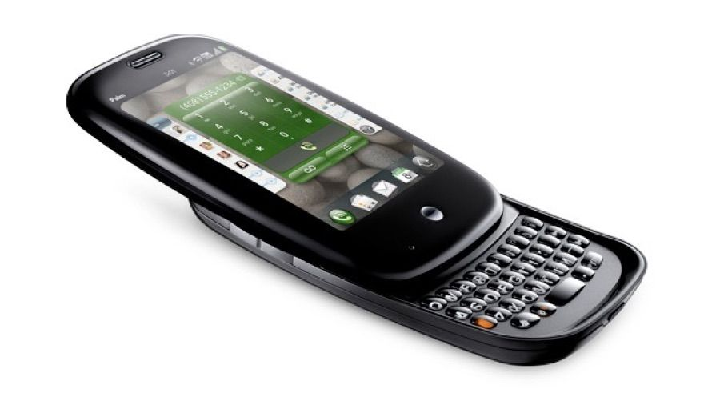
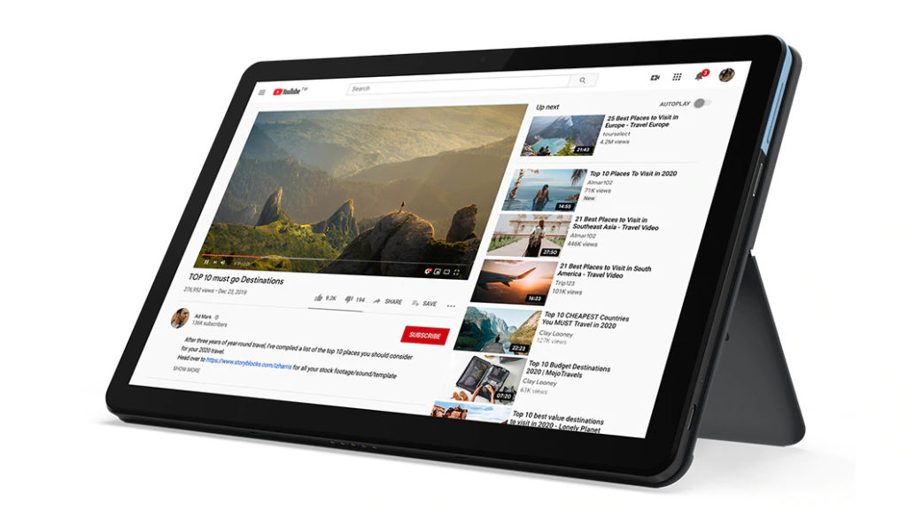
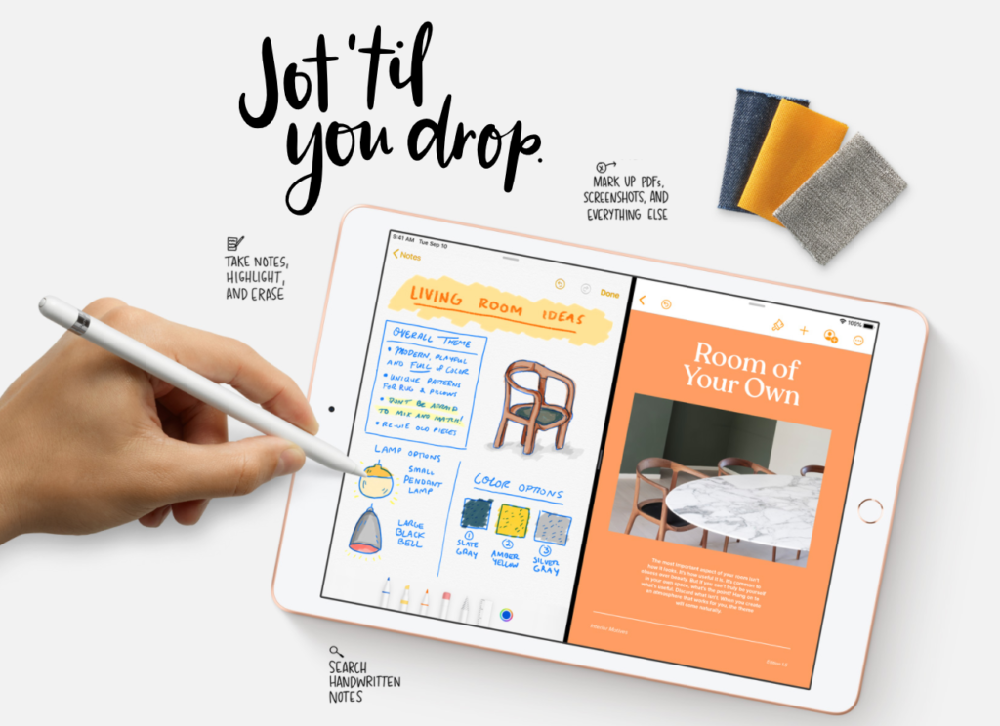
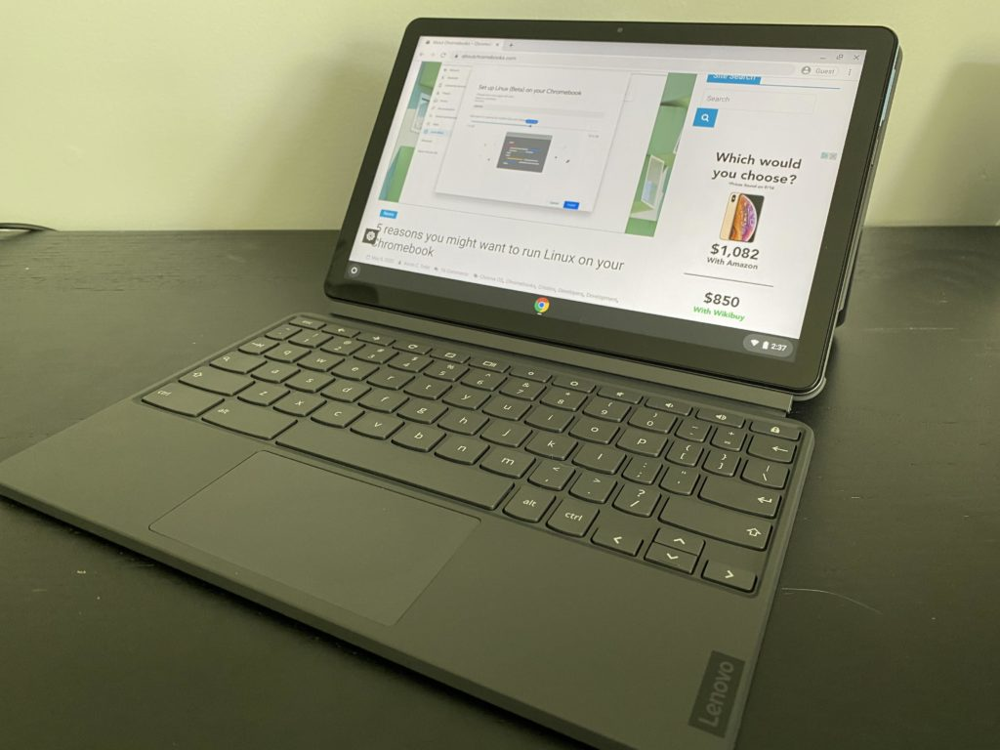
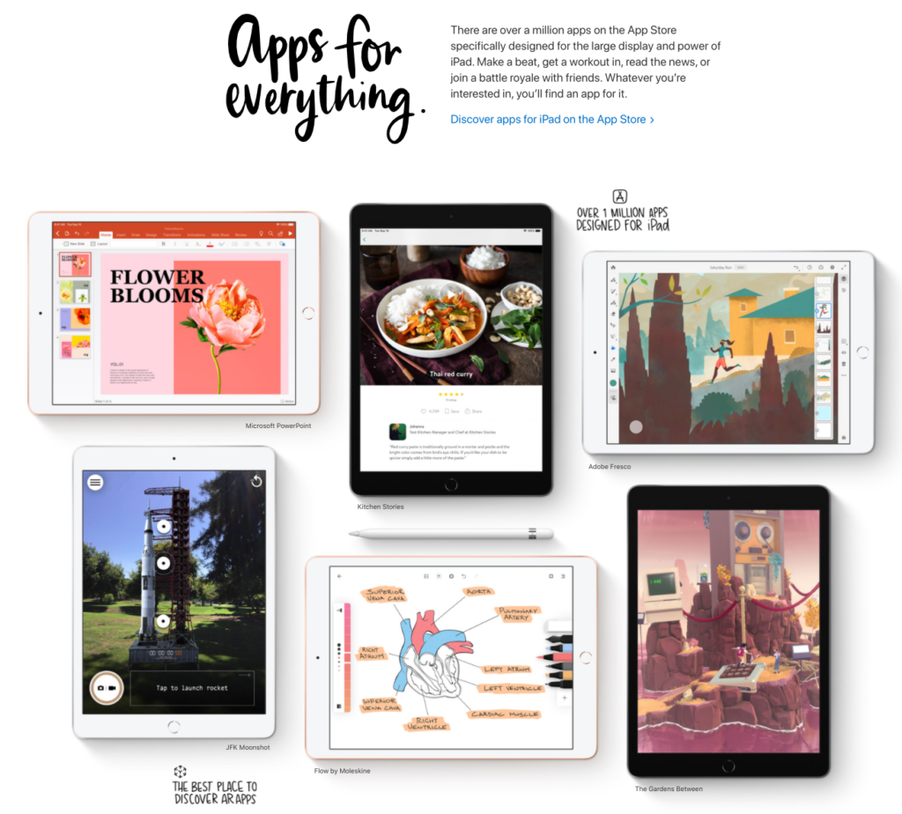
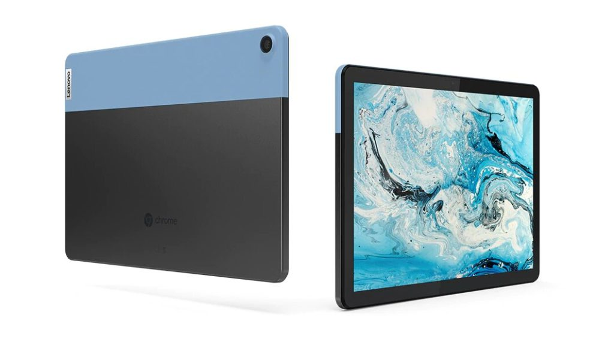

I know this is a Chromebook site, so the post title might have you scratching your head. But, I try to be as agnostic as possible when it comes to personal techology.

I've owned or used multiple phones from various brands and platforms ranging from Windows Mobile to Palm OS, Apple iOS and of course, Google Android. I also use multiple Chromebooks now but also have an Ubuntu laptop with both Windows 10 and macOS available through virtual machines. And one of my current favorite devices is my iPad Pro 11-inch tablet.

This approach gives me perspective on the pros and cons of the entire space. And that thought hit me as I was packing up the [Lenovo Duet Chromebook, now that my review of this 10.1-inch Chrome OS tablet](https://www.aboutchromebooks.com/news/lenovo-ideapad-duet-chromebook-review-2020/) is done. Why would someone choose this over the similarly priced iPad, or vice versa?

## Costs are comparable but you get more storage for less with the Duet

I think it's a valid question as the Lenovo Duet Chromebook costs $279 or $299, depending on the internal storage capacity you choose. (ProTip: If you do buy the Duet, it's well worth the extra $20 to go from 64 to 128 GB of storage). And the current base model iPad is $329, although if you purchase it through [Apple's Education store](https://www.apple.com/us-hed/shop), it's $309. (ProTip #2: Although you're supposed to be a student or the parent of a student to buy devices through the Apple Education store, anyone can actually use it.)

So the prices are very comparable, as are some of the other hardware features. On paper, the Duet comes out ahead in some cases while the iPad tops it in others.

For starters, the Duet has 64 or 128 GB of storage, as I previously noted. That base iPad? Just a scant 32 GB of local storage and if you want to step it up, you're looking at a $100 premium. Neither tablet has a memory card slot so neither has the advantage of expandable storage in that particular regard.

## Which tablet has the better display?

Since these are both tablets, let's look at what you'll be looking at the most: The screens. While I'm impressed by the 1920 x 1200 resolution display on the 10.1-inch touch screen, I think the iPad display is actually better.

My daughter owns this particular iPad and it's brighter and clearer to my eyes. Color saturation looks a little better as well to me. The 10.2-inch iPad supports a higher resolution of 2160 x 1620 and has 500 nits of screen brightness, for example. Lenovo's Chrome OS tablet brightness maxes out at 400 nits.

These two tablets both support digital pen input and it will cost you extra. Lenovo's Duet works with any USI stylus while the $89 first-generation Apple Pencil is the recommended option for the iPad. There are some cheaper third-party options available. I'd call this aspect a wash in general.

Credit: Apple

## Who has the performance edge?

Both slates effectively run on smartphone processors and although I found the Duet's performance adequate, I think Apple has the advantage here. The current iPad uses an Apple designed A10 processor, which is a few years old but I find it to have more snappiness overall. That's not to say the new MediaTek processor in the Lenovo Duet Chromebook is bad: I noted that it generally behaves similar to an Intel Celeron or perhaps a Pentium, in usage.

I think part of this equation isn't just hardware though. Apple's software is optimized to work with its hardware. That's a big advantage and a likely reason that even a slower (on-paper) iPad chip running iPad OS could be more responsive than Chrome OS with a similar, yet faster, processor.

This also equates to more run time on a charge in my experience as well. Apple delivers (often over-delivers) the advertised 10 hours of battery life with the iPad. The Duet does too... about half the time. It really depends on how you use the device since the processors are often optimized for specific tasks such as video decoding.

## What's included for your money

If the iPad wins in the overall performance category, the Duet makes a strong showing when it comes to value thanks to the included accessories. For under $300, you don't just get a Chrome OS tablet. You also get an included, detachable keyboard. Yes, it's a bit cramped but it works fairly well. The Lenovo Duet also comes with a removable magnetic fabric backplate that has a kickstand, so you're getting the whole enchilada with the tablet itself.

To get almost the same experience with the iPad, you'd have to drop a whopping $159 for a first party keyboard, stand and cover. I say "almost the same" because the cost doesn't include a trackpad, which the Lenovo keyboard does have. Again, there are third-party keyboard accessories available for the iPad that will cost less, but they still cost extra.

## Do you want or need a desktop browser on your small tablet?

Until recently, if a desktop browsing experience was what you wanted, the iPad wouldn't even be a consideration. However with the debut of iPad OS, Apple has finally brought most of that experience to mobile devices. I use Safari on my iPad Pro and many of the browser limitations I used to run into are no more.

However, I definitely prefer the Chrome OS browser experience, mainly due to extensions and other features that iPad still doesn't deliver on. I know this is a niche use-case but, for example, I often use the Chrome Developer Tools or element inspection on some web pages. That's not happening on your iPad with Safari. At least not yet.

I'd say if you haven't used Safari for iPad OS yet, you might be surprised to see how much better it is on a tablet. And if you just want basic no-frills browsing that doesn't require many web extensions (and has a really good Reader Mode), the iPad will definitely do. I like it for that type of usage but when it comes to productivity and work, I'm a Chrome OS user first and foremost.

## About the app experience

I know that many readers look to Chrome OS tablets and 2-in-1s as Android tablet replacements. I think that's overly optimistic because the Android experience on an Android tablet is generally much better than the Android experience on a Chrome OS device.

And to make the comparison even more challenging, the overall iOS app experience is better to me than that of the Android experience on similar hardware. You might not think so for the apps you use and I can't argue with you. Much depends on the apps you use on a regular basis.

That said, I've pointed out before than [you can be a very happy Chromebook and Google apps user with an iPhone](https://www.aboutchromebooks.com/opinion/can-you-happily-use-a-chromebook-and-an-iphone-yup/); the same holds true if you have an iPad.

In fact, I typically don't use any of Apple's native apps on my iOS devices. For example, I don't use Mail, iTunes, Apple Maps, or Apple Photos. Instead, I use Gmail, Google Maps and Google Photos. The same holds true for Apple's productivity suite for iOS. I delete it and replace the apps with Google Docs, Sheets, Drive and the like.

## So which is better: Apple iPad or Lenovo Duet Chromebook?

The obvious answer here is: It depends. ;)

I'm not trying to be facetious. Instead, I go back to how I pick a device. I write down what I need it to do and what kind of hardware experience I want in a prioritized list of importance.

For example, if "desktop browser" were my number one feature, I'd lean more towards the Lenovo Duet Chromebook. If it was the "app experience" atop my list, I'd more likely cross over to the iPad world. Of course, we don't pick a device based on one key feature. That's why I look at a prioritized list because that helps me get the device that will most meet my needs.

Price and value are key factors as well. And if your budget tops out at $300 or so, the clear value proposition is with the Lenovo Duet Chromebook. Well, unless you don't need a keyboard or a kickstand, in which case, the two are neck-and-neck.

Ultimately, I can't tell you which is better for you, just like you can't say which is better for me. However, these two tablets are both worth the look if you're in the market for a portable slate. Pick the one that meets more of your needs and I don't think you can go wrong.
