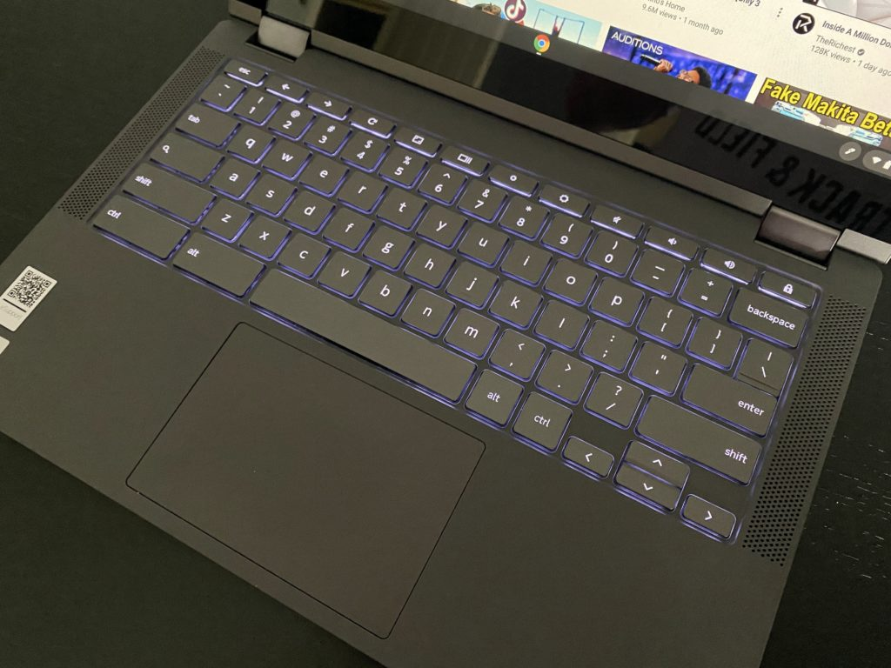

<iframe style="width:120px;height:240px;" marginwidth="0" marginheight="0" align="right" scrolling="no" frameborder="0" src="//ws-na.amazon-adsystem.com/widgets/q?ServiceVersion=20070822&amp;OneJS=1&amp;Operation=GetAdHtml&amp;MarketPlace=US&amp;source=ss&amp;ref=as_ss_li_til&amp;ad_type=product_link&amp;tracking_id=aboutchromebo-20&amp;marketplace=amazon&amp;region=US&amp;placement=B086383HC7&amp;asins=B086383HC7&amp;linkId=beedea117f2fcacc62655a8204af0a74&amp;show_border=true&amp;link_opens_in_new_window=true"></iframe>

Last week, I shared [initial impressions of the $250 Lenovo IdeaPad 3 Chromebook](https://www.aboutchromebooks.com/news/250-lenovo-ideapad-3-chromebook-14-hands-on-first-impressions-specifications/). My full review is just about complete on that device, but I decided to take a break from it, just so I could crack open the box of the Lenovo Flex 5 Chromebook. I'll be switching over to using it full-time once my IdeaPad 3 review hits shortly, and after a quick once-over with this 2-in-1 mid-range device, I'm really looking forward to it.

The Lenovo Flex 5 Chromebook almost sits in an odd category.

I typically consider there being three distinct Chromebook device markets: entry-level, mid-range, and high-end. And I have general price brackets for each in my mind: Sub-$350 or so for entry-entry level and above $700 for the high-end Chromebooks. At $409.99, the Lenovo Flex 5 Chromebook borders just above that entry-level price band but this is no entry-level device.

This is a great value for the money considering the specifications:

<table><tbody><tr><td>CPU</td><td>Dual-core Intel Core i3-10110U Processor (2.1 GHz / 4.1GHz)</td></tr><tr><td>GPU</td><td>Intel Integrated UHD Graphics</td></tr><tr><td>Display</td><td>13.3-inch IPS 1920 x 1080 touchscreen, 16:9 aspect ratio, 250 nits brightness</td></tr><tr><td>Memory</td><td>4 GB DDR4-2600MHz memory</td></tr><tr><td>Storage</td><td>64 GB eMMC 5.1, microSD card slot for expansion</td></tr><tr><td>Connectivity</td><td>WiFi6 (802.11ax, 2x2 MIMO), Bluetooth 5.0</td></tr><tr><td>Input</td><td>Spill-resistant backlit keyboard, USI stylus (optional) support, 720p webcam with physical privacy shutter</td></tr><tr><td>Ports</td><td>1 USB Type-A, 2 USB Type-C, headphone/microphone combo jack</td></tr><tr><td>Battery</td><td>51 WHr, expected run-time up to 10 hours</td></tr><tr><td>Weight</td><td>2.97 pounds</td></tr><tr><td>Software</td><td>Chrome OS automatic updates through: TBD</td></tr></tbody></table>

There are definitely mid-range Chromebooks that have some beefier specifications. Some come with 8 GB of memory, for example, while you're only getting half that here with the Flex 5. Maybe you can get a brighter screen too.

But those devices typically cost north of $500 unless they're on sale. At first glance, I think this sits squarely between the low-end and mid-range devices, which are great for those on a budget but want a few nice features to have.

One of them is a good display and I like the one on the Flex 5 so far. It's crisp, has nice color representation and has good viewing angles all around. The bezels aren't too chunky either, save for the bottom one. Simply put, this is a nice 1080p panel for the price.

And if you want to use that display in presentation or tablet mode, you can do that: This display folds back 360-degrees, hence the "Flex" name.

While we're talking about output, it's nice to see the speaker grilles along both sides of the keyboard. Unfortunately, with 2W of power per speaker, they seem just OK upon a first listen.

From an input standpoint, the backlit island-style keyboard feels nice. It's spill-proof as well. I'll have to do some long-term typing on it for my full review, but I'm a fan of Lenovo keyboards in general. I'd be surprised if this one lets me down.

The trackpad is sized nicely and made of Mylar, not glass. So far, that doesn't seem to be an issue for me in terms of responsiveness. The entire chassis is plastic while the display cover is aluminum. It doesn't feel "cheap" at all though. There feels like a smidge of texture to the plastic, which I like.

I haven't tested the 720p webcam yet but I love, love, love the physical privacy cover. Essentially, you slide it over when you want to block the camera and slide it back when it's time for a video call. Being a physical cover you don't have to worry about an electronic function that you may not trust.

I also like the port placement.

There's one USB Type-C on each side, which is good for charging. Your Type-A port, headphone jack, and memory card slot on the left side, while the right side has your power button and volume rocker. These don't stick out quite enough for my tastes; they're almost flush with the chassis. I really can't find the power button without looking.

And another downer, at least to me: Lenovo is using the same large 45W USB-C power brick for the Flex 5 as it uses for the IdeaPad 3 Chromebook. Smaller would be better in my opinion.

Getting a 10th-generation Intel Core i3 inside for around $400 is a pretty good deal, considering you're also getting a nice display, stylus support, and more. How well might it work from a performance standpoint? Here are the benchmark runs for those interested in those numbers.  All tests were run upon fresh bootup and in Guest Mode:

<table><tbody><tr><td><strong>Test</strong></td><td><strong>Score</strong></td></tr><tr><td>Octane 2.0</td><td>35,553</td></tr><tr><td>Speedometer 2.0</td><td>102</td></tr><tr><td>Basemark 3.0</td><td>544.28</td></tr><tr><td>JetStream 2.0</td><td>97.2</td></tr></tbody></table>

I don't use benchmarks for my buying decisions but for what it's worth, [the $849 Pixelbook Go I reviewed last year scored lower in some of the same tests](https://www.aboutchromebooks.com/news/pixelbook-go-review-a-premium-price-validated-by-a-premium-device/), which is interesting. I'm chalking that up to the Go having an 8th-generation chipset while this Lenovo unit has newer 10th-generation silicon inside. Also, the base clock speed of the Core i5 in the Go is 1.3GHz, while the Core i3 I'm using now runs at 2.1GHz.

I'll have to see how the Lenovo Flex 5 Chromebook performs in day-to-day use to get a better idea of the comparison. Also worth noting: This 2-in-1 has a fan for cooling, although I've only heard it when running some of the benchmark tests so far.

<iframe style="width:120px;height:240px;" marginwidth="0" marginheight="0" align="right" scrolling="no" frameborder="0" src="//ws-na.amazon-adsystem.com/widgets/q?ServiceVersion=20070822&amp;OneJS=1&amp;Operation=GetAdHtml&amp;MarketPlace=US&amp;source=ss&amp;ref=as_ss_li_til&amp;ad_type=product_link&amp;tracking_id=aboutchromebo-20&amp;marketplace=amazon&amp;region=US&amp;placement=B086383HC7&amp;asins=B086383HC7&amp;linkId=beedea117f2fcacc62655a8204af0a74&amp;show_border=true&amp;link_opens_in_new_window=true"></iframe>

Overall, I have little doubt that on paper, with the Lenovo Flex 5 Chromebook you're getting a lot for your money.

Some may be put off by the 4 GB of memory and I can understand that. This wouldn't meet my full needs, for example, that generally demand more memory and storage, such as when I'm [using Linux for hours to code](https://www.aboutchromebooks.com/news/can-you-learn-to-code-in-a-college-computer-science-program-with-a-chromebook/).

That doesn't mean this isn't a good device, especially if your requirements are geared towards everyday web use with what appears to be enough horsepower to fly around the internet or use Android apps. You also get a good display that may not be the brightest and therefore limited to non-outdoor use cases.

Stay tuned for the full review as I make the Lenovo Flex 5 Chromebook my main device over the coming days. Don't hesitate to ask any specific questions in the comments below and I'll try to answer them in the review.
