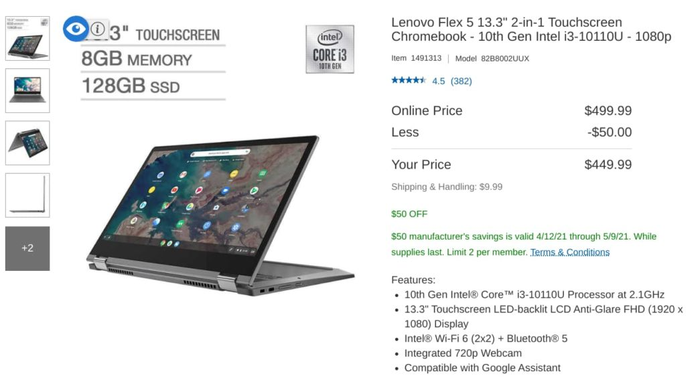
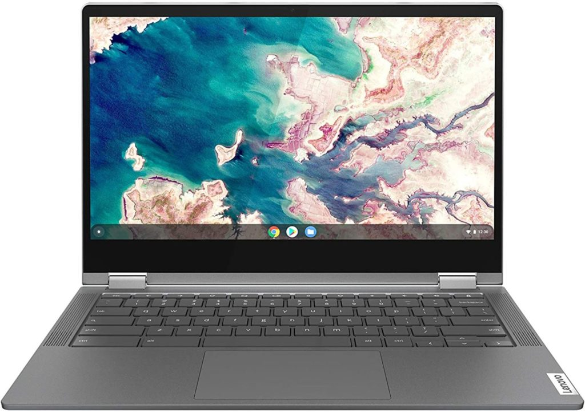
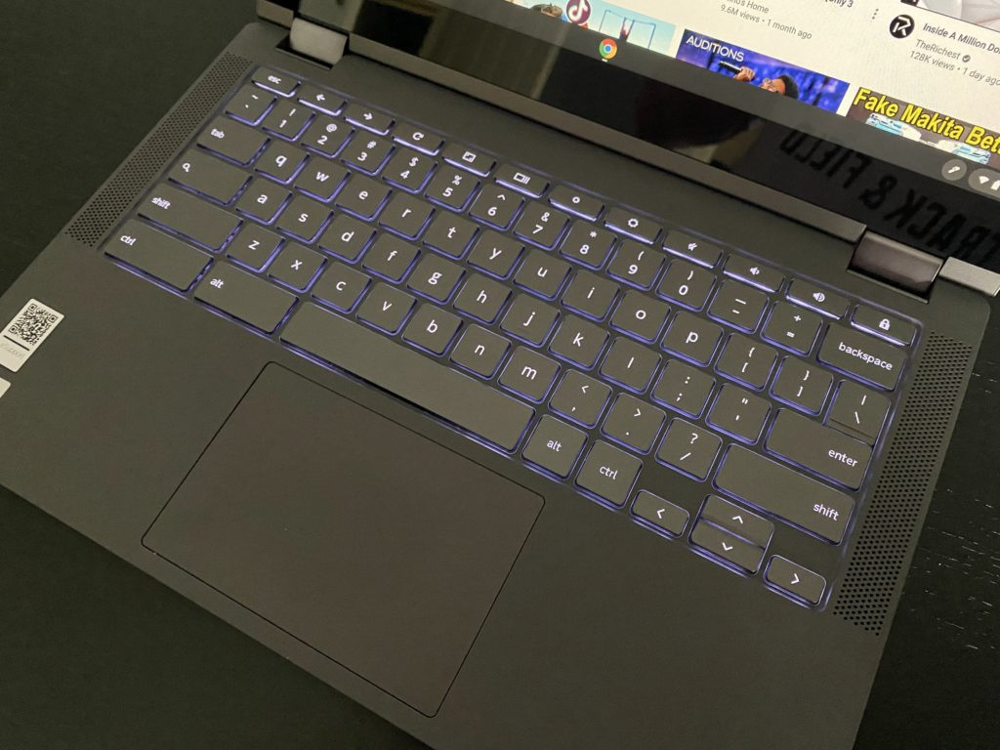

I haven't seen too many retailers selling the [Lenovo Flex 5 Chromebook with 8 GB of RAM here in the US](https://www.aboutchromebooks.com/news/theres-finally-an-8-gb-memory-version-of-the-lenovo-flex-5-chromebook-available-in-the-u-s/). When I have, the price has been $499.99, [the same as Lenovo charges for direct sales](https://www.lenovo.com/us/en/laptops/lenovo/student-chromebooks/IdeaPad-F5-CB-13CML-05/p/88IPFC51448). So it caught my eye today that Costco is offering a $50 savings on this configuration. If you're a warehouse member, you can [nab the Lenovo Flex 5 Chromebook with 8 GB RAM for $449.99](https://www.costco.com/lenovo-flex-5-13.3%22-2-in-1-touchscreen-chromebook---10th-gen-intel-i3-10110u---1080p.product.100692744.html).

Not only do you get double the memory of the base $379.99 model at this price, but you also get bumped up from an Intel Celeron to a Core i3.

Even better, you go from 64 GB of eMMC storage to [128 GB of faster PCIe SSD storage](https://www.aboutchromebooks.com/news/upgraded-lenovo-ideapad-flex-5-chromebook-emmc-vs-nvme-ssd/). All of those upgrades are easily worth the $70 premium over the base configuration, in my opinion.

[Get the Lenovo Flex 5 Chromebook deal](https://www.costco.com/lenovo-flex-5-13.3%22-2-in-1-touchscreen-chromebook---10th-gen-intel-i3-10110u---1080p.product.100692744.html "Get the Lenovo Flex 5 Chromebook deal")

I first looked at this device back in June and I was generally impressed with performance of the 4 GB model, saying:

> I don’t use benchmarks for my buying decisions but for what it’s worth, [the $849 Pixelbook Go I reviewed last year scored lower in some of the same tests](https://www.aboutchromebooks.com/news/pixelbook-go-review-a-premium-price-validated-by-a-premium-device/), which is interesting. I’m chalking that up to the Go having an 8th-generation chipset while this Lenovo unit has newer 10th-generation silicon inside. Also, the base clock speed of the Core i5 in the Go is 1.3GHz, while the Core i3 I’m using now runs at 2.1GHz.

I like the 1080p 13.3-inch display, WiFi 6 support that offers great connectivity speeds with my WiFi 6 router, the physical webcam cover, above-average backlit keyboard, and the trio of USB ports.

About the only thing I _didn't_ like was the large power brick but that's a small concession I'd be willing to make for such a great value. Oh and don't expect super loud sound out of the 2W speakers either.

I should note that although I haven't experienced any issues with the 360-degree display hinges, some readers have reported that theirs broke.

I don't know if that's a widespread issue but I did search for this problem in various user reviews on retailer sites. I only found a few such instances, however it's worth mentioning.

Also worth noting is that Costco offers a 90-day return policy on this convertible Chromebook, which is a nice little insurance policy in case of any issues in the first three months.

Here's a rundown of what you get for your $449.99:

<table><tbody><tr><td>CPU</td><td>Dual-core Intel Core i3-10110U Processor (2.1 GHz / 4.1GHz)</td></tr><tr><td>GPU</td><td>Intel Integrated UHD Graphics</td></tr><tr><td>Display</td><td>13.3-inch IPS 1920 x 1080 touchscreen, 16:9 aspect ratio, 250 nits brightness</td></tr><tr><td>Memory</td><td>8 GB DDR4-2600MHz memory</td></tr><tr><td>Storage</td><td>128 GB PCIe SSD, microSD card slot for expansion</td></tr><tr><td>Connectivity</td><td>WiFi6 (802.11ax, 2x2 MIMO), Bluetooth 5.0</td></tr><tr><td>Input</td><td>Spill-resistant backlit keyboard, USI stylus (optional) support, 720p webcam with physical privacy shutter</td></tr><tr><td>Ports</td><td>1 USB Type-A, 2 USB Type-C, headphone/microphone combo jack</td></tr><tr><td>Battery</td><td>51 WHr, expected run-time up to 10 hours</td></tr><tr><td>Weight</td><td>2.97 pounds</td></tr><tr><td>Software</td><td>Chrome OS automatic updates through June 2028</td></tr></tbody></table>

For the price, you're getting a solid mid-range Chromebook at not much more than an upgraded entry-level configuration.

Based on my usage of the Lenovo Flex 5 Chromebook, it should easily meet the needs of typical Chromebook usage when it comes to browsing and Android apps. Probably even the occasional Linux app or two from time to time.

[Get the Lenovo Flex 5 Chromebook deal](https://www.costco.com/lenovo-flex-5-13.3%22-2-in-1-touchscreen-chromebook---10th-gen-intel-i3-10110u---1080p.product.100692744.html "Get the Lenovo Flex 5 Chromebook deal")
