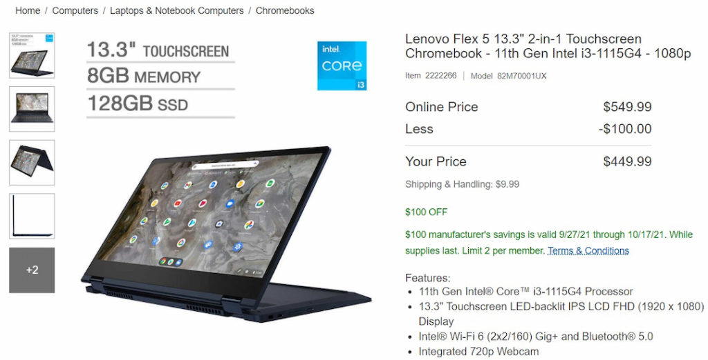
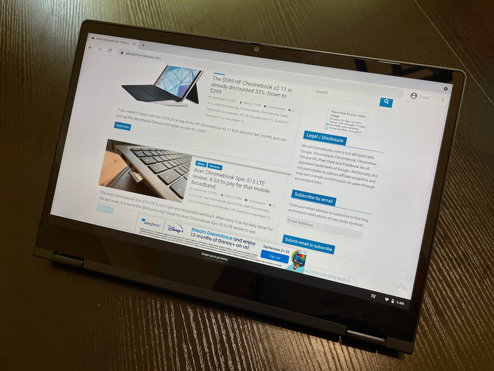
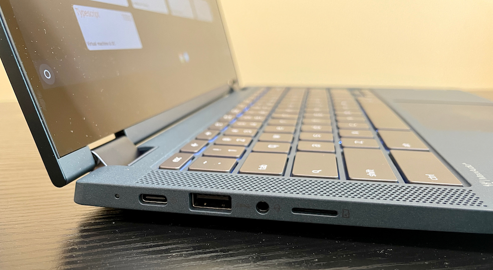
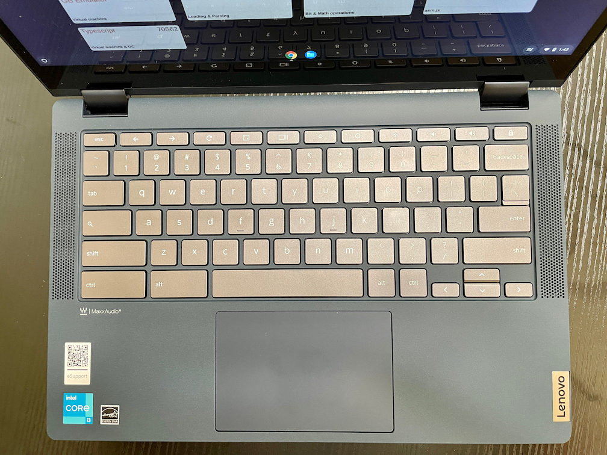
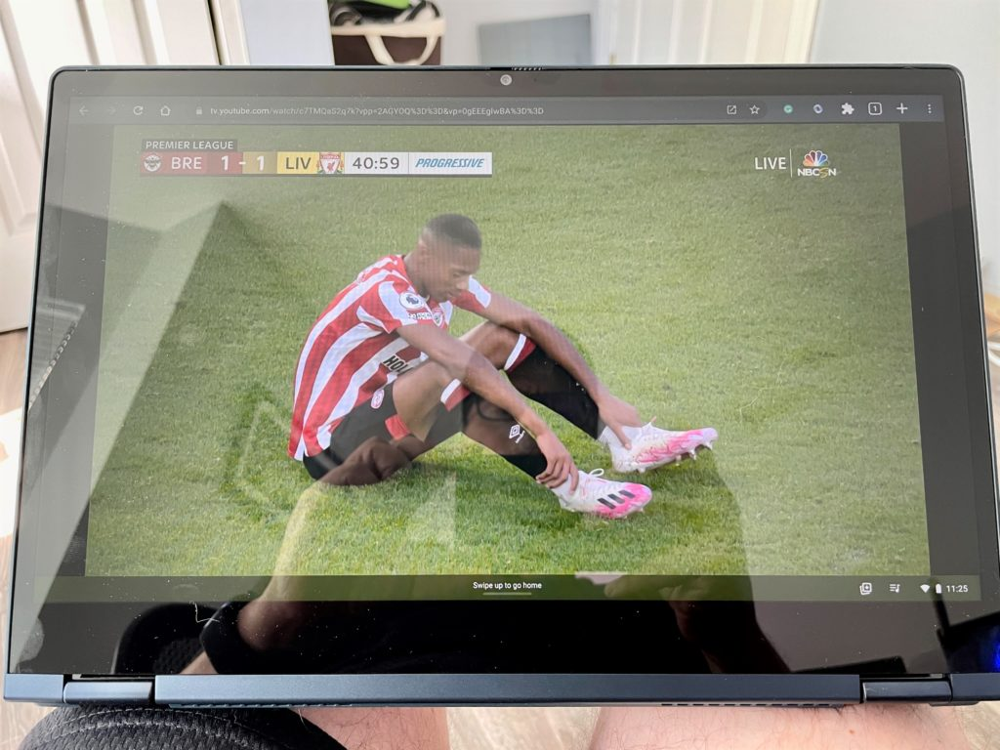

After being [thoroughly impressed by the Lenovo IdeaPad 5i Chromebook](https://www.aboutchromebooks.com/news/lenovo-ideapad-5i-chromebook-review-a-potent-pentium-powered-laptop/), I had high hopes for the similar convertible model, the [Lenovo Flex 5i Chromebook](https://www.lenovo.com/us/en/p/laptops/lenovo/lenovo-edu-chromebooks/ideapad-flex-5i-chromebook-gen-6/82m70010ux). While the clamshell 5i has a new Pentium Gold processor, the convertible Flex 5i is bumped up to the recent Intel Core i3. Aside from the chipset upgrade and the ability to fold the display for tablet-mode usage, there's little else different. But that's a good thing as I note in my Lenovo Flex 5i Chromebook review.

Just keep in mind that there is a price difference between the two models. This Lenovo Flex 5i Chromebook review unit as configured is priced at $549.99. [This model is sold through Costco and I just noticed there's a $100 discount until October 17th](https://www.costco.com/lenovo-flex-5-13.3%22-2-in-1-touchscreen-chromebook---11th-gen-intel-i3-1115g4---1080p.product.100744753.html). Also of interest: Direct sales of the Flex 5i from Lenovo are the same $549.99 price but with half the RAM and storage as the Costco configuration.

No, I don't get it either. Nor do I get the naming. Costo shows this as the Flex 5 Chromebook. The Lenovo site shows it as the Flex 5i. And yet the Lenovo part number on both is 82M70010UX. My take: If you want the newest 5i model from Lenovo, make sure it has an 11th-generation processor inside, regardless of whether the model is a 5 or a 5i.

For comparison shoppers, the clamshell 5i Chromebook I tested has a retail price of $439.99, although I've already seen some sale pricing.

You're paying more for the better processor in the Flex model, double the RAM, and the ability to rotate the display up to 360-degrees. Those are the most substantial differences, save for the displays. The clamshell 5i uses a 14-inch display with 300 nits of brightness while the Lenovo Flex 5i Chromebook reduces the screen size to 13.3-inches and brightness of 250 nits. Both are 1080p IPS touch panels.

## What do you get?

Here are the full specifications of the Lenovo Flex 5i Chromebook review unit that Lenovo loaned me:

<table><tbody><tr><td>CPU</td><td>Dual-core (four-threads) Intel Core i3-1115G4 CPU (3.0 GHz / 4.1 GHz)</td></tr><tr><td>GPU</td><td>Intel Integrated UHD Graphics</td></tr><tr><td>Display</td><td>13.3-inch IPS 1920 x 1080 display, anti-glare finish, 16:9 aspect ratio, 250 nits brightness</td></tr><tr><td>Memory</td><td>8 GB DDR4x-3733 MHz memory</td></tr><tr><td>Storage</td><td>128GB SSD M.2 PCIe 3.0x4 NVMe, microSD card slot for expansion</td></tr><tr><td>Connectivity</td><td>802.11ax (2x2) WiFi 6, Bluetooth 5.1</td></tr><tr><td>Input</td><td>Spill-resistant backlit keyboard, Mylar trackpad 720p webcam with physical privacy shutter</td></tr><tr><td>Ports</td><td>1 USB Type-A 3.2 (Gen 1), 2 USB Type-C 3.2 (Gen 1) supporting PD 3.0, data and DisplayPort 1.4, headphone/microphone combo jack</td></tr><tr><td>Battery</td><td>51 WHr, expected run-time up to 10 hours</td></tr><tr><td>Weight</td><td>2.97 pounds</td></tr><tr><td>Software</td><td>Chrome OS automatic updates through June 2029</td></tr></tbody></table>

Again, aside from the previously mentioned differences, much is the same here with regards to ports, battery capacity, keyboard (backlit on this one), the camera, and connectivity. Build materials and quality are similar too, which I don't mind. The plastic/ABS alloy chassis is sturdy but light. And the aluminum lid has a nice feel to it as well.

Given that some buyers of last year's convertible model experienced a broken hinge, I don't see any design differences. There could be a stronger material used, but I can't tell. And I haven't had any hinge issues with this review unit or with last year's model.

Since this model is slightly smaller all around than the 5i Chromebook clamshell, I thought the keyboard might feel a little cramped. Nope, there's no difference to me after more than a week of use. I have plenty of room to bang out text and the keyboard quietly offers a comfortable amount of travel. The trackpad is about as big as it can be in a chassis of this size and it worked well for me.

Oh, that trackpad isn't off-center either; that was a minor annoyance on the clamshell model to me.

## Performance: The Flex 5i Chromebook flexes that 11th-gen Core i3

When I reviewed the standard 5i Chromebook with the new Pentium, I was pleasantly surprised by the performance.

Here's how I summarized it: "The benchmark results, although just a general performance indicator, are striking. The newest chip is a Pentium processor but handily beats a Core i5 that’s two generations old. And it fares better against last year’s Core i3 mobile CPU as well."

The Lenovo Flex 5i Chromebook kicks things up a notch from there, thanks to the 11th-generation Core i3 CPU. For the benchmark crowd, you can see the indicators to back that up.

<table class="has-fixed-layout"><tbody><tr><th class="has-text-align-center" data-align="center">Test</th><td class="has-text-align-center" data-align="center"><strong>Flex 5i 11th-gen Core i3</strong></td><th class="has-text-align-center" data-align="center">IdeaPad 5i 11th-gen Pentium</th><th class="has-text-align-center" data-align="center">Flex 5 10th-gen Core i3</th><th class="has-text-align-center" data-align="center">Acer Chromebook Spin 13 8th-gen Core i5</th></tr><tr><td class="has-text-align-center" data-align="center">Speedometer 1.0</td><td class="has-text-align-center" data-align="center">311</td><td class="has-text-align-center" data-align="center">249.8</td><td class="has-text-align-center" data-align="center">207</td><td class="has-text-align-center" data-align="center">179.9</td></tr><tr><td class="has-text-align-center" data-align="center">Speedometer 2.0</td><td class="has-text-align-center" data-align="center">176</td><td class="has-text-align-center" data-align="center">144.0</td><td class="has-text-align-center" data-align="center">118</td><td class="has-text-align-center" data-align="center">99.6</td></tr><tr><td class="has-text-align-center" data-align="center">JetStream 2</td><td class="has-text-align-center" data-align="center">151.88</td><td class="has-text-align-center" data-align="center">130.35</td><td class="has-text-align-center" data-align="center">113.87</td><td class="has-text-align-center" data-align="center">94.436</td></tr><tr><td class="has-text-align-center" data-align="center">Basemark 3.0</td><td class="has-text-align-center" data-align="center">1,179.9</td><td class="has-text-align-center" data-align="center">1,032.8</td><td class="has-text-align-center" data-align="center">528.1</td><td class="has-text-align-center" data-align="center">594.18</td></tr><tr><td class="has-text-align-center" data-align="center">Octane 2.0</td><td class="has-text-align-center" data-align="center">55,360</td><td class="has-text-align-center" data-align="center">47,152</td><td class="has-text-align-center" data-align="center">42,429</td><td class="has-text-align-center" data-align="center">35,116</td></tr></tbody></table>

Higher numbers are better

And those numbers are also backed up by my experience. This 2-in-1 Chromebook handled everything I needed it to do for my workload, which is higher than the typical Chromebook user. It's not uncommon for me to have 15 or more browser tabs open and [a Linux terminal for coding](https://www.aboutchromebooks.com/news/linux-on-chromebooks-just-might-get-me-through-a-masters-in-computer-science/).

Running my few Android apps didn't exhibit any issues either. I didn't notice them being noticeably quicker than on other devices, but then again, I don't use "heavy" Android apps such as games.

Regardless, the whole experience was better than my aging Acer Chromebook Spin 13.

That device uses a Core i5 CPU that's two generations older than the Core i3 inside the Flex 5i. [My daily driver, the Spin 13, also has 16 GB of memory](https://www.aboutchromebooks.com/news/acer-chromebook-spin-13-with-16-gb-ram-should-you-buy-one/), or double what this Chromebook has. Side-by-side testing of the same activities showed me that the Lenovo Flex 5i Chromebook is faster in every way than my "expensive, high-end" Spin 13.

Battery life is solid too. It's not useful to compare runtime on the Flex 5i with my 3-year-old Chromebook and its tired battery of course. But I was able to get between 8 and 9 hours with the Flex 5i, which is close to Lenovo's claim of "up to 10". And I love having USB Type-C on both sides of the device for recharging that battery.

If it weren't for the 16:9 aspect ratio, I'd already have ordered my own Flex 5i. That's not a knock on the device. My daily activities are better served by a taller display. And to be honest those activities don't require a convertible Chromebook. If yours do, and/or you prefer a wider display, you'll likely be very happy with performance on the Flex 5i.

## Tablet mode isn't bad as long as you limit the time using

You also might want a Chromebook that pulls double duty as a tablet or can be used in presentation and tent modes. I don't have a USI stylus and Lenovo doesn't include one, so I couldn't test any digital inking. But I did fold back that display to hide the keyboard and do some web browsing in my recliner.

Even though this is a relatively small, lightweight Chromebook, I wouldn't want to hold it in tablet mode for too long. It's fine for occasional casual browsing. And it's great for consuming content in presentation mode on the lap. Why look at the keyboard in that use case?

Speaking of consuming content, video playback is really good on this display. There is a little more glare than I'd like but it's not terrible. The top-firing speakers are better than average but not mind-blowing... or is it ear-splitting? Either way, the 2x2W speakers sound better than they should thanks to the Waves MaxxAudio features.

## Should you buy the Lenovo Flex 5i Chromebook?

There really aren't any major "gotchas" here. The Lenovo Flex 5i Chromebook is a solid device with great performance, a workday's worth of battery life, and a nice combination of display, keyboard, and trackpad. It has all of the ports most users would want.

About the only gripe I can come up with is the 720p camera. I appreciate the privacy shutter but I'd appreciate a 1080p sensor even more. It's fine and usable, just not impressive.

Everything else really is though. So if you want better performance than a high-end Chromebook from just a few short years ago and have to have a convertible Chromebook, you should strongly consider the Lenovo Flex 5i. I'd recommend hitting up Costco before the $100 discount expires; you get the lower price, 8 GB of memory, 128 GB of NVMe storage, and a generous return policy. Short of any long-term issues, I don't think most people would be returning this device.

If you can get away with a clamshell device and want to give up a smidge of performance, the Lenovo IdeaPad 5i Chromebook is less expensive but mainly the same device. Either way: These are both really good Chromebooks.
