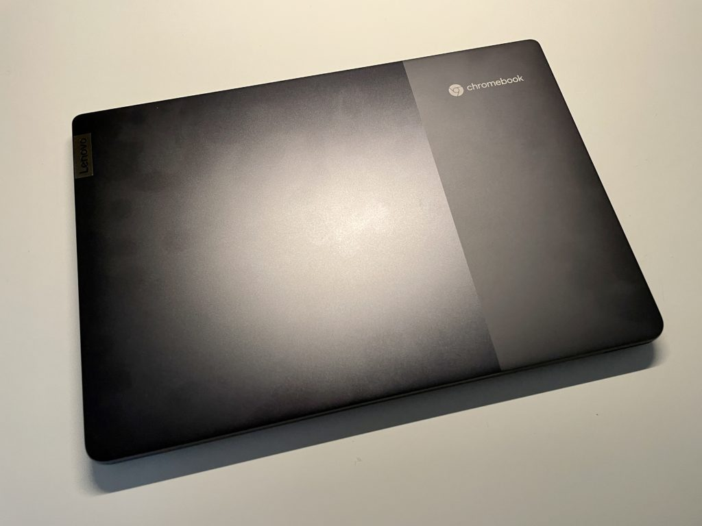
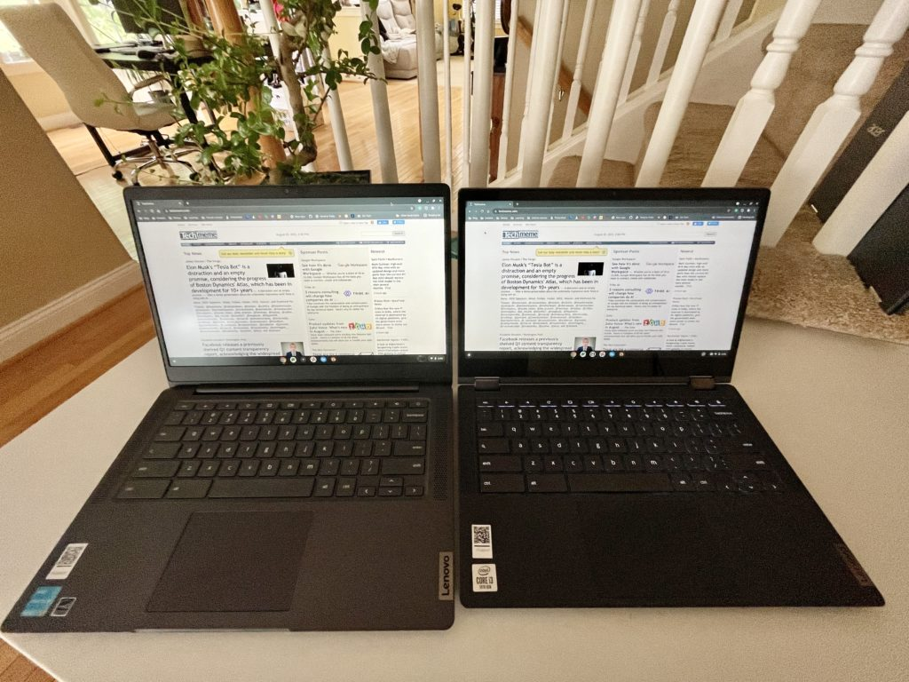
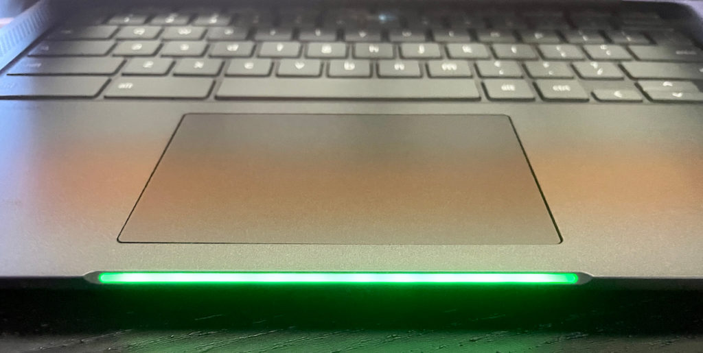
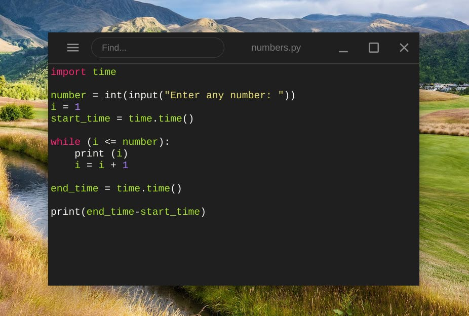

Even after two weeks of using the Lenovo IdeaPad 5i Chromebook, this little laptop continues to surprise me. My first impressions on it mostly discussed the design changes and high-level thoughts. Those haven't changed. But I also made [early observations about the 11th-gen Intel Pentium Gold processor](https://www.aboutchromebooks.com/news/hands-on-lenovo-ideapad-5i-chromebook-first-impressions/), noting that it impressed me.

Using the Lenovo IdeaPad 5i Chromebook these last 14 days has only reinforced those thoughts. The Lenovo IdeaPad 5i Chromebook is shockingly fast for its configuration and [$439.99 price tag on Lenovo's site](https://www.lenovo.com/us/en/laptops/lenovo/student-chromebooks/5i-Chromebook-Gen-6-14-Intel/p/WMD00000481). This is surely a contender for "Chromebook of the year" in 2021 based on what you get.

## Slight design improvements from last year's model

I won't spend much time discussing the design as I covered much of that in my first impressions earlier this month. If you missed those, here are the main takeaways:

> If you’re familiar with last year’s slightly smaller model, you’ll see many familiar features. In fact, this isn’t a radical redesign although moving up from a 13.3-inch display to a 14-inch panel does give a little more room in the chassis. This time around there are larger speaker ports alongside the keyboard, for example. These house 2W speakers are tuned with Waves MaxxAudio. The sound quality isn’t bad and the loudness is high for a laptop of this size and price.

With the slightly larger screen, the overall footprint of the 5i is a smidge larger than last year's Flex 5. And of course, this isn't a Flex model, so the display only folds back to around 130-degrees or so. The display panel is otherwise similar to the 2020 models, which is to say they're above average. And Lenovo gave the 2021 5i Chromebook a brighter 300-nit backlight for the IPS panel, which is a welcome addition.

5i on the left, Flex 5 on the right. The size difference is magnified by a wide-angle lens.

The new chassis material adds rigidity and having USB Type-C ports on both sides of it is fantastic. Putting all of those on one side should be a criminal offense, in my opinion. I liked the continued inclusion of a physical slider to disable the webcam. The webcam itself is average at best, but serviceable.

The keyboard isn't backlit on this configuration, unfortunately. That's the only issue I can find with it. It's comfortable and responsive with good key travel. And the mylar trackpad has performed admirably as well. Indeed, it's far better than the clicky-sounding trackpad on the Flex 5. Oddly, the trackpad is slightly offset from the center, although that didn't bother me.

With my WiFi 6 router, I'm getting superb transfer speeds and I haven't experienced any Bluetooth issues. Battery life is closer to that 8-hour mark that I figured, not the 10 hours that Lenovo claims. Then again, they use a standard controlled test. I simply used the device as I would daily, so your mileage may vary.

Here are the rest of the hardware specifications for this configuration:

<table><tbody><tr><td>CPU</td><td>Dual-core (four-threads) <a href="https://ark.intel.com/content/www/us/en/ark/products/208667/intel-pentium-gold-7505-processor-4m-cache-up-to-3-50-ghz-with-ipu.html" target="_blank" rel="noreferrer noopener">Intel Pentium Gold 7505</a> (2.0 GHz / 3.5 GHz)</td></tr><tr><td>GPU</td><td>Intel Integrated UHD Graphics</td></tr><tr><td>Display</td><td>14-inch IPS 1920 x 1080 display, matte finish, 16:9 aspect ratio, 300 nits brightness</td></tr><tr><td>Memory</td><td>4 GB DDR4x-3733 MHz memory</td></tr><tr><td>Storage</td><td>128GB SSD M.2 PCIe 3.0x4 NVMe, microSD card slot for expansion</td></tr><tr><td>Connectivity</td><td>802.11ax (2x2) WiFi 6, Bluetooth 5.1</td></tr><tr><td>Input</td><td>Spill-resistant keyboard, Mylar trackpad 720p webcam with physical privacy shutter</td></tr><tr><td>Ports</td><td>1 USB Type-A 3.2 (Gen 1), 2 USB Type-C 3.2 (Gen 1) supporting PD 3.0, data and DisplayPort 1.4, headphone/microphone combo jack</td></tr><tr><td>Battery</td><td>51 WHr, expected run-time up to 10 hours</td></tr><tr><td>Weight</td><td>3.1 pounds</td></tr><tr><td>Software</td><td>Chrome OS automatic updates through June 2029</td></tr></tbody></table>

I also have to admit: Even though it doesn't appear on the specs, I really like the LED battery indicator.

## A portable Pentium powerhouse

I'd say the Lenovo IdeaPad 5i Chromebook ticks off most of the main boxes when it comes to design, run-time, and a solid experience. When you add in the performance factor for the cost, this Chromebook **_really_** shines.

To give you an idea of how the 11th-generation Pentium Gold inside the IdeaPad 5i Chromebook, I ran a suite of benchmarks.

For comparison purposes, I ran the same benchmarks on last year's Flex 5 Chromebook with its 10th-generation Core i3. And mainly to see the progress Intel has made over the last few silicon iterations, I included my daily driver. That's the [Acer Chromebook Spin 13 with an 8th-generation Core i5 paired with 16 GB of memory](https://www.aboutchromebooks.com/news/acer-chromebook-spin-13-with-16-gb-ram-should-you-buy-one/).

All tests were run on the latest [Chrome OS 92 Stable Channel](https://www.aboutchromebooks.com/news/chrome-os-92-stable-update-arrives-heres-what-you-need-to-know/), with [hyper-threading enabled](https://www.aboutchromebooks.com/news/chrome-os-74-disables-cpu-hyperthreading-intel-mds-vulnerabilities-security/), and in Guest Mode on a freshly booted machine. All flags were set to the default settings, save for the hyper-threading option.

Looks like I need to update my daily driver!

| Test | IdeaPad 5i  
11th-gen Pentium | Flex 5  
10th-gen Core i3 | Acer Chromebook Spin 13  
8th-gen Core i5 |
| --- | --- | --- | --- |
| Speedometer 1.0 | 249.8 | 207 | 179.9 |
| Speedometer 2.0 | 144.0 | 118 | 99.6 |
| JetStream 2 | 130.35 | 113.87 | 94.436 |
| Basemark 3.0 | 1,032.8 | 528.1 | 594.18 |
| Octane 2.0 | 47,152 | 42,429 | 35,116 |

Higher numbers are better

The benchmark results, although just a general performance indicator, are striking.

The newest chip is a Pentium processor but handily beats a Core i5 that's two generations old. And it fares better against last year's Core i3 mobile CPU as well.

Put another way: This isn't your grandpa's Pentium. It's a peppy little processor that keeps things moving nicely in Chrome OS. Dare I say, this year's Pentium in an entry-level Chromebook competes well against last year's mid-range line?

I suppose that depends on how you view entry-level and mid-range Chromebooks. However, a Celeron or Pentium has long been considered on the low end of that scale.

I don't use many Android apps on my Chromebook these days, but the ones I tested worked just as well as they do on my daily driver. Maybe even a little bit quicker, to be honest, although most are fairly "light" applications.

Another test that I don't normally do is anything in Linux. But given the higher than expected numbers from the latest Pentium processor, I figured to make an exception. For a super basic baseline test, I installed Linux on all three devices. I then wrote a very simple Python script to print out the numbers 1 to 1,000,000 sequentially. The test then displays the time, in seconds, indicating how long the script took to run.

No, it's not ideal and it probably tests the ALU (Arithmetic Logic Unit) of the processor more than anything else. Even so, the results were surprising:

<table class="has-fixed-layout"><tbody><tr><td class="has-text-align-center" data-align="center">IdeaPad 5i</td><td class="has-text-align-center" data-align="center">9.963</td></tr><tr><td class="has-text-align-center" data-align="center">Flex 5</td><td class="has-text-align-center" data-align="center">11.78</td></tr><tr><td class="has-text-align-center" data-align="center">Acer Chromebook Spin 13</td><td class="has-text-align-center" data-align="center">35.411</td></tr></tbody></table>

All times in seconds, lower numbers are better

Again, this is a super simple test but installing development tools and testing how long it takes to compile code is likely beyond the scope of most Chromebook users.

## Should you buy the Lenovo IdeaPad 5i Chromebook?

If you're in the market for a higher-end Chromebook, want a 2-in-1 device, or desire a touchscreen, this isn't the Chromebook for you. Anyone else on a limited budget should definitely consider the Lenovo IdeaPad 5i Chromebook, although I'd recommend waiting for a sale.

It's quite common for Lenovo to discount their laptops on a regular basis. But even at the full price, it's a great value based on my usage. Every day browsing, Android apps, and even some Linux usage are all enjoyable here.

This is definitely more of a mid-range performer, even with the 4 GB of RAM, that should suit most Chromebook user's needs. As I mentioned earlier, it's a definite contender for "Chromebook of the year" based on the price and performance.

Note that I received some reports from readers last week that the Lenovo IdeaPad 5i Chromebook was discontinued. I reached out to Lenovo and that's not the case. It seems like there was a bad link floating around on the web. [The correct one is here](https://www.lenovo.com/us/en/laptops/lenovo/student-chromebooks/5i-Chromebook-Gen-6-14-Intel/p/WMD00000481).
