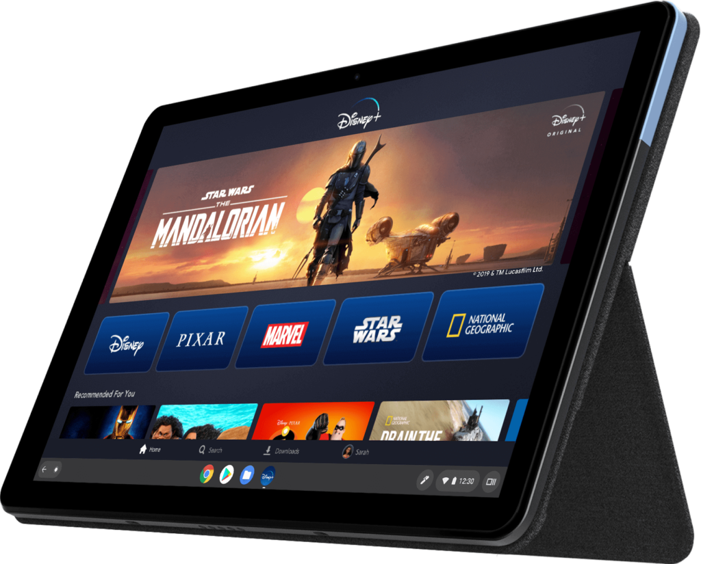
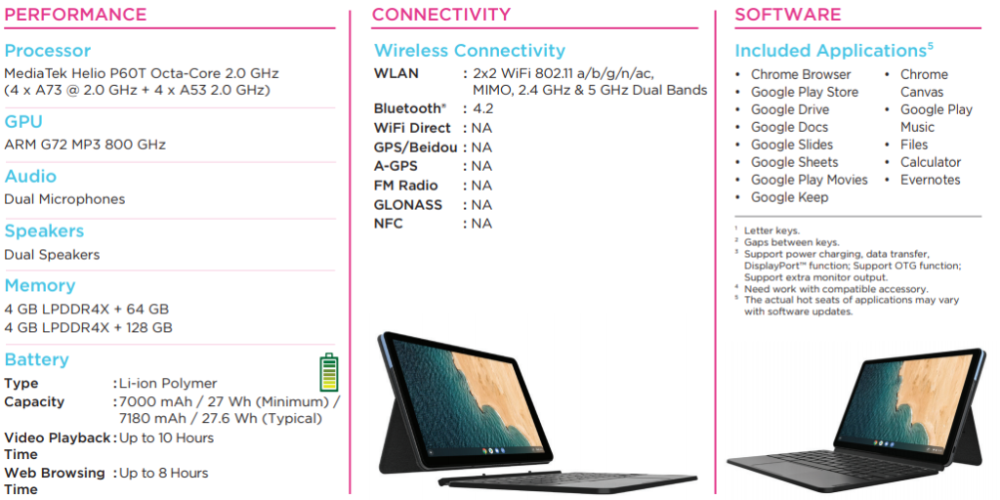
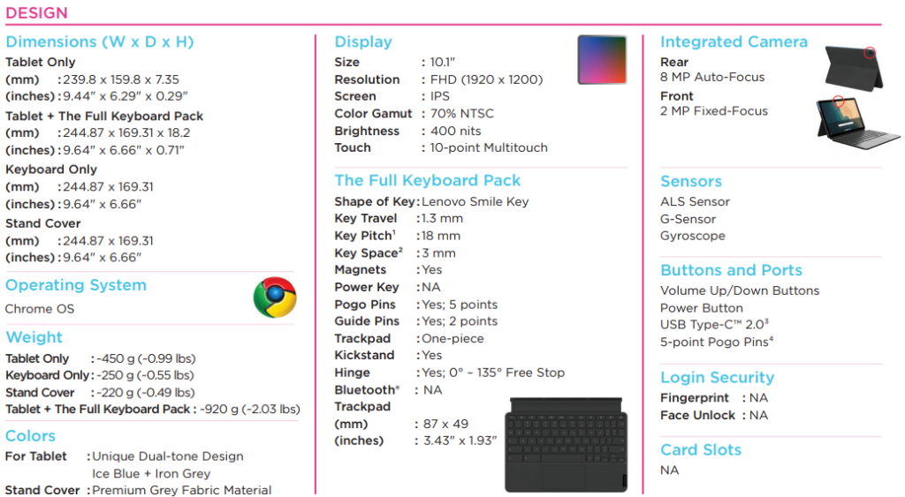

Folks waiting for a smaller Chrome OS tablet surely have the [Lenovo IdeaPad Duet on their wishlist after seeing the 10.1-inch tablet with a detachable keyboard get introduced in January](https://www.aboutchromebooks.com/news/did-you-miss-the-new-lenovo-chromebook-flex-5-at-ces-2020/). According to Best Buy, your wishlist might be fulfilled on May 6, as the online retailer is currently showing that as a [release date for the IdeaPad Duet Chromebook in the U.S.](https://www.bestbuy.com/site/lenovo-ideapad-duet-chromebook-10-1-tablet-128gb-with-keyboard-ice-blue-iron-gray/6401727.p?skuId=6401727)

[Chrome Unboxed spotted the product listing](https://chromeunboxed.com/lenovo-chromebook-duet-available-pre-order-shipping-date/) for the [slightly upgraded model with 128 GB of storage capacity](https://www.aboutchromebooks.com/news/official-spec-sheet-outlines-every-aspect-of-the-two-lenovo-ideapad-duet-chromebook-models/) and placed a pre-order at $299. The base model with 64 GB of storage is expected to retail for $279. Best Buy currently doesn't have a listing for the base model and it appears that the pre-order process is now turned off.

Still, this Chrome OS tablet with MediaTek chipset was expected to debut in May, so odds are good that May 6 is the release date.

If you missed the specifications from these two devices, here's a reminder:

I don't need another Chromebook or Chrome OS tablet at the moment, but I may drop the $299.99 for the IdeaPad Duet if only to see how that MediaTek Helios P60 processor performs. I was generally disappointed by the ARM processor in the Acer Chromebook Tab 10, which turned me off from the smaller Chrome OS tablet form factor.

With 4 GB of memory and a smaller screen than I'm used to, the Lenovo IdeaPad Duet Chromebook wouldn't be much of a productivity device for what I do. But it _could_ be an ideal part-time browser and entertainment unit in a portable package.

Is anyone else interested in this li'l guy?
