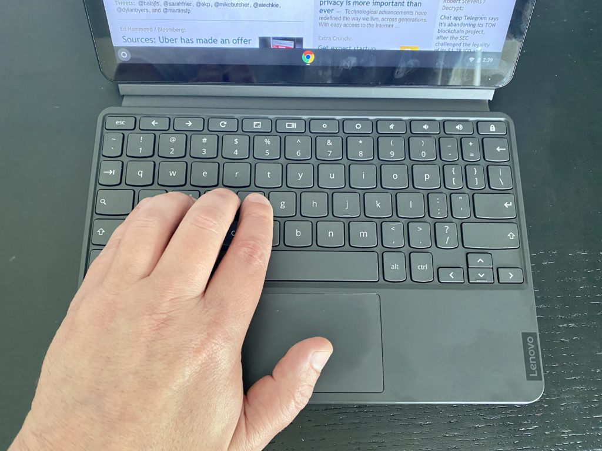
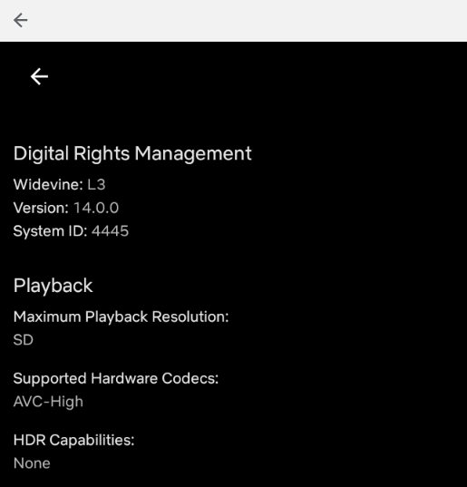
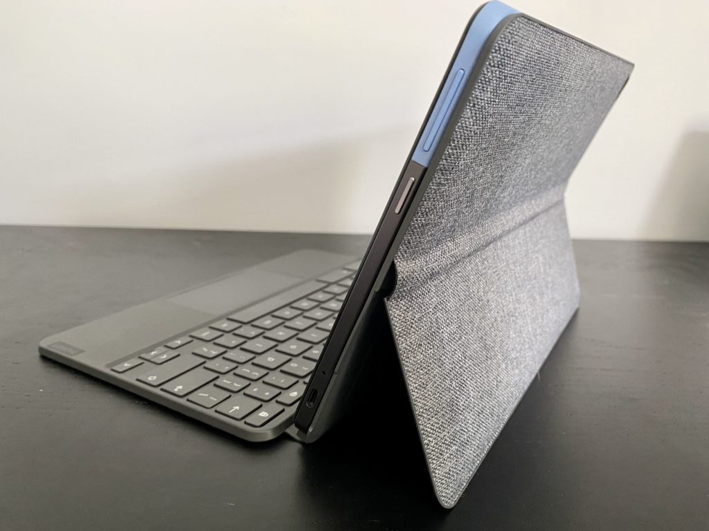
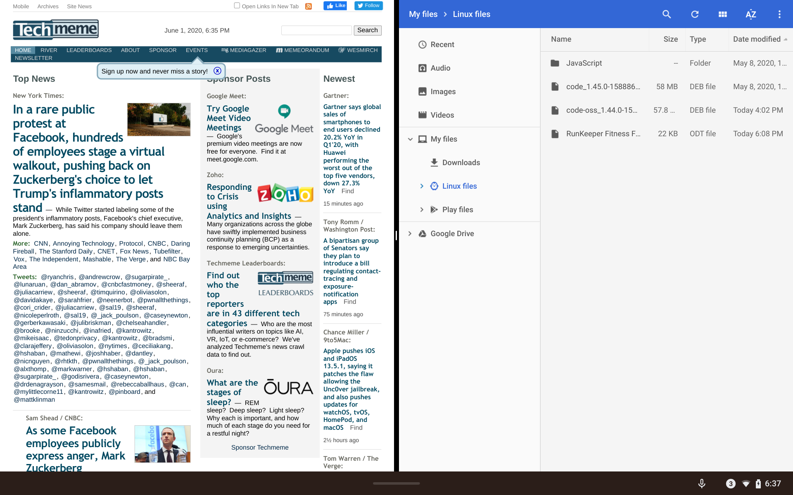
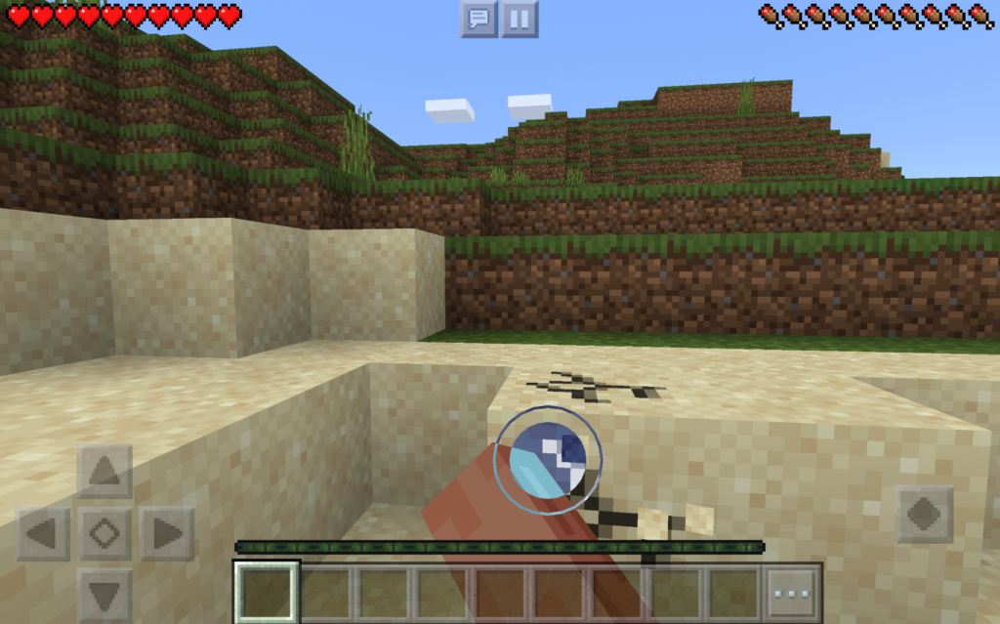
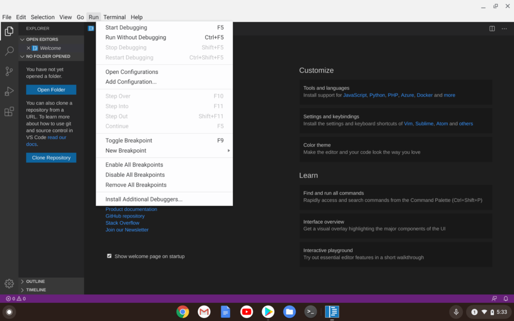
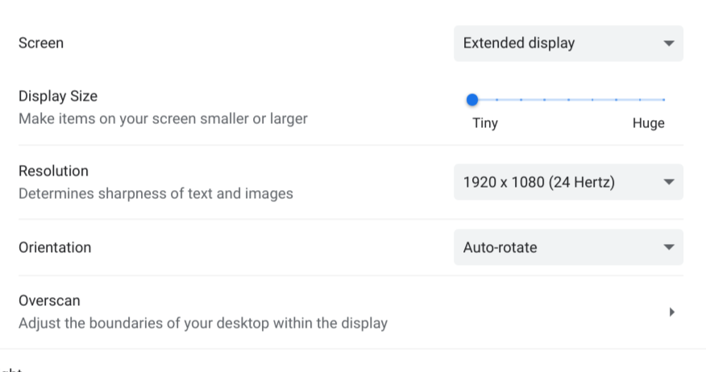

I've been using the $299 configuration of the Lenovo Duet Chromebook for several weeks now, which is longer than I typically take to review Chromebooks. The main reason is that I realized something about the latest Chrome OS tablet: There will be different potential buyers of this small slate. Additionally, I knew Chrome OS 83 was due for release soon so I wanted to complete my testing with that version, [which arrived last week](https://www.aboutchromebooks.com/news/chrome-os-83-stable-channel-arrives-what-you-need-to-know-release-notes/).

Overall, I think it's a great value for the price. However, I also think that the question of "Should you buy it?" depends on if you plan to use it as a primary or a secondary device. I'll share my thoughts on that aspect after covering the basics and answering a few previously asked reader questions along the way.

## Overall quality, display, design and input

Not much has changed from my i[nitial hands-on and first impressions of the Lenovo Duet Chromebook](https://www.aboutchromebooks.com/news/299-lenovo-duet-chromebook-first-impressions-positive-as-long-as-you-keep-expectations-in-check/). I still think the build quality, materials, design, durability, and display are all better than you'd expect at this price.

And although I can get used to practically any keyboard, I still struggle at times with the included detachable one even though I don't mind that it isn't backlit. The overall typing experience is good but the keys are small and about one dozen of the keys are about half the size as a full-sized keyboard would have.

That's to be expected when designing a keyboard that can't be wider than the display in landscape mode. Lenovo has done as good a job here as I think anyone could. But I get frustrated with the smaller punctuation keys; it has definitely slowed down my typing speeds and/or has led to more inadvertent typing errors. Those keys are a bigger challenge to me than the small trackpad, which again is limited by available space for a tablet of this size. Regardless, it performs admirably.

I still find the display a little too cool for my tastes but that's easy to mitigate if you feel the same. I simply enabled the Night Light setting to be always-on and adjusted the screen temperature to be a smidgen warmer.

One other interesting aspect about that 400-nit bright display with native 1920 x 1200 resolution: The default resolution is 1440 x 900. But the Chrome OS Settings app doesn't say that. It's only when you move the resolution setting to 1080 x 675 when you see the word "Default" for the screen res. It's not a problem and there are nine different resolution settings to choose from, but I find it odd.

Regardless, I like the screen's output for work and for entertainment. I watch most of my television and movie content on Chromebooks and I enjoyed doing the same on the Lenovo Duet Chromebook. I even used the small slate for some Google Stadia gaming and everything looked detailed and fluid, although the graphics are really rendered in the cloud.

**Reader question from Mike:** "PLEASE address HD 1080p streaming and downloading through Android apps. Example, Netflix Android app CANNOT do 1080p on ANY Chromebook.

**Answer:** The Netflix Android app shows Standard Definition (SD) as the maximum playback resolution. The only way to watch higher definition content on the Lenovo Duet Chromebook is the same method for all others at this time: In the Chrome browser, which means watching HD movies online only.

This device isn't flimsy or plastic-y at all either, which impresses me. It feels solid and well made. And I include not just the device itself here, but also the detachable keyboard and fabric back cover with kickstand. On looks and design alone, I think people not familiar with the Lenovo Duet Chromebook would be shocked at the price once they got this in their hands.

The rear kickstand is super useful to me; obviously when using the keyboard since you need the screen propped up to use it, but also without the keyboard. Just using the tablet and kickstand cover for content consumption is an ideal use case for me personally.

The kickstand can fold back from around 95 to about 135 degrees

Note that you can fold the detachable keyboard underneath the tablet and kickstand but I don't recommend it for consuming content in kickstand mode because unlike the Pixel Slate Keyboard, the keys remain active in this configuration. I found that out when watching a movie with the Duet on my lap. However, when folding the keyboard 360-degrees to the back of the device, keyboard input is disabled for the true tablet mode.

## Performance is entry-level and good enough for the basics

I won't run through the benchmarks here as [I already did that in my first impressions](https://www.aboutchromebooks.com/news/299-lenovo-duet-chromebook-first-impressions-positive-as-long-as-you-keep-expectations-in-check/). I will, however, re-share the specifications:

<table><tbody><tr><td>CPU</td><td>Octa-core Mediatek Helio P60T (4xA73 at 2.0GHz)</td></tr><tr><td>GPU</td><td>ARM G72 MP3</td></tr><tr><td>Display</td><td>10.1-inch 1920 x 1200 touchscreen, 400-nits, 70% color gamut</td></tr><tr><td>Memory</td><td>4 GB LPDDR4x</td></tr><tr><td>Storage</td><td>Up to 128 GB eMMC</td></tr><tr><td>Connectivity</td><td>Wi-Fi 5, Bluetooth 4.2</td></tr><tr><td>Input</td><td>Included keyboard with trackpad, optional stylus, 2 MP front camera, 8 MP webcam</td></tr><tr><td>Ports</td><td>One USB Type-C (2.0 + DisplayPort)</td></tr><tr><td>Battery</td><td>7180 mAh, expected run-time of 10 hours for video, 8 hours for web browsing</td></tr><tr><td>Weight</td><td>0.99 pounds without keyboard</td></tr><tr><td>Software</td><td>Chrome OS automatic updates through June 2028</td></tr></tbody></table>

Suffice it to say, you're looking at Celeron-quality performance in most use-cases. Again, this tablet has comparable entry-level pricing so I'm not surprised. Battery life is generally in the 8 or 9-hour range for browsing and using apps. It will take at least 2 hours to recharge a fully dead battery.

In fact, I can use the Lenovo Duet Chromebook for hours of basic browsing with about a half-dozen tabs open before I start to see some limitations. I wouldn't run more than one or two Android applications simultaneously here: The Duet is best suited for a single Android app or perhaps a _few_ very light ones.

For example, not that I would watch Netflix and browse the web at the same time, but when opening the Netflix Android app I've seen up to 3 seconds before it's fully loaded at times.

I also watch YouTube TV in the browser quite a bit on my devices and while it works, I find it annoying to see two or three-second delays from the time I change a channel to the time video actually starts playing.

And then there are another few seconds of waiting for the menu to fade down. But aside from what I'd call laggy performance during interaction with YouTube TV, once you're in a show or movie, everything looks and sounds good.

My point is: Don't expect PC-like responsiveness from a device powered by an ARM-based processor more likely to be used in a smartphone. Especially when phones these days often come with more than the 4 GB of memory that you'll find inside the Duet.

I will say on the positive side: The [poor tablet animations we saw with the Celeron-based Pixel Slate](https://www.aboutchromebooks.com/news/pixel-slate-celeron-review-video/) aren't an issue here. And the [new tablet gestures in Chrome OS](https://www.aboutchromebooks.com/news/chrome-os-81-stable-channel-release-what-you-need-to-know/) make navigation much easier, provided you have the keyboard detached; you'll be in desktop mode otherwise.

As I said in my first impressions, as long as you keep your expectations in check and don't consider this tablet to be an all-day multi-tasking powerhouse device, you'll likely be happy.

**Reader question from Henry:** Do you think this would be adequate for a tween that will use it for Minecraft / Roblox and Google for schoolwork?

**Answer**: Yes, I think this device would suffice, having testing Minecraft on Android as well as various GSuite applications. In fact, I'd say it's ideal for those use cases and that age group. Just remember the internal limitations: Running Minecraft and nothing else shows around 3.7 GB of memory in use after a fresh reboot in my testing.

Although a few people asked about Linux apps, I can't recommend this device for Linux usage at this time. And that's not because of my performance concerns and the fact that you'll have to find or build Linux apps for the ARM architecture but because of a bug I saw in Chrome OS 81 and still see in Chrome OS 83.

Here's an example image of the main Microsoft Visual Code for ARM screen.

You can't see it but **the cursor is at the top left of the menu bar.** I'm trying to open the File menu here. However, there's some type of cursor offset that, in this case, is opening the Run menu instead. I've seen this in every Linux app I've installed and tested.

Additionally, working in Linux on a 10.1-inch display can get tedious over time. More screen real estate would be beneficial. And therein lies another limitation of this device: While you can use a second display with either a USB-C hub with HDMI out like this one, the highest resolution I could get is 1080p at 24fps. This could vary by monitor brand, but from what I've heard in other reviews and from actual buyers, this is a limitation.

So keep in mind that you want to use a secondary, large monitor, you be limited to these resolutions and frame rates. They're usable for sure but don't expect high resolutions and/or high frame rates that you might see on other entry-level Chromebooks. Again, this is a $300 device, so something has to give.

**Question from Chris:** My primary use cases for this device would be note taking (using a USI Stylus) and LibreOffice (yes, may be dodgy), and using it on a 1080p external monitor. So far no one’s been able to indicate whether lag with a USI Stylus is prohibitive for note-taking or not. If you could please test that, it would be great! Knowing how well it might scroll through a LibreOffice document on a 1080p monitor would be nice too.

**Answer:** Without a USI stylus, I can't speak to the note-taking experience, unfortunately. I did install the ARM version of LibreOffice, however, which took a good five minutes of unpacking due to the hardware limitations. Scrolling around and using the app is actually fine, save for the above-mentioned menu issue when using the trackpad or a mouse. However, even with just a two-page document, I experienced many app crashes, so I can't currently recommend this use case.

## What are you buying this for?

Now we get into what I alluded to early on: Are you a potential buyer for a primary Chromebook or will you use the Duet as a secondary device?

**Question from gr8bkset:** Currently I have a raspberry pi 4 and an Android box plugged into my TV, a separate Windows laptop and an Android tablet. I’m curious to know if the Duet can essentially replace the 4 devices with 1.

**Answer**: I'm going to lean towards a "no" here. On paper, yes, the Duet can "do" all of the same functions, but it's not optimized for a high performance experience as those four devices in my opinion.

I'd **_never_** say you can't use the Lenovo Duet Chromebook as your sole Chrome OS device but I don't think it best fits that need. That is unless you're a grade-school or middle-school student or you just need a basic tablet for browsing that just happens to come with a keyboard and kickstand.

I'd instead recommend something like the Lenovo Chromebook C340, which can often be had for $50 less. Or if you can up your budget to the $350 range, maybe a different recent traditional Chromebook or something with 8 GB of RAM on sale.

Having said that, if you're looking for a **_secondary_** Chrome OS device that won't be used full time, works well for browsing needs as well as entertainment on the go, then I can see you being generally happy with the Lenovo Duet Chromebook.

After weeks of use, it's the performance of the device that leads me to these conclusions.

Yes, the Duet is better in every way than the Acer Chromebook Tab 10 from 2018: Marginally better performance, great build quality, and the inclusion of both a kickstand cover and keyboard, plus the USI stylus support all for $279 to $299 depending on the storage capacity. It truly is a nice device and can meet your needs if you keep them in check.

But it's certainly not for power users to use all the time and I'd wager that most mainstream users would get frustrated from time to time if this was their only Chrome OS device. Not all of them, but most. Treat using this device as a part-time slate and I think you'll be thrilled.
