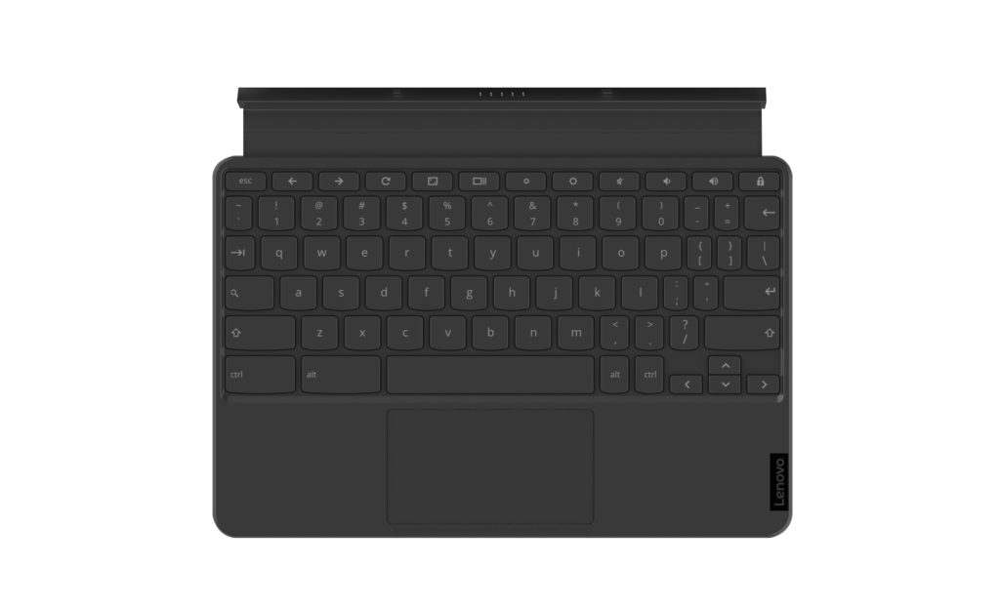
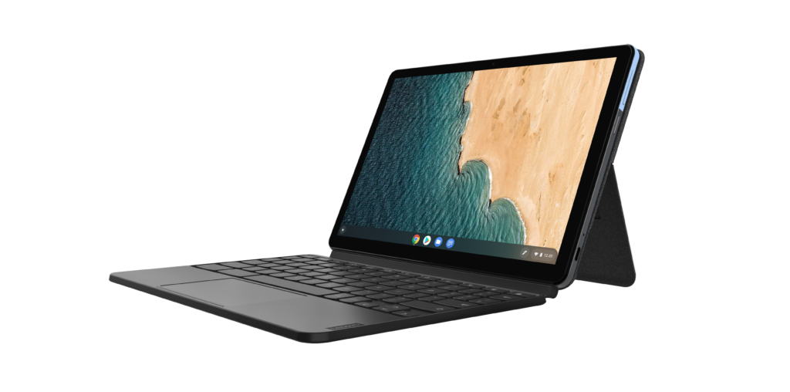
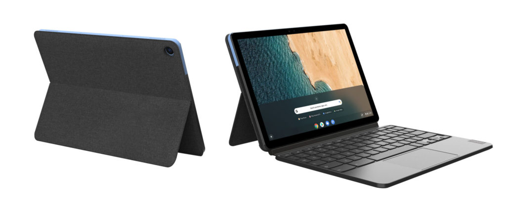

Well, well, well, it looks like [that 10.1-inch tablet I suggested a few weeks ago would come from Lenovo](https://www.aboutchromebooks.com/news/lenovo-chrome-os-tablet-kodama-details/) has indeed arrived. On Monday at the Consumer Electronics Show, the Lenovo IdeaPad Duet was introduced and will arrive with a very appealing $279 price tag.

Unlike prior small Chrome OS tablets, this one has a 400 nit 1920 x 1080 touchscreen, which packs a large number of pixels into a portable package.

And you won't have to buy a wireless keyboard if you want to pound out text: The Lenovo IdeaPad Duet Chromebook comes with a detachable keyboard that has a trackpad. I'll have to see how well this keyboard works because it looks like it may be a bit floppy, similar to the [Google Pixel Slate Keyboard](https://www.aboutchromebooks.com/reviews/google-pixel-slate-review/).

For media consumption or typing the Chrome OS tablet has a cover with a built-in stand that opens up to 135-degrees. I wish all Chrome OS tablets, regardless of their size, had this feature.

So at $279, you can't expect high-end Intel hardware inside.

Instead, the Lenovo IdeaPad Duet Chromebook is powered by a [Mediatek Helio P60T processor](https://i.mediatek.com/p60) paired with up to 4 GB of memory and up to 128 GB of eMMC storage.

For a small Chrome OS tablet that's unlikely to be your only computing device, that hardware is likely acceptable for most people. Although you might be able to use this tablet as a primary device, it's really aimed at portability on the go thanks to the size and 0.98-pound weight without the keyboard.

Even for its small size, you still get a USB Type-C port, front and rear webcams, and, according to Lenovo, a whopping 8 years of Chrome OS software updates. I think that's a record! Here's a rundown of all of the hardware specifications currently available:

<table class=""><tbody><tr><td>CPU</td><td>Octa-core Mediatek Helio P60T (4xA73 at 2.0GHz)</td></tr><tr><td>GPU</td><td>ARM G72 MP3</td></tr><tr><td>Display</td><td>10.1-inch 1920 x 1200 touchscreen, 400-nits, 70% color gamut</td></tr><tr><td>Memory</td><td>Up to 4 GB LPDDR4x</td></tr><tr><td>Storage</td><td>Up to 128 GB eMMC, microSD slot for expansion</td></tr><tr><td>Connectivity</td><td>Wi-Fi <em>(Note, I suspect Bluetooth as well)</em></td></tr><tr><td>Input</td><td>Included keyboard with trackpad, optional stylus, 2 MP front camera, 8 MP webcam</td></tr><tr><td>Ports</td><td>One USB Type-C (2.0 + DisplayPort)</td></tr><tr><td>Battery</td><td>7180 mAh</td></tr><tr><td>Weight</td><td>0.94 pounds without keyboard</td></tr><tr><td>Software</td><td>Chrome OS automatic updates for 8 years</td></tr></tbody></table>

With the updated processor, integrated kickstand cover and included keyboard attachment, the Lenovo IdeaPad Duet Chromebook appears to be a solid choice for those who want a small Chrome OS tablet.

The Acer Chromebook Tab 10 didn't wow the market, although there are some happy customers, so this package starting at $279 could increase demand for a portable Chromebook slate from a small niche to a larger niche. Unfortunately, we'll have to wait until May to find out; that's when the product becomes available.
