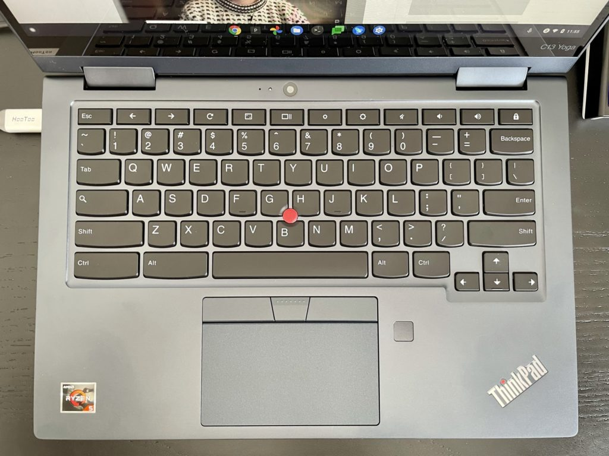
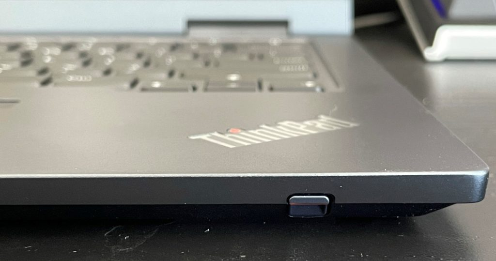
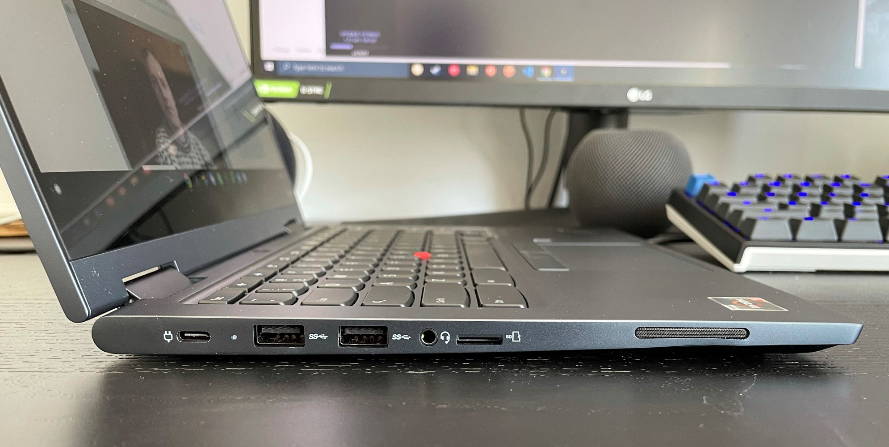
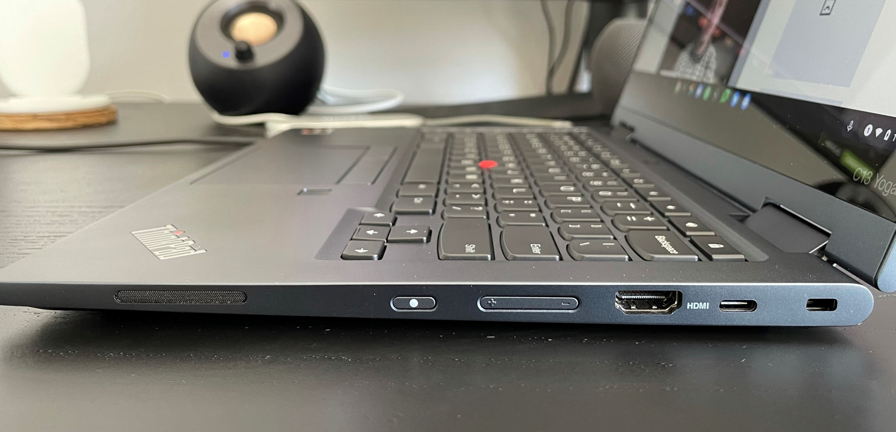
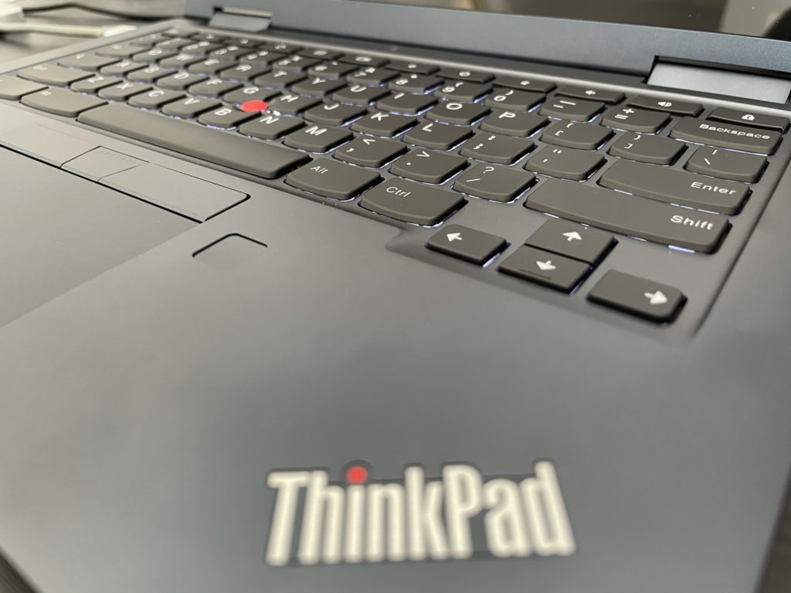

2020 was a good year for Lenovo in the Chromebook space. Not only did it launch my [Chromebook of the year with the $279 Lenovo Duet Chromebook](https://www.aboutchromebooks.com/news/my-pick-for-2020-chromebook-of-the-year/), but it also had other solid devices in the low- to mid-range market. The [Lenovo Chromebook Flex 5](https://www.aboutchromebooks.com/news/lenovo-flex-5-chromebook-hands-on-and-first-impressions/) comes to mind here.

This year, Lenovo is moving up to the high-end and enterprise space. Exhibit A: [The Lenovo ThinkPad C13 Yoga Chromebook](https://www.lenovo.com/us/en/laptops/thinkpad/thinkpad-c-series/ThinkPad-C13-Yoga-Chromebook-Enterprise/p/22TPC13C3Y1).

I just received a review model of this 2-in-1. There are several configurations available, all of them with AMD Ryzen processors and GPUs. And if you were ever an IBM ThinkPad fan, you'll appreciate the famous design attributes.

## There's no mistaking this is a ThinkPad Chromebook

Yes, it has the red TrackPoint mouse for navigation, the triple-key trackpad, and those great ThinkPad keyboard keys, which are backlit on all models.

Lenovo also added some other supported Chrome OS features here, which are optional or included, depending on the configuration you choose.

There's a fingerprint reader to the right of the trackpad on my review unit, for example, as well as a 5MP camera above the keyboard for use in tablet mode. And in the review configuration I received, there's a Lenovo USI stylus that is kept in the front of the chassis.

## Review unit configuration and model costs

Let's talk for a second about the review configuration because it has a list price of $1,179.00 but is currently on sale for $766.35.

Inside is a 2.1 GHz AMD Ryzen 5 Pro 3500C Processor with Radeon Vega Mobile Gfx, paired with 8 GB of DDR4-2400 memory. There's 128 GB of PCIe SSD storage as well as a microSD card slot. You also get WiFi 6 and Bluetooth 5.0 on all configurations.

The 13.3-inch display is an IPS, 1920 x 1080 resolution touch-panel with up to 300 nits of brightness. In addition to the aforementioned 5MP world camera, there's a 720p webcam with a physical shutter cover.

In terms of ports, there's a nice selection and they're spread out nicely. The left side has 1 USB Type-C, a pair of USB Type-A ports, a combination headphone/microphone jack, and the card reader. The right side is where you'll find the power and volume buttons, along with another USB Type-C port and full-sized HDMI 2.0 output. All USB ports are USB 3.2. Speakers adorn both sides closest to the trackpad.

I doubt anyone will have to pay the list price for this 2-in-1 Chromebook as Lenovo often discounts, but the price creeps quickly creeps up through the configurations. There's only one higher option than this review unit that lists for $1,489.00 and is currently discounted to $967.85.

That boosts you to an AMD Ryzen 7 3700C Processor, 16 GB of memory and 256 GB of SSD storage, as well as a display upgrade. You'll get a 4K OLED touch panel with 400 nits of brightness.

And the lowest configuration among five different options lists for $899, which is what the 4K Lenovo Chromebook Yoga 13 cost in 2018. With a discount, this model is currently $584.35, but most of that price is to get the ThinkPad-specific attributes.

That's because you get an entry-level AMD® Athlon Gold 3150C CPU, 4 GB of 2400 MHz RAM, and a paltry 32 GB of eMMC storage plus memory card expansion. You keep the same 13.3-inch 1080p touch panel as the review unit but gone are the fingerprint reader and USI stylus.

Essentially, this is a low- to maybe mid-range ThinkPad Chromebook in terms of expected performance.

I wanted to mention the cost, but I'll keep the price to value opinion for my full review.

For that, I'll be using the Lenovo ThinkPad C13 Yoga Chromebook as my full-time device for the next week or so. I welcome any specific questions in the comments below and I'll try to answer them as best as possible.

## First impressions: Very positive

Overall, with just a little while to look over this Chromebook, I'm impressed.

Build quality and materials appear excellent, there are enough ports for most people and the display is quite nice with thinner bezels than on most other Chromebooks.

The keyboard is outstanding to me, which if you've ever used a ThinkPad device, you'll know what I mean. They just have a great feel and amount of travel. The entire device feels premium on the outside.

Of course, it depends on what you choose to put inside that counts too. And from some limited browsing sessions, I'm sure the AMD Ryzen 5 Pro 3500C paired with ample RAM and fast SSD storage will impress most people. I can only review the configuration provided, so I can't speak to the lower-cost models. Surely, they won't provide the same experience.

Looking ahead, I'll continue to monitor the performance of course. And I want to see how close the 51 WHr battery can get to the advertised "up to 12.5 hours" of run-time.

Even if it only achieves 75% of that on a charge, there's an added bonus here: Lenovo says a 60-minute charge can get you from 0 to 80% capacity in an hour. I'll be sure to test that as well.
