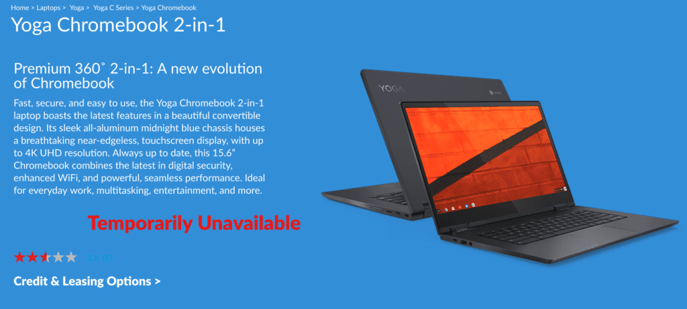

An odd situation with the Lenovo Yoga Chromebook C630 just got odder. In early January, [the C630 appeared as "temporarily unavailable" on Lenovo's website](https://www.aboutchromebooks.com/news/lenovo-yoga-chromebook-c630-temporarily-unavailable/), later to return at discounted prices. Today, the two 1080p models are no longer appearing for sale at Lenovo, however you can purchase the newly released 4K version. What's going on?

Early today I caught wind of the 1080p models disappearing from the Lenovo store, [thanks to a Reddit post by stealurface1](http:// it will be the only one they sell for foreseeable future.), who chatted with a Lenovo rep. The rep said that the 4K model "will be the only one they sell for foreseeable future." I immediately reached out to Lenovo by email to confirm, but received an out of office autoreply; I suspect my contact is on the way home from Mobile World Congress.

At that point, I simply resigned myself to waiting for official word. But then I heard from an About Chromebooks reader, George, who pointed me to the official [Lenovo Product Specifications Reference site](https://psref.lenovo.com/Product/Lenovo_Tablets_and_Convertibles/Yoga_Chromebook_C630), where I saw this:

See the two model numbers in red, which are specific to the US and Canada?

According to a footnote at the bottom of this list,

> "The model numbers in red indicate they have been withdrawn. After the whole product is withdrawn, they will be moved to the Withdrawn Products section."

That seems to line up with the fact that the Lenovo online store for the US no longer shows the FHD, or 1080p, models with either the Core i3 or Core i5 processer. And it reinforces what the Lenovo rep said earlier in the day: It appears that Lenovo will only directly be selling the 4K version of this Chromebook, at least in the US and Canada. Yes, the [only available version direct on Lenovo's Canada site is the 4K edition](https://www.lenovo.com/ca/en/laptops/yoga/yoga-c-series/Yoga-Chromebook/p/88YGCC61096).

If and when I hear back on my email from Lenovo about this, I'll update the post, but for now, all evidence points to a confirmation that if you want to directly order the Lenovo Chromebook C630, you can have any model you want, so long as its the 4K version.

[Best Buy still shows the 1080p edition](https://www.bestbuy.com/site/lenovo-yoga-c630-2-in-1-15-6-touch-screen-chromebook-intel-core-i5-8gb-memory-128gb-emmc-flash-memory-midnight-blue/6295998.p?skuId=6295998), which is currently $100 off for a price of $599, so there is an option there. Just know that the model Best Buy sells doesn't have a backlit keyboard, something that was strange to begin with.

The whole situation has me scratching my head because I can't understand why Lenovo would discontinue direct sales of a relatively new Chromebook. And, at least so far, only in the US and Canada. Then again, I never understood why there was a separate Best Buy edition of this device either.

**Update on 3/4**: My contact at Lenovo initially responded with this statement: "_The Yoga Chromebook selection is only temporary, they should be putting up the i3/i5 FHD models again shortly._" I then pointed out the models marked in red indicating model withdrawals. My contact responded, "_I will look into the matter to get some clarity, however the i5 FHD version is on sale at Best Buy currently._" More to follow as I get additional information; at time of writing this update, Lenovo's product page still only shows the 4K model available directly.
