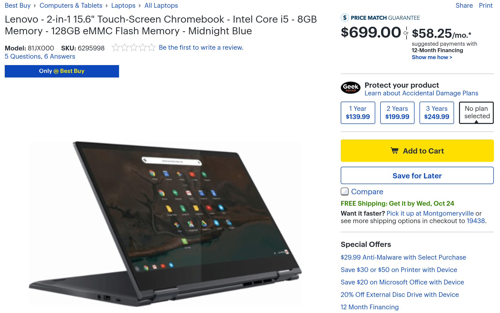

If you're heading into a Best Buy store to check out the [new Dell Inspiron Chromebook 14 today,](https://www.aboutchromebooks.com/news/dell-inspiron-chromebook-14-early-release-date-best-buy/) there's _another_ surprise waiting for you: The Lenovo Chromebook Yoga C630 is also debuting today in retail stores. Best Buy has two models available and one is an exclusive: [$699 for the same internal configuration as the base $999 Google Pixelbook](https://www.bestbuy.com/site/lenovo-2-in-1-15-6-touch-screen-chromebook-intel-core-i5-8gb-memory-128gb-emmc-flash-memory-midnight-blue/6295998.p?skuId=6295998).

For that price, you get an 8th-gen [Intel Core i5-8250U](https://ark.intel.com/products/124967/Intel-Core-i5-8250U-Processor-6M-Cache-up-to-3_40-GHz) processor, 8GB of memory and 128GB of eMMC storage. This model doesn't have the 4K display, however: You're limited to 1080p on the 15.6-inch touchscreen display. Other specs include a pair of USB Type-C ports, a full USB Type-A port, and microSD card slot in the metal chassis. Expected battery life on the 4.2 pound Chromebook is around 10 hours.

If you _do_ want that 4K display, [you can get the exact same internals with it for $899](https://www.bestbuy.com/site/lenovo-2-in-1-15-6-4k-ultra-hd-touch-screen-chromebook-intel-core-i5-8gb-memory-128gb-emmc-flash-memory-midnight-blue/6302552.p?skuId=6302552). I expected about a $200 price premium for that higher resolution and Lenovo came through. ;)

As some newer devices have been announced over the past few months, I've heard some grumblings that Chromebook prices were getting too high. There's merit to that since most of the upcoming Chromebooks and the Google Pixel Slate have traditional PC-like power inside. And that costs money.

But it was just a few years ago when the grumblings were about not having enough high-end Chromebooks on the market, save for Google devices. Essentially, I don't see an issue. The Chromebook makers are filling in the gaps at the high end but not abandoning entry-level devices at the same time. There's no way they will because Chromebooks have a large chunk of the education market and school districts can't afford to offer every student a $1,000 or more device.

Additionally, the price of a high-end Chromebook is actually _decreasing_. A Core i5 device like this Lenovo can be had for $599 if you choose the base model, although I haven't seen it on sale yet. The Dell Inspiron Chromebook 14 isn't quite as powerful with its Core i3 but is still reasonably priced. And the [Acer Chromebook Spin 13](https://www.aboutchromebooks.com/news/acer-chromebook-spin-13-price-specifications/) is right there too with models ranging from $699 to $999. Just a year or two ago, there weren't any high-end choices under $999.

Anyway, if I get a chance to hit Best Buy to check out the Dell, I'll look at the Lenovo as well. I'm curious what kind of benchmarks\* we'll see on these 8th-generation Intel chips inside a Chromebook.

_\*Note: My stance on benchmarks is that they are a very general indicator of performance; real-world usage is far more important in my opinion._
