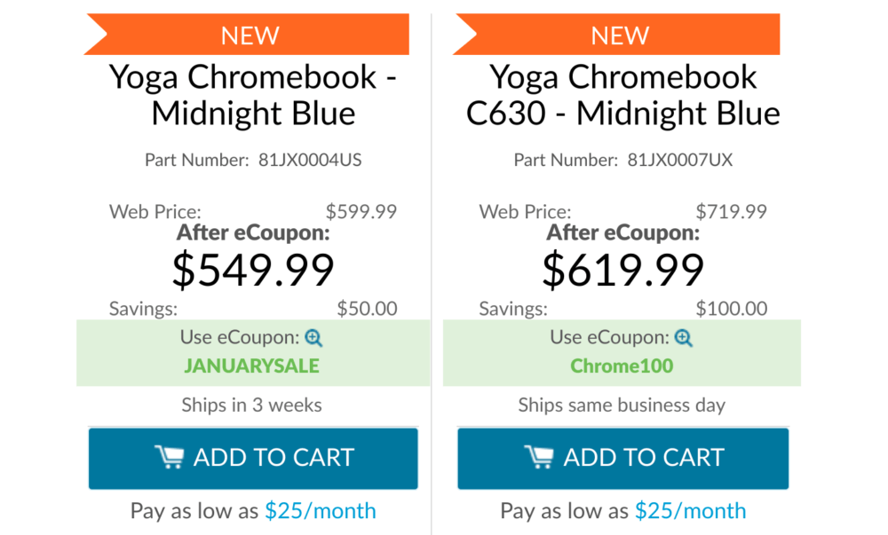
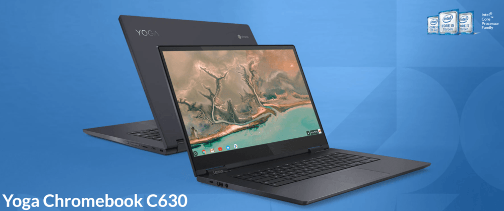

Early this month, [Lenovo inexplicably stopped direct sales of the Yoga Chromebook C630](https://www.aboutchromebooks.com/news/lenovo-yoga-chromebook-c630-temporarily-unavailable/) on its website, saying the product was "temporarily unavailable. This weekend, [the 2-in-1 Chromebook returned to Lenovo's site](https://www.lenovo.com/us/en/laptops/yoga/yoga-c-series/Yoga-Chromebook/p/88YGCC61096), with a choice of two different configurations. Both are also on sale with a coupon code that can save you $50 or $100, depending on your choice of model.

There are only two differences in the configurations since the options are all internal. You can pick from either the 8th-gen [Intel Core i3-8130U](https://ark.intel.com/products/137977/Intel-Core-i3-8130U-Processor-4M-Cache-up-to-3-40-GHz-) or [Intel Core i5-8250U](https://ark.intel.com/products/124967/Intel-Core-i5-8250U-Processor-6M-Cache-up-to-3-40-GHz-) processors, for example. Note that these U-Series chips can run longer at full clock speed than the [Y-Series processors found in many other recent Chrome OS devices, such as the Pixel Slate](https://www.aboutchromebooks.com/opinion/which-google-pixel-slate-to-buy-guide/). General performance should be better in the Lenovo devices by comparison to any powered by Intel's Y-Series, however, these devices do have fans to reduce heat from the processor. Both use the same integrated [Intel UHD 620 graphics](https://www.intel.com/content/www/us/en/support/products/126789/graphics-drivers/graphics-for-8th-generation-intel-processors/intel-uhd-graphics-620.html).

If you choose the i3 model, you'll have 64 GB of local storage, while the more expensive configuration doubles that to 128 GB.

Everything else is the same between the two:

- 15.6-inch IPS touchscreen with 1920 x 1080 resolution
- 8 GB of memory
- 2 USB Type-C ports, 1 USB Type-A (USB 3.0) port, microSD card slot, headphone jack
- 802.11ac Wi-Fi and Bluetooth 4.1
- 720p front-facing camera
- Backlit keyboard
- Weight of 4.2 pounds

With coupon codes (shown above) the $599 Core i3 model is available for $549, while the $719 Core i5 choice is $619. Note that the less expensive configuration won't ship for 3 weeks.

That makes me wonder if Lenovo had another production run of that particular device. It's speculation on my part, but one of our readers has bought that model twice, and not because he liked it so much that he wanted two of them. From [George's comments on a related post](https://www.aboutchromebooks.com/news/lenovo-yoga-chromebook-c630-price-availability-4k/#comment-12100):

> I returned the Lenovo Yoga Chromebook C630 to my local Best Buy (due to severe backlight screen bleeding) and exchanged it for another unit. The replacement also has a backlight screen bleed issue similar in severity and distrubution\[sic\] to the first, indicating this was not an isolated defect but a more pervasive issue with the product. Lenovo seems to have low standards for the quality of the 1080p displays it configures into this particular line of (Best Buy exclusive) Chromebook laptops.

[Although the Best Buy model is a Core i5](https://www.bestbuy.com/site/lenovo-yoga-c630-2-in-1-15-6-touch-screen-chromebook-intel-core-i5-8gb-memory-128gb-emmc-flash-memory-midnight-blue/6295998.p?skuId=6295998), I'm thinking that perhaps Lenovo has addressed any backlight bleed on this device, which would explain the "temporarily unavailable" situation a few weeks ago. There could be other reasons of course, but I'll be curious to hear from any new Lenovo Yoga Chromebook C630 owners to see if their device has any backlight bleed. I'm also curious when Lenovo will release the previously announced 4K display model, not to mention the cost of it.
