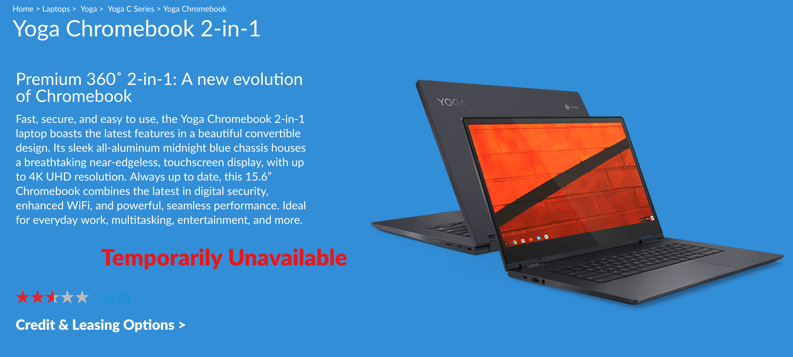

Right before the Consumer Electronics Show kicks off, there's a mystery to be solved. Namely: Why is the [Lenovo Yoga Chromebook C630 showing as "temporarily unavailable" on Lenovo's website](https://www.lenovo.com/us/en/laptops/yoga/yoga-c-series/Yoga-Chromebook/p/88YGCC61096)? Typically, you see an "out of stock" or a back ordered" status, so this seems strange to me.

I only found out about this today from George, one of the site's readers, who recently bought this very device not long ago. Indeed, you can still [get the Yoga Chromebook C630 from Best Buy as of today](https://www.bestbuy.com/site/lenovo-yoga-c630-2-in-1-15-6-touch-screen-chromebook-intel-core-i5-8gb-memory-128gb-emmc-flash-memory-midnight-blue/6295998.p?skuId=6295998), although that model is a Best Buy exclusive, currently priced at $699 with a Core i5 processor, 8 GB of memory and 128 GB of storage to go with the 15.6-inch FullHD display.

Specs on the Lenovo site show a lesser model with the same display but a Core i3 chip, 8 GB of memory and 64 GB of storage. Then again, it doesn't model because you can't currently get that model for some strange reason.

It's possible this is very temporary and unless direct inventory becomes available soon, I'll be sure to ask Lenovo at their CES booth in the next few days. I'll likely be stopping by there anyway because there's still another minor mystery to be solved: Where the heck is [the C630 with the 4K display](https://www.aboutchromebooks.com/news/4k-lenovo-yoga-chromebook-c630-specs-price-release-date-599/) that was announced back in August?

For those interested, George is likely taking back the Yoga Chromebook he bought due to "severe backlight screen bleed" and [a few other minor issues that you can read about here](https://www.aboutchromebooks.com/news/lenovo-yoga-chromebook-c630-price-availability-4k/#comment-10240).
